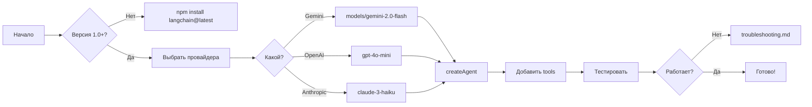

п# LangChain v1.0 Router

**Версия**: 1.0
**Дата создания**: 2025-11-19
**Статус**: Активный
**Проверено на**: langchain@1.0.6, Gemini 2.0 Flash

---

## 🎯 Когда использовать этот роутер

**Используй ЭТОТ роутер когда**:

- Работаешь с LangChain v1.0+ (НЕ v0.x!)
- Создаешь агентов через `createAgent` API
- Мигрируешь с LangGraph на createAgent
- Настраиваешь Gemini/OpenAI/Anthropic провайдеры
- Добавляешь tools, middleware, persistence
- Реализуешь human-in-the-loop workflows

**НЕ используй если**:

- Работаешь с прямым LangGraph (см. `.claude/routers/langgraph/`)
- Используешь старый createReactAgent (deprecated)
- Версия LangChain < 1.0

---

## 📚 Структура роутера

```
.claude/routers/langchain/
├── router.md               # Этот файл - точка входа
├── quickstart.md           # Быстрый старт за 5 минут
├── migration-guide.md      # Миграция с v0.x или LangGraph
├── providers.md            # Настройка Gemini/OpenAI/Anthropic
├── tools-patterns.md       # Паттерны создания tools
├── persistence.md          # PostgresSaver и checkpointing
├── troubleshooting.md      # Частые проблемы и решения
└── examples/
    ├── simple-agent.ts     # Базовый пример
    ├── waymates-agent.ts   # Пример с Core API
    └── complex-workflow.ts # add_experience workflow
```

---

## ⚡ Quick Start (2 минуты)

### 1. Установка

```bash
# Минимальный набор
npm install langchain@latest @langchain/google-genai

# Для persistence (опционально)
npm install @langchain/langgraph @langchain/langgraph-checkpoint-postgres
```

### 2. Настройка .env

```bash
# ВАЖНО: Для Gemini используй префикс "models/"!
GOOGLE_API_KEY=AIzaSy...  # Получить: https://makersuite.google.com/app/apikey

# Альтернативы
OPENAI_API_KEY=sk-...     # OpenAI
ANTHROPIC_API_KEY=sk-ant-... # Claude
```

### 3. Минимальный пример

```typescript
import { createAgent, tool } from "langchain";
import { ChatGoogleGenerativeAI } from "@langchain/google-genai";
import { z } from "zod";

// ⚠️ КРИТИЧНО: Модели Gemini ВСЕГДА с префиксом "models/"
const model = new ChatGoogleGenerativeAI({
  model: "models/gemini-2.0-flash", // ✅ Правильно
  // model: "gemini-2.0-flash",      // ❌ НЕ БУДЕТ РАБОТАТЬ!
  temperature: 0.7,
});

// Создаем tool
const calculatorTool = tool(
  async ({ a, b, operation }) => {
    console.log(`🔧 Calling: ${operation}(${a}, ${b})`);
    switch (operation) {
      case "add":
        return a + b;
      case "multiply":
        return a * b;
      default:
        throw new Error(`Unknown operation`);
    }
  },
  {
    name: "calculator",
    description: "Math operations",
    schema: z.object({
      a: z.number(),
      b: z.number(),
      operation: z.enum(["add", "multiply"]),
    }),
  },
);

// Создаем агента
const agent = createAgent({
  model,
  tools: [calculatorTool],
  systemPrompt: "You are a helpful assistant.",
});

// Используем
const result = await agent.invoke({
  messages: [{ role: "user", content: "What is 42 times 17?" }],
});
console.log(result.messages.at(-1).content);
```

---

## 🚨 КРИТИЧЕСКИ ВАЖНО

### Модели Gemini - ВСЕГДА с префиксом

```typescript
// ✅ ПРАВИЛЬНО - с префиксом "models/"
model: "models/gemini-2.0-flash";
model: "models/gemini-2.5-flash";
model: "models/gemini-2.5-pro";

// ❌ НЕПРАВИЛЬНО - без префикса (404 ошибка!)
model: "gemini-2.0-flash";
model: "gemini-1.5-flash";
model: "gemini-pro";
```

### Импорты - из правильных пакетов

```typescript
// ✅ ПРАВИЛЬНО - v1.0
import { createAgent, tool } from "langchain";

// ❌ НЕПРАВИЛЬНО - старые версии
import { createReactAgent } from "@langchain/langgraph/prebuilts";
```

### PostgresSaver - официальный пакет

```typescript
// ✅ ПРАВИЛЬНО - официальный пакет существует
import { PostgresSaver } from "@langchain/langgraph-checkpoint-postgres";

// ❌ НЕТ для JavaScript (только Python!)
import { RedisSaver } from "@langchain/langgraph-checkpoint-redis"; // НЕ СУЩЕСТВУЕТ
```

---

## 🏗️ Архитектура LangChain v1.0

### Что изменилось в v1.0

```
До v1.0:
LangChain (базовый фреймворк)
    ↓
LangGraph (отдельная библиотека для workflows)

После v1.0:
createAgent (простой API)
    ↓ построен на
LangGraph (встроенный движок)
```

**Ключевое**: createAgent теперь построен ПОВЕРХ LangGraph, а не заменяет его!

### Новые возможности

1. **Middleware система** - lifecycle hooks
2. **Human-in-the-loop** - встроенные interrupts
3. **Persistence** - автоматический checkpointing
4. **Parallel tools** - агент сам решает порядок
5. **State management** - через stateSchema

---

## 📋 Пошаговые инструкции

### Для простого агента

→ См. [`quickstart.md`](quickstart.md)

### Для миграции с LangGraph

→ См. [`migration-guide.md`](migration-guide.md)

### Для настройки провайдеров

→ См. [`providers.md`](providers.md)

### Для создания tools

→ См. [`tools-patterns.md`](tools-patterns.md)

### Для persistence

→ См. [`persistence.md`](persistence.md)

---

## 🔍 Проверенные факты

| Утверждение                           | Статус           | Источник            |
| ------------------------------------- | ---------------- | ------------------- |
| createAgent доступен в langchain@1.0+ | ✅ Проверено     | Наши тесты          |
| PostgresSaver официальный для JS      | ✅ Подтверждено  | NPM пакет           |
| RedisSaver НЕ существует для JS       | ✅ Только Python | GitHub поиск        |
| Параллельные tools работают           | ✅ Проверено     | gemini-agent.poc.ts |
| Gemini модели нужен префикс "models/" | ✅ КРИТИЧНО      | API тесты           |
| createAgent построен на LangGraph     | ✅ Факт          | Документация        |

---

## 💡 Best Practices

### 1. Всегда проверяй версию

```bash
npm list langchain
# Должно быть: langchain@1.x.x (НЕ 0.x.x!)
```

### 2. Используй правильную модель для задачи

| Модель                    | Скорость | Умность | Цена        | Когда использовать        |
| ------------------------- | -------- | ------- | ----------- | ------------------------- |
| `models/gemini-2.0-flash` | ⚡⚡⚡   | 🧠🧠    | Бесплатно   | Разработка, простые tools |
| `models/gemini-2.5-flash` | ⚡⚡⚡   | 🧠🧠+   | Бесплатно   | Продакшн, быстрый отклик  |
| `models/gemini-2.5-pro`   | ⚡       | 🧠🧠🧠  | Бесплатно\* | Сложная логика, reasoning |
| `gpt-4o-mini`             | ⚡⚡     | 🧠🧠+   | $           | Если нужна стабильность   |

\*Бесплатно с лимитами

### 3. Структурируй tools правильно

```typescript
// ✅ Хорошо - атомарные tools
const searchTool = tool(...);
const saveTool = tool(...);

// ❌ Плохо - монолитный tool
const doEverythingTool = tool(...);
```

### 4. Добавляй логирование

```typescript
const myTool = tool(
  async (params) => {
    console.log(`🔧 Tool called: ${JSON.stringify(params)}`);
    const result = await doWork(params);
    console.log(`✅ Tool result: ${JSON.stringify(result)}`);
    return result;
  },
  { ... }
);
```

---

## 🐛 Частые проблемы

### "Model not found" с Gemini

**Проблема**: 404 ошибка при вызове Gemini
**Решение**: Добавь префикс "models/" к имени модели

### "createAgent is not a function"

**Проблема**: Импорт не работает
**Решение**: Обнови до langchain@1.0+

### "API key not valid"

**Проблема**: Ключ не работает
**Решение**: Проверь что ключ из правильного проекта в Google Cloud

Полный список → [`troubleshooting.md`](troubleshooting.md)

---

## 📚 Дополнительные материалы

- [Наши эксперименты](../../docs/architecture/workflows/facade/langgraph/)
- [ADR-014: Миграция на LangChain v1.0](../../docs/architecture/decisions/ADR-014-langchain-v1-migration.md)
- [Официальная документация](https://js.langchain.com/docs)
- [Примеры кода](examples/)

---

## 🔄 Workflow для работы с LangChain



---

**Последнее обновление**: 2025-11-19
**Проверено на**: WayMates project, Gemini 2.0 Flash
