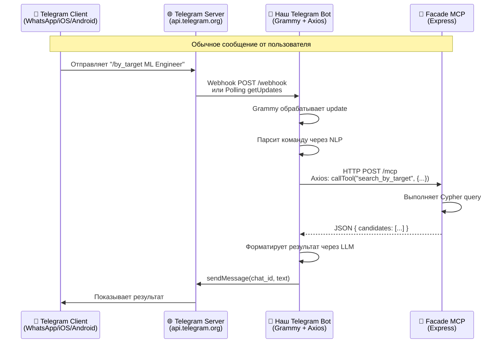
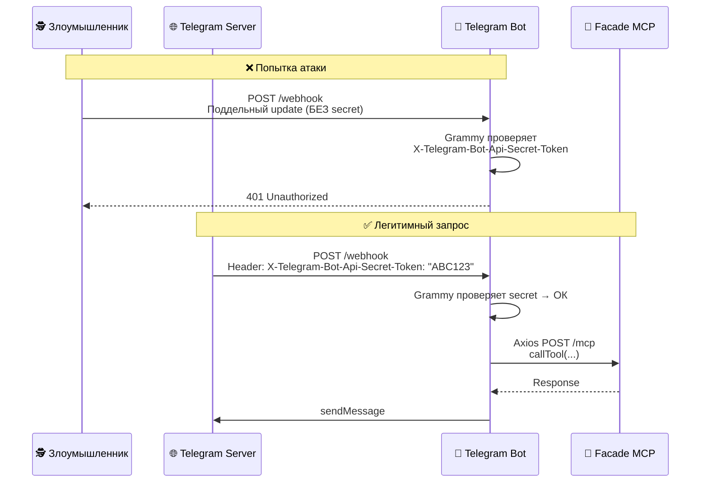

# Telegram Bot Architecture — Sequence Diagram

## Три компонента системы



## Детальный поток с Webhook Secret



## Технологии

| Компонент | Назначение | Технология |
|-----------|-----------|------------|
| **Telegram Client** | Приложение пользователя | iOS/Android/Desktop |
| **Telegram Server** | Центральный сервер Telegram | api.telegram.org |
| **Наш Telegram Bot** | Обработка команд, бизнес-логика | Grammy (фреймворк) |
| **Axios в боте** | HTTP клиент для запросов к Facade | axios (библиотека) |
| **Facade MCP** | MCP сервер, работа с Neo4j | Express + FastMCP |

## Почему НЕ нужен Express в Telegram Bot?

**Polling режим (текущий):**
```typescript
// Grammy сам запрашивает updates у Telegram
await bot.start(); // Внутри: setInterval(() => axios.get("getUpdates"))
```

**Webhook режим (будущий):**
```typescript
// Grammy использует встроенный http.createServer
const handleWebhook = webhookCallback(bot, "std/http", {
  secretToken: env.TELEGRAM_WEBHOOK_SECRET,
});

// Встроенный HTTP сервер (НЕ Express!)
http.createServer(handleWebhook).listen(3000);
```

**Вывод:** Grammy имеет встроенный HTTP сервер для webhook. Express НЕ нужен.
