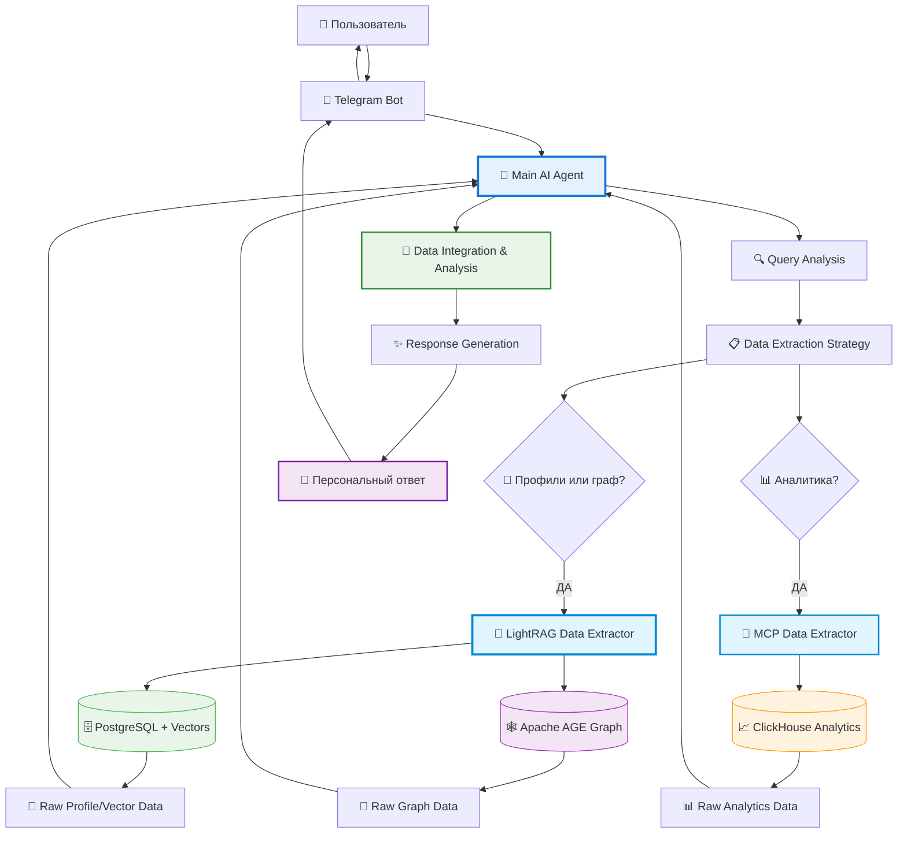
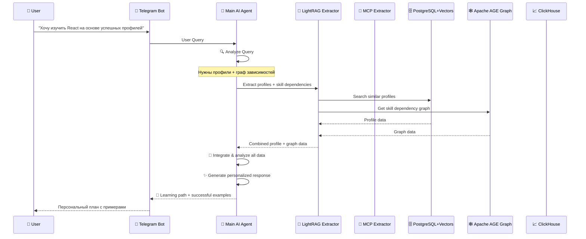

# AI-First Career Intelligence Platform Architecture

## 🎯 **Концепция: AI-First Data-Driven Career Intelligence**

**Основная идея:** Единый Main AI Agent получает пользовательский запрос и самостоятельно решает, какие данные ему нужны для ответа. Он использует LightRAG и MCP как **инструменты извлечения данных**, а всю аналитику и генерацию ответов выполняет сам.

### **Ключевые принципы:**
1. **AI-центричность** — все решения принимает Main AI
2. **Данные как сервисы** — LightRAG и MCP только извлекают данные
3. **Единая точка анализа** — вся логика в одном AI
4. **Максимальная гибкость** — AI может отвечать на любые вопросы

## 🏗️ **Архитектурная диаграмма**



## 🔄 **Поток обработки запросов**



## 🧠 **Main AI Agent Architecture**

### **Центральный интеллект системы:**
```typescript
class MainAIAgent {
  async processUserQuery(query: string): Promise<string> {
    // 1. Анализ запроса пользователя
    const queryAnalysis = await this.analyzeQuery(query);
    
    // 2. Планирование извлечения данных
    const dataStrategy = await this.planDataExtraction(queryAnalysis);
    
    // 3. Параллельное извлечение данных
    const extractedData = await this.extractData(dataStrategy);
    
    // 4. Интеграция и анализ всех данных
    const analysis = await this.integrateAndAnalyze(extractedData, query);
    
    // 5. Генерация персонализированного ответа
    return await this.generateResponse(analysis, query);
  }
}
```

### **Логика принятия решений:**
- **Профили или графы** → LightRAG Data Extractor
- **Аналитика и статистика** → MCP Data Extractor  
- **Комплексные запросы** → Оба экстрактора + AI анализ

## 🔧 **Data Extraction Tools**

### **LightRAG Data Extractor (универсальный):**
```typescript
class LightRAGDataExtractor {
  async extractData(query: string, dataType: 'profiles' | 'graph' | 'both') {
    switch (dataType) {
      case 'profiles':
        return await this.extractFromPostgreSQL(query); // + Vectors
      case 'graph':
        return await this.extractFromApacheAGE(query);  // Graph traversal
      case 'both':
        return await this.extractBoth(query);           // Parallel extraction
    }
  }
}
```

### **MCP Data Extractor (аналитика):**
```typescript
class MCPDataExtractor {
  async extractAnalytics(query: string) {
    // MCP AI генерирует SQL + выполняет в ClickHouse
    return await this.mcp.analyze(query);
  }
}
```

## ⚡ **Преимущества AI-First архитектуры**

### **✅ Единая точка интеллекта:**
- Все решения принимает один AI
- Консистентные ответы
- Единая логика обработки

### **✅ Максимальная гибкость:**
- AI может отвечать на любые вопросы
- Автоматический выбор источников данных
- Адаптация к новым типам запросов

### **✅ Оптимальное использование ресурсов:**
- Параллельное извлечение данных
- Использование только нужных источников
- Кэширование результатов

### **✅ Масштабируемость:**
- Легко добавлять новые источники данных
- Простое расширение функциональности
- Горизонтальное масштабирование

## 🎯 **Типы запросов и обработка**

### **Только LightRAG Data Extractor:**
- "Покажи похожих людей, которые стали Senior Developer"
- "Какие навыки изучали успешные Tech Lead'ы?"
- "Найди профили с опытом в финтехе"

### **Только MCP Data Extractor:**
- "Покажи статистику изучения React за последний год"
- "Какая средняя зарплата Senior Developer'ов?"
- "Создай дашборд по эффективности обучения"

### **Оба экстрактора + AI анализ:**
- "Сколько времени нужно для изучения React?"
- "Какие компании лучше для карьерного роста?"
- "Стоит ли мне изучать Vue.js или React?"

## 🚀 **Итоговое видение**

**WayMates как AI-First Career Intelligence Platform:**

1. **Единый AI Agent** — принимает все решения и выполняет всю аналитику
2. **Инструменты извлечения данных** — LightRAG, MCP как сервисы
3. **Максимальная гибкость** — может отвечать на любые карьерные вопросы
4. **Персонализированные ответы** — на основе полного анализа всех доступных данных

**Результат:** Интеллектуальная система, которая может дать экспертный совет по любому вопросу карьерного развития! 🎯


