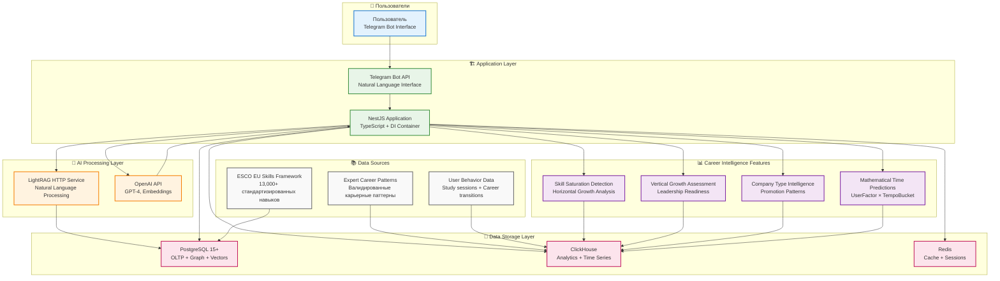

# 🏗️ WayMates Data-Driven Career Intelligence Architecture (ОБНОВЛЕНО)

## 📊 Обзор архитектуры

### **Обновленный технологический стек**



## 🎯 Ключевые особенности архитектуры

### **1. Data-Driven Career Intelligence**
- **Skill Saturation Detection**: Алгоритм определения plateau в горизонтальном росте
- **Vertical Growth Assessment**: 4-факторный анализ готовности к leadership
- **Company Type Intelligence**: Анализ promotion patterns по типам компаний
- **Mathematical Time Predictions**: UserFactor × TempoBucket × Paradigm algorithms

### **2. Natural Language Processing**
- **LightRAG**: HTTP API для обработки естественного языка
- **OpenAI GPT-4**: Анализ карьерных данных и генерация рекомендаций
- **Telegram Bot**: Интерфейс для natural language interaction

### **3. Hybrid Database Architecture**
- **PostgreSQL**: OLTP + Graph + Vectors для структурированных данных
- **ClickHouse**: OLAP Analytics для career intelligence
- **Redis**: Кэш и сессии для производительности

### **4. ESCO EU Skills Integration**
- **13,000+ стандартизированных навыков** с иерархией
- **BGE-m3 embeddings** для семантического поиска
- **EU competency standards** для time predictions

## 🔄 Потоки данных

### **Создание пользовательского профиля**
```
User → Telegram Bot → NestJS → PostgreSQL → Skill Saturation Analysis → ClickHouse
```

### **Поиск карьерных путей**
```
User Query → LightRAG → PostgreSQL Graph → ClickHouse Analytics → OpenAI Analysis → Recommendations
```

### **Career Intelligence Analysis**
```
User Profile → Skill Saturation Detection → Vertical Growth Assessment → Company Type Analysis → Action Plan
```

### **Обновление career intelligence**
```
New User Data → ClickHouse → Career Intelligence Algorithms → Updated Recommendations → Cache Invalidation
```

## 📊 Уникальные возможности WayMates

### **1. Теория убывающей отдачи горизонтального роста**
- Анализ skill saturation для определения момента переключения стратегии
- Математические расчеты ROI от изучения новых навыков
- Рекомендации по переходу от горизонтального к вертикальному росту

### **2. Теория трех осей карьерного роста**
- **Ширина**: Рост по доменной области в ширину
- **Глубина**: Рост по доменной области в глубину
- **Вертикаль**: Вертикальный рост (управление людьми)

### **3. Proven Responsibility Assessment**
- Results-based анализ management experience
- Оценка готовности к leadership roles
- Конкретные метрики для принятия решений

### **4. Mathematical Time Predictions**
- ESCO EU standards + статистическая валидация
- Персонализированные прогнозы времени обучения
- Confidence scores для каждого прогноза

## 🚀 Готовность к реализации

### **✅ Технические решения валидированы**
- **PostgreSQL + Apache AGE + pgvector**: Production-ready multi-model database
- **ClickHouse**: Optimal для career analytics и promotion intelligence
- **LightRAG HTTP API**: Simplified TypeScript-only integration
- **OpenAI API**: Качество русского языка для MVP критично
- **Telegram Bot API**: Natural language interface

### **🎯 Уникальная ценность WayMates**
- **EU standards + expert career intelligence** → эволюция к data-driven
- **Skill Dependencies Analysis** — какие prerequisites критичны для success rate
- **Company Type Intelligence** — по типам компаний (Series A/B, Enterprise)
- **Vertical growth probability** calculations из real promotion data
- **Experience-Based Readiness** — что можно изучить vs что требует опыта
- **Statistical Evidence** — каждая рекомендация backed минимум 50+ cases

### **📊 Impact Assessment**
- **Timeline**: 7-8 недель до production-ready системы
- **Value Proposition**: 300% увеличение — unique data-driven approach
- **Risk**: Medium — все технологии validated, proven architecture
- **MVP Focus**: Career progression intelligence вместо generic learning advice

