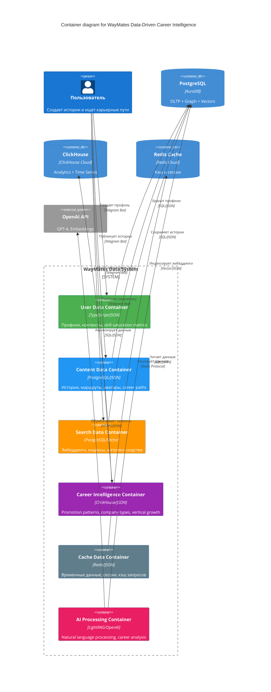

# 🏗️ Level 2: Контейнеры данных WayMates (ОБНОВЛЕНО)

## 📊 Архитектура хранения данных

### **Контейнеры данных и их назначение**



## 🗄️ Детали контейнеров данных

### **User Data Container**

#### **Назначение**
Хранение всех данных, связанных с пользователями системы + skill saturation analysis

#### **Типы данных**
```typescript
interface UserProfile {
  id: string;
  firstName: string;
  lastName: string;
  email: string;
  skills: string[];
  experience: {
    years: number;
    level: 'junior' | 'middle' | 'senior' | 'lead';
    domains: string[];
  };
  location: {
    current: string;
    target: string[];
  };
  preferences: {
    language: string;
    notifications: boolean;
    privacy: 'public' | 'private';
  };
  // НОВОЕ: Skill Saturation Metrics
  skillSaturation: {
    horizontalSkillCount: number;
    marketUtilizationRate: number;
    salaryProgressionRate: number;
    roleStagnationMonths: number;
    saturationDetected: boolean;
  };
  // НОВОЕ: Vertical Growth Readiness
  verticalReadiness: {
    technicalCredibility: number;
    provenResponsibility: number;
    leadershipMotivation: number;
    opportunityAvailability: number;
    overallReadiness: number;
  };
  createdAt: Date;
  updatedAt: Date;
}

interface UserContext {
  userId: string;
  currentSituation: string;
  constraints: {
    budget: number;
    timeline: number;
    family: boolean;
    education: boolean;
  };
  goals: string[];
  // НОВОЕ: Career Axis Analysis
  careerAxis: {
    width: number;        // Рост по ширине (%)
    depth: number;        // Рост по глубине (грейд)
    vertical: number;     // Рост по вертикали (команда)
    recommendedAxis: 'width' | 'depth' | 'vertical' | 'choice';
  };
  createdAt: Date;
}
```

#### **Операции**
- `createProfile()` - создание профиля пользователя
- `updateProfile()` - обновление данных профиля
- `getProfile()` - получение профиля по ID
- `createContext()` - создание контекста пользователя
- `updateContext()` - обновление контекста
- `analyzeSkillSaturation()` - анализ горизонтального роста
- `assessVerticalReadiness()` - оценка готовности к вертикальному росту

### **Content Data Container**

#### **Назначение**
Управление историями путешествий, маршрутами, аватарами и их шагами

#### **Типы данных**
```typescript
interface Story {
  id: string;
  authorId: string;
  title: string;
  content: string;
  processedContent: string;
  metadata: {
    skills: string[];
    fromLocation: string;
    toLocation: string;
    timeline: number;
    budget: number;
    success: boolean;
  };
  steps: StoryStep[];
  status: 'draft' | 'published' | 'archived';
  createdAt: Date;
  updatedAt: Date;
}

interface Avatar {
  id: string;
  userId: string;
  startingContext: UserContext;
  intermediateSteps: RoleTransition[];
  finalRole: string;
  timeSpent: number;
  satisfactionScore: number;
  axisProgression: {
    width: number;
    depth: number;
    vertical: number;
  };
  createdAt: Date;
}

interface RoleTransition {
  fromRole: string;
  toRole: string;
  monthsDuration: number;
  keySkillsLearned: string[];
  axis: 'width' | 'depth' | 'vertical';
  contextAtTransition: UserContext;
}

interface Route {
  id: string;
  title: string;
  description: string;
  targetRole: string;
  targetCountry: string;
  experienceLevel: string;
  steps: RouteStep[];
  statistics: {
    successRate: number;
    averageTimeline: number;
    totalStories: number;
  };
  createdAt: Date;
  updatedAt: Date;
}

interface RouteStep {
  id: string;
  routeId: string;
  stepNumber: number;
  title: string;
  description: string;
  averageTimeline: string;
  successRate: number;
  commonObstacles: string[];
  requiredSkills: string[];
}
```

#### **Операции**
- `createStory()` - создание новой истории
- `updateStory()` - обновление истории
- `getStory()` - получение истории по ID
- `searchStories()` - поиск историй по критериям
- `createAvatar()` - создание аватара
- `createRoute()` - создание маршрута
- `updateRoute()` - обновление маршрута
- `getRoute()` - получение маршрута по ID

### **Career Intelligence Container**

#### **Назначение**
Аналитика карьерного роста, promotion patterns, company types

#### **Типы данных**
```typescript
interface SkillSaturationAnalysis {
  userId: string;
  horizontalSkillCount: number;
  marketUtilizationRate: number;
  salaryProgressionRate: number;
  roleStagnationMonths: number;
  saturationDetected: boolean;
  recommendation: 'keep_learning' | 'plateau_detected' | 'ready_for_vertical';
  analysisDate: Date;
}

interface VerticalGrowthAttempt {
  userId: string;
  fromRole: string;
  toRole: string;
  monthsInRole: number;
  technicalCredibilityScore: number;
  provenResponsibilityScore: number;
  leadershipMotivationScore: number;
  companyOpportunityScore: number;
  attemptSuccessful: boolean;
  attemptDate: Date;
}

interface CompanyTypeAnalysis {
  companyStage: string;
  companySizeCategory: string;
  industrySector: string;
  promotionRate: number;
  averageTimeline: number;
  predictability: 'high' | 'medium' | 'low';
  financialImpact: number;
  sampleSize: number;
}

interface PromotionPattern {
  fromRole: string;
  toRole: string;
  companyType: string;
  successRate: number;
  averageTime: number;
  requiredSkills: string[];
  commonObstacles: string[];
}
```

#### **Операции**
- `analyzeSkillSaturation()` - анализ горизонтального роста
- `trackVerticalGrowthAttempt()` - отслеживание попыток вертикального роста
- `analyzeCompanyTypes()` - анализ типов компаний
- `getPromotionPatterns()` - получение паттернов повышений
- `calculateVerticalReadiness()` - расчет готовности к вертикальному росту

### **AI Processing Container**

#### **Назначение**
Обработка естественного языка и AI анализ карьерных данных

#### **Типы данных**
```typescript
interface LightRAGQuery {
  query: string;
  userContext: UserContext;
  response: {
    skills: Skill[];
    explanation: string;
    recommendedPath: LearningPath;
  };
}

interface CareerAnalysis {
  skillDependencies: SkillDependency[];
  companyTypeRecommendations: CompanyTypeAnalysis[];
  verticalGrowthProbability: number;
  timePredictions: TimePrediction[];
  riskFactors: string[];
}

interface SkillDependency {
  prerequisiteSkill: string;
  impact: {
    successRateWith: number;
    successRateWithout: number;
    timeImpact: string;
    sampleSize: number;
  };
  recommendation: 'critical' | 'optional';
}

interface TimePrediction {
  skillId: string;
  weeksNormal: number;
  weeksSafe: number;
  confidence: number;
  explanation: string;
}
```

#### **Операции**
- `processNaturalQuery()` - обработка естественного языка
- `analyzeCareerPath()` - анализ карьерного пути
- `predictLearningTime()` - прогноз времени обучения
- `analyzeSkillDependencies()` - анализ зависимостей навыков
- `recommendCompanyType()` - рекомендация типа компании

### **Search Data Container**

#### **Назначение**
Обработка поисковых запросов и семантического поиска

#### **Типы данных**
```typescript
interface Embedding {
  id: string;
  contentId: string;
  contentType: 'story' | 'step' | 'route' | 'avatar';
  embedding: number[];
  model: string;
  createdAt: Date;
}

interface SearchQuery {
  id: string;
  userId: string;
  text: string;
  embedding: number[];
  filters: {
    skills?: string[];
    locations?: string[];
    timeline?: number;
    experience?: string;
  };
  results: SearchResult[];
  createdAt: Date;
}

interface SearchResult {
  id: string;
  contentType: 'story' | 'route' | 'avatar';
  contentId: string;
  similarity: number;
  confidence: number;
  matchedSteps?: string[];
  explanation: string;
  metadata: SearchResultMetadata;
}

interface SimilarityMetric {
  id: string;
  sourceId: string;
  targetId: string;
  similarity: number;
  method: 'cosine' | 'euclidean' | 'manhattan';
  createdAt: Date;
}
```

#### **Операции**
- `createEmbedding()` - создание эмбеддинга
- `searchSimilar()` - поиск похожего контента
- `calculateSimilarity()` - расчет метрики сходства
- `rankResults()` - ранжирование результатов поиска

### **Cache Data Container**

#### **Назначение**
Временное хранение часто используемых данных

#### **Типы данных**
```typescript
interface CacheEntry {
  key: string;
  value: any;
  ttl: number;
  createdAt: Date;
  expiresAt: Date;
}

interface UserSession {
  sessionId: string;
  userId: string;
  data: {
    currentQuery?: string;
    searchHistory: string[];
    preferences: any;
  };
  createdAt: Date;
  lastAccessed: Date;
}

interface QueryCache {
  queryHash: string;
  results: SearchResult[];
  createdAt: Date;
  expiresAt: Date;
}
```

#### **Операции**
- `set()` - сохранение в кэш
- `get()` - получение из кэша
- `delete()` - удаление из кэша
- `clear()` - очистка кэша
- `getSession()` - получение сессии пользователя

## 🔄 Потоки данных между контейнерами

### **Создание истории**
```
User Data → Content Data → Search Data → Cache Data
```

### **Поиск карьерных путей**
```
Cache Data → Search Data → Content Data → Career Intelligence → User Data
```

### **Обновление маршрутов**
```
Content Data → Search Data → Cache Data → Career Intelligence
```

### **AI анализ карьеры**
```
User Data → AI Processing → Career Intelligence → Content Data
```

## 📊 Схемы данных

### **PostgreSQL Schema**
```sql
-- Пользователи с skill saturation metrics
CREATE TABLE users (
  id UUID PRIMARY KEY,
  telegram_id BIGINT UNIQUE,
  first_name VARCHAR(100),
  last_name VARCHAR(100),
  email VARCHAR(255),
  skills TEXT[],
  experience JSONB,
  location JSONB,
  preferences JSONB,
  skill_saturation JSONB,
  vertical_readiness JSONB,
  created_at TIMESTAMP DEFAULT NOW(),
  updated_at TIMESTAMP DEFAULT NOW()
);

-- ESCO Skills с иерархией
CREATE TABLE skills (
  id UUID PRIMARY KEY,
  esco_id VARCHAR UNIQUE NOT NULL,
  name_en VARCHAR NOT NULL,
  name_ru VARCHAR,
  skill_type skill_type_enum NOT NULL,
  tier INT NOT NULL CHECK (tier IN (0,1,2)),
  ects_baseline_hours INT,
  alt_labels TEXT[],
  embedding VECTOR(1024),
  created_at TIMESTAMP DEFAULT NOW()
);

-- Истории с аватарами
CREATE TABLE stories (
  id UUID PRIMARY KEY,
  author_id UUID REFERENCES users(id),
  title VARCHAR(255),
  content TEXT,
  processed_content TEXT,
  metadata JSONB,
  steps JSONB,
  status story_status_enum DEFAULT 'draft',
  created_at TIMESTAMP DEFAULT NOW(),
  updated_at TIMESTAMP DEFAULT NOW()
);

-- Аватары для career path analysis
CREATE TABLE avatars (
  id UUID PRIMARY KEY,
  user_id UUID REFERENCES users(id),
  starting_context JSONB,
  intermediate_steps JSONB,
  final_role VARCHAR(100),
  time_spent INT,
  satisfaction_score INT,
  axis_progression JSONB,
  created_at TIMESTAMP DEFAULT NOW()
);

-- Apache AGE Graph для связей
SELECT create_graph('waymates_graph');
```

### **ClickHouse Schema**
```sql
-- Skill saturation analysis
CREATE TABLE skill_saturation_analysis (
  user_id UUID,
  skills_count UInt16,
  market_utilization_rate Float32,
  salary_stagnation_months UInt16,
  saturation_detected Boolean,
  analysis_date Date
) ENGINE = MergeTree()
ORDER BY (analysis_date, saturation_detected);

-- Vertical growth attempts
CREATE TABLE vertical_growth_attempts (
  user_id UUID,
  from_role String,
  to_role String,
  months_in_role UInt16,
  technical_credibility_score UInt8,
  proven_responsibility_score UInt8,
  leadership_motivation_score UInt8,
  company_opportunity_score UInt8,
  attempt_successful Boolean,
  attempt_date Date
) ENGINE = MergeTree()
ORDER BY (from_role, to_role, attempt_date);

-- Company type analysis
CREATE TABLE company_type_analysis (
  company_stage String,
  company_size_category String,
  industry_sector String,
  promotion_rate Float32,
  average_timeline Float32,
  predictability String,
  financial_impact Float32,
  sample_size UInt32,
  analysis_date Date
) ENGINE = MergeTree()
ORDER BY (company_stage, company_size_category, analysis_date);
```

### **Redis Schema**
```json
{
  "user_sessions": {
    "session_id": {
      "userId": "string",
      "data": "object",
      "createdAt": "datetime",
      "lastAccessed": "datetime",
      "expiresAt": "datetime"
    }
  },
  "query_cache": {
    "query_hash": {
      "results": "array",
      "filters": "object",
      "createdAt": "datetime",
      "expiresAt": "datetime",
      "hitCount": "int"
    }
  },
  "career_intelligence_cache": {
    "user_id": {
      "skillSaturation": "object",
      "verticalReadiness": "object",
      "cachedAt": "datetime",
      "expiresAt": "datetime"
    }
  }
}
```