# 🧩 Level 3: Компоненты данных WayMates (ОБНОВЛЕНО)

## 📊 Детальная структура компонентов данных

### **Компоненты обработки данных**

```mermaid
C4Component
    title Component diagram for WayMates Data-Driven Career Intelligence

    Container_Boundary(data_processing, "Data Processing System") {
        Component(user_processor, "User Data Processor", "TypeScript", "Обработка пользовательских данных + skill saturation")
        Component(content_processor, "Content Data Processor", "TypeScript", "Обработка контентных данных + avatars")
        Component(career_intelligence_processor, "Career Intelligence Processor", "TypeScript", "Аналитика карьерного роста")
        Component(ai_processor, "AI Processing Engine", "LightRAG/OpenAI", "Natural language processing + career analysis")
        Component(embedding_processor, "Embedding Processor", "Python/TypeScript", "Создание и обработка эмбеддингов")
        Component(validation_processor, "Validation Processor", "TypeScript", "Валидация и очистка данных")
        Component(ranking_processor, "Ranking Processor", "TypeScript", "MCDM ранжирование + career recommendations")
        
        Component(postgres_adapter, "PostgreSQL Adapter", "TypeScript", "Адаптер для работы с PostgreSQL")
        Component(clickhouse_adapter, "ClickHouse Adapter", "TypeScript", "Адаптер для работы с ClickHouse")
        Component(redis_adapter, "Redis Adapter", "TypeScript", "Адаптер для работы с Redis")
        
        Component(data_transformer, "Data Transformer", "TypeScript", "Преобразование данных между форматами")
        Component(schema_validator, "Schema Validator", "TypeScript", "Валидация схем данных")
        Component(cache_manager, "Cache Manager", "TypeScript", "Управление кэшем")
    }

    ContainerDb(postgres, "PostgreSQL", "AuraDB", "OLTP + Graph + Vectors")
    ContainerDb(clickhouse, "ClickHouse", "ClickHouse Cloud", "Analytics + Time Series")
    ContainerDb(redis, "Redis Cache", "Redis Cloud", "Кэш и сессии")
    System_Ext(openai, "OpenAI API", "GPT-4, Embeddings")

    %% Data flow connections
    Rel(user_processor, postgres_adapter, "Store user data", "SQL/JSON")
    Rel(content_processor, postgres_adapter, "Store content", "SQL/JSON")
    Rel(career_intelligence_processor, clickhouse_adapter, "Analytics queries", "SQL/JSON")
    Rel(ai_processor, openai, "AI processing", "HTTPS/JSON")
    Rel(ai_processor, postgres_adapter, "Read data", "SQL/JSON")
    Rel(embedding_processor, postgres_adapter, "Store embeddings", "Vector/JSON")
    
    Rel(postgres_adapter, postgres, "Database operations", "SQL/HTTPS")
    Rel(clickhouse_adapter, clickhouse, "Analytics operations", "SQL/JSON")
    Rel(redis_adapter, redis, "Cache operations", "Redis Protocol")
    
    Rel(data_transformer, user_processor, "Transform user data", "Method Call")
    Rel(data_transformer, content_processor, "Transform content", "Method Call")
    Rel(schema_validator, validation_processor, "Validate schemas", "Method Call")
    Rel(cache_manager, redis_adapter, "Manage cache", "Method Call")

    UpdateElementStyle(user_processor, $fontColor="white", $bgColor="#4caf50")
    UpdateElementStyle(content_processor, $fontColor="white", $bgColor="#2196f3")
    UpdateElementStyle(career_intelligence_processor, $fontColor="white", $bgColor="#9c27b0")
    UpdateElementStyle(ai_processor, $fontColor="white", $bgColor="#e91e63")
    UpdateElementStyle(embedding_processor, $fontColor="white", $bgColor="#ff9800")
    UpdateElementStyle(validation_processor, $fontColor="white", $bgColor="#f44336")
    UpdateElementStyle(ranking_processor, $fontColor="white", $bgColor="#795548")
```



## 🧩 Детали компонентов данных

### **User Data Processor**

#### **Назначение**
Обработка всех данных, связанных с пользователями + skill saturation analysis

#### **Основные методы**
```typescript
class UserDataProcessor {
  // Создание профиля пользователя с skill saturation metrics
  async createUserProfile(profileData: CreateUserProfileDto): Promise<UserProfile> {
    // 1. Валидация данных
    await this.validateUserProfile(profileData);
    
    // 2. Обработка навыков
    const processedSkills = await this.processSkills(profileData.skills);
    
    // 3. Создание контекста
    const userContext = await this.createUserContext(profileData);
    
    // 4. Анализ skill saturation
    const skillSaturation = await this.analyzeSkillSaturation(processedSkills);
    
    // 5. Оценка vertical readiness
    const verticalReadiness = await this.assessVerticalReadiness(profileData);
    
    // 6. Сохранение в PostgreSQL
    const profile = await this.postgresAdapter.createUser({
      ...profileData,
      skillSaturation,
      verticalReadiness
    });
    
    // 7. Кэширование
    await this.cacheManager.setUserProfile(profile.id, profile);
    
    return profile;
  }

  // Анализ skill saturation
  async analyzeSkillSaturation(skills: string[]): Promise<SkillSaturationAnalysis> {
    const marketDemand = await this.getMarketSkillDemand(skills);
    const salaryStagnation = await this.checkSalaryStagnation(skills);
    const roleTime = await this.getRoleStagnationTime(skills);
    
    const saturationDetected = (
      marketDemand.utilizationRate < 30 && 
      salaryStagnation && 
      roleTime > 24
    );
    
    return {
      horizontalSkillCount: skills.length,
      marketUtilizationRate: marketDemand.utilizationRate,
      salaryProgressionRate: salaryStagnation.rate,
      roleStagnationMonths: roleTime,
      saturationDetected,
      recommendation: saturationDetected ? 'ready_for_vertical' : 'keep_learning'
    };
  }

  // Оценка готовности к вертикальному росту
  async assessVerticalReadiness(profileData: CreateUserProfileDto): Promise<VerticalReadinessScore> {
    const technicalCredibility = await this.assessTechnicalCredibility(profileData);
    const provenResponsibility = await this.assessProvenResponsibility(profileData);
    const leadershipMotivation = await this.assessLeadershipMotivation(profileData);
    const opportunityAvailability = await this.assessOpportunityAvailability(profileData);
    
    const overallReadiness = (
      technicalCredibility * 0.3 +
      provenResponsibility * 0.3 +
      leadershipMotivation * 0.2 +
      opportunityAvailability * 0.2
    );
    
    return {
      technicalCredibility,
      provenResponsibility,
      leadershipMotivation,
      opportunityAvailability,
      overallReadiness,
      blockers: this.identifyBlockers(overallReadiness),
      actionPlan: this.createActionPlan(overallReadiness)
    };
  }
}
```

#### **Типы данных**
```typescript
interface CreateUserProfileDto {
  firstName: string;
  lastName: string;
  email: string;
  skills: string[];
  experience: {
    years: number;
    level: string;
    domains: string[];
  };
  location: {
    current: string;
    target: string[];
  };
  preferences: {
    language: string;
    notifications: boolean;
    privacy: string;
  };
}

interface SkillSaturationAnalysis {
  horizontalSkillCount: number;
  marketUtilizationRate: number;
  salaryProgressionRate: number;
  roleStagnationMonths: number;
  saturationDetected: boolean;
  recommendation: 'keep_learning' | 'plateau_detected' | 'ready_for_vertical';
}

interface VerticalReadinessScore {
  technicalCredibility: number;
  provenResponsibility: number;
  leadershipMotivation: number;
  opportunityAvailability: number;
  overallReadiness: number;
  blockers: string[];
  actionPlan: VerticalGrowthAction[];
}
```

### **Career Intelligence Processor**

#### **Назначение**
Аналитика карьерного роста, promotion patterns, company types

#### **Основные методы**
```typescript
class CareerIntelligenceProcessor {
  // Анализ skill saturation patterns
  async analyzeSkillSaturationPatterns(): Promise<SkillSaturationPattern[]> {
    const patterns = await this.clickhouseAdapter.query(`
      SELECT 
        skills_count,
        market_utilization_rate,
        salary_stagnation_months,
        saturation_detected,
        COUNT(*) as sample_size
      FROM skill_saturation_analysis
      GROUP BY skills_count, market_utilization_rate, salary_stagnation_months, saturation_detected
      HAVING sample_size > 10
      ORDER BY sample_size DESC
    `);
    
    return patterns.map(pattern => ({
      skillCount: pattern.skills_count,
      utilizationRate: pattern.market_utilization_rate,
      stagnationMonths: pattern.salary_stagnation_months,
      saturationDetected: pattern.saturation_detected,
      sampleSize: pattern.sample_size,
      confidence: Math.min(0.9, pattern.sample_size / 100)
    }));
  }

  // Анализ vertical growth patterns
  async analyzeVerticalGrowthPatterns(): Promise<VerticalGrowthPattern[]> {
    const patterns = await this.clickhouseAdapter.query(`
      SELECT 
        from_role,
        to_role,
        AVG(technical_credibility_score) as avg_technical_credibility,
        AVG(proven_responsibility_score) as avg_proven_responsibility,
        AVG(leadership_motivation_score) as avg_leadership_motivation,
        AVG(company_opportunity_score) as avg_company_opportunity,
        SUM(CASE WHEN attempt_successful = 1 THEN 1 ELSE 0 END) as successful_attempts,
        COUNT(*) as total_attempts,
        AVG(months_in_role) as avg_months_in_role
      FROM vertical_growth_attempts
      GROUP BY from_role, to_role
      HAVING total_attempts > 20
      ORDER BY successful_attempts DESC
    `);
    
    return patterns.map(pattern => ({
      fromRole: pattern.from_role,
      toRole: pattern.to_role,
      successRate: pattern.successful_attempts / pattern.total_attempts,
      avgTechnicalCredibility: pattern.avg_technical_credibility,
      avgProvenResponsibility: pattern.avg_proven_responsibility,
      avgLeadershipMotivation: pattern.avg_leadership_motivation,
      avgCompanyOpportunity: pattern.avg_company_opportunity,
      avgMonthsInRole: pattern.avg_months_in_role,
      sampleSize: pattern.total_attempts
    }));
  }

  // Анализ company types для promotion optimization
  async analyzeCompanyTypes(): Promise<CompanyTypeAnalysis[]> {
    const analysis = await this.clickhouseAdapter.query(`
      SELECT 
        company_stage,
        company_size_category,
        industry_sector,
        AVG(promotion_rate) as avg_promotion_rate,
        AVG(average_timeline) as avg_timeline,
        AVG(financial_impact) as avg_financial_impact,
        COUNT(*) as sample_size
      FROM company_type_analysis
      GROUP BY company_stage, company_size_category, industry_sector
      HAVING sample_size > 10
      ORDER BY avg_promotion_rate DESC
    `);
    
    return analysis.map(company => ({
      companyStage: company.company_stage,
      companySizeCategory: company.company_size_category,
      industrySector: company.industry_sector,
      promotionRate: company.avg_promotion_rate,
      averageTimeline: company.avg_timeline,
      financialImpact: company.avg_financial_impact,
      sampleSize: company.sample_size,
      predictability: company.sample_size > 50 ? 'high' : 'medium'
    }));
  }

  // Рекомендации по career path
  async recommendCareerPath(userProfile: UserProfile): Promise<CareerPathRecommendation> {
    const skillSaturation = await this.analyzeSkillSaturation(userProfile.skills);
    const verticalReadiness = await this.assessVerticalReadiness(userProfile);
    const companyTypes = await this.analyzeCompanyTypes();
    
    if (skillSaturation.saturationDetected && verticalReadiness.overallReadiness > 70) {
      return {
        recommendedPath: 'vertical_growth',
        targetRoles: await this.findTargetRoles(userProfile),
        companyTypes: await this.recommendCompanyTypes(userProfile, companyTypes),
        timeline: await this.estimateTimeline(userProfile, 'vertical_growth'),
        actionPlan: verticalReadiness.actionPlan
      };
    } else if (skillSaturation.saturationDetected) {
      return {
        recommendedPath: 'skill_development',
        targetSkills: await this.recommendSkills(userProfile),
        timeline: await this.estimateTimeline(userProfile, 'skill_development'),
        actionPlan: await this.createSkillDevelopmentPlan(userProfile)
      };
    } else {
      return {
        recommendedPath: 'horizontal_growth',
        targetSkills: await this.recommendSkills(userProfile),
        timeline: await this.estimateTimeline(userProfile, 'horizontal_growth'),
        actionPlan: await this.createHorizontalGrowthPlan(userProfile)
      };
    }
  }
}
```

### **AI Processing Engine**

#### **Назначение**
Обработка естественного языка и AI анализ карьерных данных через LightRAG + OpenAI

#### **Основные методы**
```typescript
class AIProcessingEngine {
  // Обработка естественного языка через LightRAG
  async processNaturalQuery(userId: string, query: string): Promise<CareerAnalysis> {
    // 1. Получение контекста пользователя
    const userContext = await this.getUserContext(userId);
    
    // 2. Обработка через LightRAG
    const lightragResult = await this.lightragService.processQuery(query, userContext);
    
    // 3. Анализ через OpenAI
    const openaiAnalysis = await this.openaiService.analyzeCareerQuery(lightragResult);
    
    // 4. Обогащение данными из ClickHouse
    const careerData = await this.enrichWithCareerData(openaiAnalysis, userContext);
    
    return careerData;
  }

  // Анализ skill dependencies
  async analyzeSkillDependencies(skillId: string): Promise<SkillDependency[]> {
    // 1. Получение ESCO prerequisites
    const escoPrerequisites = await this.getESCOPrerequisites(skillId);
    
    // 2. Статистический анализ из ClickHouse
    const statisticalAnalysis = await this.clickhouseAdapter.query(`
      SELECT 
        prerequisite_skill_id,
        COUNT(*) as total_learners,
        SUM(CASE WHEN had_prerequisite = 1 THEN 1 ELSE 0 END) as with_prereq,
        SUM(CASE WHEN had_prerequisite = 1 AND successful = 1 THEN 1 ELSE 0 END) as successful_with_prereq,
        SUM(CASE WHEN had_prerequisite = 0 AND successful = 1 THEN 1 ELSE 0 END) as successful_without_prereq,
        AVG(CASE WHEN had_prerequisite = 1 THEN learning_time_weeks ELSE NULL END) as avg_time_with,
        AVG(CASE WHEN had_prerequisite = 0 THEN learning_time_weeks ELSE NULL END) as avg_time_without
      FROM skill_learning_journeys
      WHERE target_skill_id = '${skillId}'
      GROUP BY prerequisite_skill_id  
      HAVING total_learners > 50
    `);
    
    // 3. Объединение ESCO + статистика
    return this.combineDependencyAnalysis(escoPrerequisites, statisticalAnalysis);
  }

  // Прогноз времени обучения
  async predictLearningTime(userId: string, skillId: string, tempo: TempoBucket): Promise<TimePrediction> {
    // 1. Получение статистики навыка
    const skillStats = await this.getSkillLearningStats(skillId, tempo.signature);
    
    // 2. Получение user factor
    const userFactor = await this.getUserSpeedFactor(userId);
    
    // 3. Расчет прогноза
    if (skillStats.sample_size > 10) {
      return {
        skillId,
        weeksNormal: (skillStats.median_hours * userFactor) / tempo.hoursPerWeek,
        weeksSafe: (skillStats.safe_hours * userFactor) / tempo.hoursPerWeek,
        confidence: Math.min(0.9, 0.5 + skillStats.sample_size / 200),
        explanation: `Основано на ${skillStats.sample_size} завершений с похожим темпом`
      };
    } else {
      // Используем ESCO baseline
      const baselineHours = await this.getESCOBaseline(skillId);
      return {
        skillId,
        weeksNormal: (baselineHours * userFactor) / tempo.hoursPerWeek,
        weeksSafe: (baselineHours * userFactor * 1.5) / tempo.hoursPerWeek,
        confidence: 0.4,
        explanation: `Базовая оценка (недостаточно данных для точного прогноза)`
      };
    }
  }

  // Анализ company types
  async analyzeCompanyTypes(userProfile: UserProfile, targetRole: string): Promise<CompanyTypeRecommendation[]> {
    const patterns = await this.clickhouseAdapter.query(`
      SELECT 
        company_stage,
        company_size_category,
        industry_sector,
        COUNT(*) as total_attempts,
        SUM(CASE WHEN promotion_successful = 1 THEN 1 ELSE 0 END) as successful_promotions,
        AVG(months_to_promotion) as avg_timeline,
        AVG(salary_increase_percent) as avg_salary_bump
      FROM career_transitions
      WHERE from_role = '${userProfile.currentRole}' 
        AND to_role = '${targetRole}'
      GROUP BY company_stage, company_size_category, industry_sector
      HAVING total_attempts >= 20
      ORDER BY successful_promotions DESC
    `);
    
    return patterns.map(pattern => ({
      companyType: {
        stage: pattern.company_stage,
        size: pattern.company_size_category,
        industry: pattern.industry_sector
      },
      metrics: {
        promotionRate: (pattern.successful_promotions / pattern.total_attempts * 100).toFixed(1) + '%',
        avgTimeline: pattern.avg_timeline + ' месяцев',
        predictability: pattern.avg_timeline < 18 ? 'high' : 'medium',
        financialImpact: pattern.avg_salary_bump + '% salary increase',
        sampleSize: pattern.total_attempts
      },
      matchScore: this.calculateMatchScore(pattern, userProfile)
    }));
  }
}
```

### **Content Data Processor**

#### **Назначение**
Обработка историй путешествий, маршрутов, аватаров и их шагов

#### **Основные методы**
```typescript
class ContentDataProcessor {
  // Создание аватара для career path analysis
  async createAvatar(avatarData: CreateAvatarDto): Promise<Avatar> {
    // 1. Валидация данных
    await this.validateAvatarData(avatarData);
    
    // 2. Анализ career path
    const careerPath = await this.analyzeCareerPath(avatarData);
    
    // 3. Расчет axis progression
    const axisProgression = await this.calculateAxisProgression(careerPath);
    
    // 4. Сохранение в PostgreSQL
    const avatar = await this.postgresAdapter.createAvatar({
      ...avatarData,
      axisProgression,
      careerPath
    });
    
    // 5. Индексация для поиска
    await this.indexAvatar(avatar);
    
    return avatar;
  }

  // Поиск похожих аватаров
  async findSimilarAvatars(userContext: UserContext, targetRole: string): Promise<AvatarMatch[]> {
    // 1. Векторный поиск по контексту
    const vectorResults = await this.vectorSearch(userContext, targetRole);
    
    // 2. Расширение через граф
    const graphResults = await this.postgresAdapter.expandSearchResults(vectorResults);
    
    // 3. Расчет similarity scores
    const matches = await this.calculateSimilarityScores(vectorResults, graphResults);
    
    // 4. Ранжирование результатов
    const rankedMatches = await this.rankingProcessor.rankAvatars(matches);
    
    return rankedMatches;
  }

  // Обновление маршрута на основе новых историй
  async updateRouteFromStory(routeId: string, storyId: string): Promise<Route> {
    // 1. Получение маршрута и истории
    const route = await this.getRoute(routeId);
    const story = await this.getStory(storyId);
    
    // 2. Анализ сходства шагов
    const stepMatches = await this.analyzeStepSimilarity(route.steps, story.steps);
    
    // 3. Обновление статистики
    const updatedStatistics = await this.updateRouteStatistics(route, story, stepMatches);
    
    // 4. Обновление шагов маршрута
    const updatedSteps = await this.updateRouteSteps(route.steps, story.steps, stepMatches);
    
    // 5. Сохранение обновленного маршрута
    const updatedRoute = await this.postgresAdapter.updateRoute(routeId, {
      statistics: updatedStatistics,
      steps: updatedSteps,
      updatedAt: new Date()
    });
    
    return updatedRoute;
  }
}
```

## 🔄 Взаимодействие компонентов

### **Поток создания истории**
```
User Data Processor → Content Data Processor → AI Processing Engine → PostgreSQL + ClickHouse
```

### **Поток поиска карьерных путей**
```
AI Processing Engine → Content Data Processor → Career Intelligence Processor → ClickHouse Analytics
```

### **Поток обновления career intelligence**
```
Career Intelligence Processor → ClickHouse → User Data Processor → Cache Manager
```

### **Поток AI анализа**
```
User Input → AI Processing Engine → LightRAG → OpenAI → Career Intelligence Processor → Recommendations
```