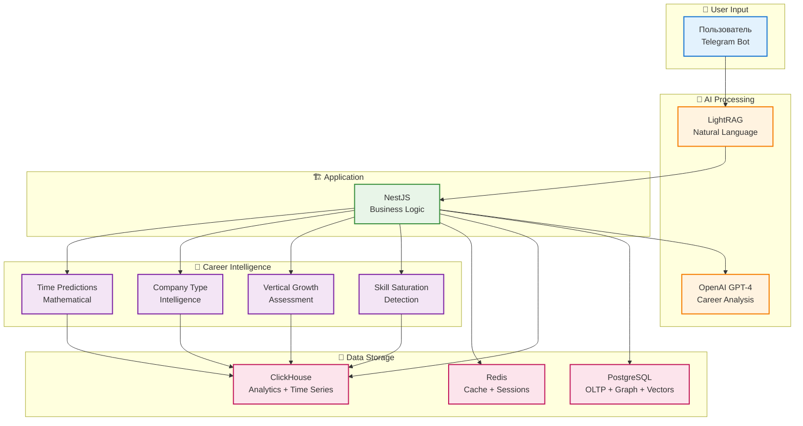

# 🎯 VAN Context Summary - Data-Driven Career Intelligence

## 📊 Обновленный контекст VAN

### **Архитектура системы**
- **Стек**: NestJS + OpenAI + LightRAG (PostgreSQL + Vector + Graph) + ClickHouse + Telegram Bot
- **Фокус**: Data-Driven Career Intelligence с математическими прогнозами
- **Уникальность**: Skill saturation detection + vertical growth analysis + company type intelligence

### **Ключевые теории интегрированы**
1. **Теория убывающей отдачи горизонтального роста** - определение момента переключения стратегии
2. **Теория трех осей карьерного роста** - Ширина → Глубина → Вертикаль
3. **Proven Responsibility Assessment** - results-based анализ management experience

### **Career Intelligence Features**
- **Skill Saturation Detection**: Algorithm для определения plateau в горизонтальном росте
- **Vertical Growth Assessment**: 4-факторный анализ готовности к leadership
- **Company Type Intelligence**: Series A/B/Enterprise promotion patterns
- **Mathematical Time Predictions**: UserFactor × TempoBucket × Paradigm algorithms

## 🔄 Потоки данных

## 📋 Data Requirements Analysis

### **Минимальный набор данных для MVP**

#### **User Context Data**
- **Профиль**: Навыки, опыт, локация, предпочтения
- **Skill Saturation**: Количество навыков, market utilization rate, salary progression
- **Vertical Readiness**: Technical credibility, proven responsibility, leadership motivation

#### **Target Context Data**
- **Целевые роли**: Описание роли, требования, временные рамки
- **Company Types**: Series A/B/Enterprise, industry sector, promotion patterns
- **Career Paths**: Промежуточные шаги, необходимые навыки, статистика успеха

#### **Avatar Data**
- **Истории успеха**: Полные рассказы о карьерных переходах
- **Career Paths**: Промежуточные этапы, временные рамки, satisfaction scores
- **Axis Progression**: Рост по ширине, глубине, вертикали

#### **Skills Data**
- **ESCO Framework**: 13,000+ стандартизированных навыков с иерархией
- **Dependencies**: Prerequisites и learning dependencies
- **Market Data**: Demand, utilization rates, salary impact

#### **Analytics Data**
- **Study Sessions**: Time series data для tempo analysis
- **Career Transitions**: Promotion attempts, success rates, timelines
- **Skill Completions**: Learning outcomes, time predictions validation

## 🎯 Готовность к следующему этапу

### **✅ VAN Phase Completed**
- **Архитектура валидирована**: NestJS + OpenAI + LightRAG + ClickHouse + Telegram Bot
- **Теории интегрированы**: Skill saturation + vertical growth + three axes theory
- **Data requirements определены**: Минимальный набор данных для career intelligence
- **Features спроектированы**: Skill saturation detection + vertical growth assessment

### **🚀 Ready for PLAN Phase**
- **Технические решения**: Все компоненты validated и ready к implementation
- **Data models**: Схемы данных определены для PostgreSQL + ClickHouse
- **AI integration**: LightRAG + OpenAI integration strategy готова
- **Career intelligence**: Алгоритмы спроектированы и готовы к реализации

### **📊 Next Steps**
1. **PLAN Phase**: Детальное планирование implementation
2. **IMPLEMENT Phase**: Реализация Data-Driven Career Intelligence
3. **QA Phase**: Тестирование и валидация career intelligence features

## 💡 Уникальная ценность WayMates

### **Data-Driven Career Intelligence**
- **Skill Dependencies Analysis**: Какие навыки действительно нужны ДО изучения цели
- **Company Type Intelligence**: В каких типах компаний realistic ваш рост
- **Vertical Growth Probability**: Математический расчет шансов на promotion
- **Experience-Based Readiness**: Что можно изучить vs что требует опыта работы
- **Statistical Evidence**: Каждый совет основан на анализе сотен случаев

### **Mathematical Foundation**
- **UserFactor × TempoBucket × Paradigm**: Персонализированные прогнозы времени
- **ESCO EU Standards**: Стандартизированная основа для time predictions
- **Statistical Validation**: ClickHouse analytics для continuous improvement
- **Confidence Scoring**: Метрики надежности для каждого прогноза

**Ready for PLAN Phase** 🎯

