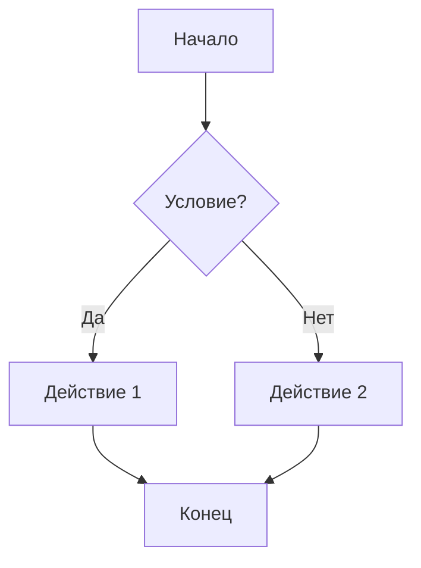
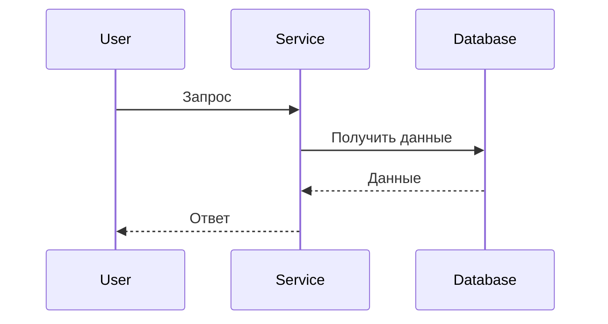

# Тестирование MCP-Mermaid

## Валидная диаграмма


## Невалидная диаграмма (незакрытая скобка)
```mermaid
graph TD
    A[Начало] --> B{Условие?}
    B -->|Да| C[Действие 1
    B -->|Нет| D[Действие 2]
    C --> E[Конец]
    D --> E
```

## Сложная диаграмма из проекта


