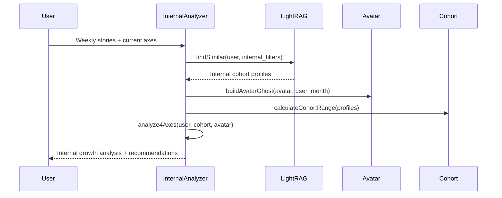
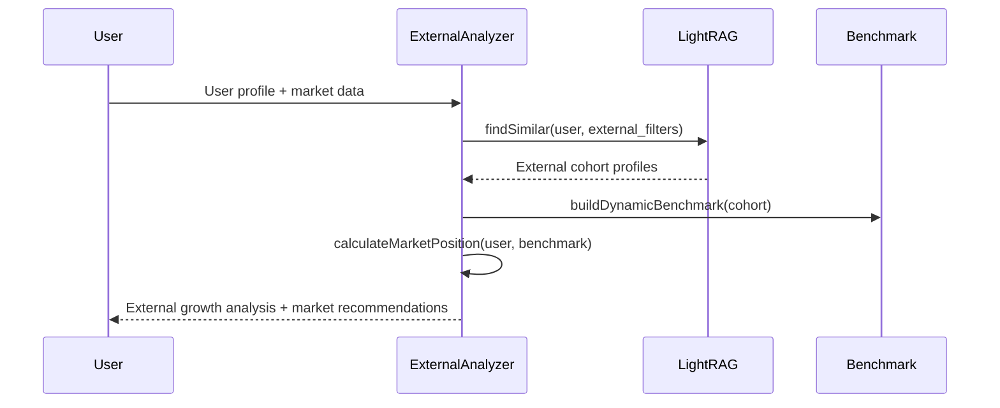
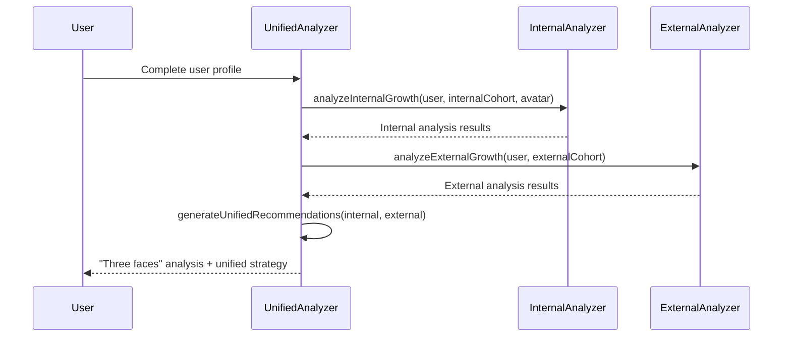

# WayMates Career Intelligence — Тест-план

## Обзор системы
1. **WayMates Career Intelligence** — революционная система двумерного карьерного анализа, объединяющая:
   - **Internal Growth** — 4-осевая модель развития внутри компании (широта, глубина, неформальное лидерство, формальная ответственность)
   - **External Growth** — динамический эталон рыночного позиционирования
2. Система использует **Avatar-driven навигацию** с динамическими "призраками" для показа конкретных примеров развития
3. **"Три лица" анализа**: пользователь, аватар, когорта — показывают текущую позицию, цель и диапазон нормы
4. **Контекстная чувствительность**: один пользователь получает разные рекомендации в зависимости от референтной группы

## Unit тестирование

### Internal Growth Analyzer (4-осевая модель)

#### 1. Расчет осей развития
- [ ] **Ось 1: Доменная широта (Individual)**
  - [ ] Анализ освоения новых технологических доменов
  - [ ] Подсчет уникальных областей (frontend, backend, devops, mobile)
  - [ ] Влияние сложности задач на оценку широты
  - [ ] Градация от 0 до 10 баллов

- [ ] **Ось 2: Доменная глубина (Individual)**
  - [ ] Анализ сложности решаемых задач
  - [ ] Определение задач "выше грейда" (Senior-задачи для Middle)
  - [ ] Влияние story points на оценку глубины
  - [ ] Связь с текущим role_level

- [ ] **Ось 3: Неформальное лидерство (Shared)**
  - [ ] Анализ помощи коллегам (quick_answer, detailed_help, mentoring)
  - [ ] Взвешивание по типу помощи (1x, 2x, 3x)
  - [ ] Учет продолжительности менторства
  - [ ] Связь с командной динамикой

- [ ] **Ось 4: Формальная ответственность (Official)**
  - [ ] Анализ официальных ролей (temporary_lead, official_lead)
  - [ ] Учет продолжительности ответственности
  - [ ] Связь с project ownership
  - [ ] Влияние на карьерный рост

#### 2. Avatar-driven навигация
- [ ] **Построение динамических "призраков"**
  - [ ] Live tracking данные (точная интерполяция)
  - [ ] Memory данные (приблизительная оценка)
  - [ ] Cohort усреднение (базовая оценка)
  - [ ] Source confidence levels

- [ ] **Алгоритм смены аватаров**
  - [ ] 3-месячный буфер для сезонных отклонений
  - [ ] Детекция persistent deviation
  - [ ] Подбор аватаров по velocity (more/less/similar ambitious)
  - [ ] Обработка завершения пути аватара

#### 3. Cohort анализ
- [ ] **Построение диапазонов нормы**
  - [ ] Расчет min/max/median по каждой оси
  - [ ] Очистка от выбросов
  - [ ] Статистическая валидность
  - [ ] Размер выборки (минимум 10-15 профилей)

### External Growth Analyzer (динамический эталон)

#### 1. Построение динамического эталона
- [ ] **Salary range анализ**
  - [ ] Расчет min/max/median зарплат
  - [ ] Процентильное распределение
  - [ ] Очистка от выбросов
  - [ ] Влияние location и company_type

- [ ] **Role distribution анализ**
  - [ ] Распределение по грейдам (junior/middle/senior/lead)
  - [ ] Progression speed (месяцы до promotion)
  - [ ] Market readiness indicators
  - [ ] Skill coverage requirements

#### 2. Market positioning
- [ ] **Расчет рыночной позиции**
  - [ ] Salary percentile относительно когорты
  - [ ] Skill market fit (покрытие требований)
  - [ ] Role progression readiness
  - [ ] Market segment context

### LightRAG Integration

#### 1. Поиск похожих профилей
- [ ] **Internal Growth поиск**
  - [ ] Фильтрация по company_type, team_size, role_level
  - [ ] Tech stack similarity
  - [ ] Domain context matching
  - [ ] Quality threshold (similarity > 0.7)

- [ ] **External Growth поиск**
  - [ ] Фильтрация по role_level, tech_stack, experience_years
  - [ ] Location-based matching
  - [ ] Market diversity (разные типы компаний)
  - [ ] Broader market coverage

#### 2. Source attribution
- [ ] **Трассировка источников данных**
  - [ ] user: собственные данные пользователя
  - [ ] cohort_memory: воспоминания похожих людей
  - [ ] cohort_live: отслеженные данные похожих людей
  - [ ] Profile ID traceability

### ClickHouse Analytics Integration

#### 1. ETL Pipeline Testing
- [ ] **Data Ingestion**
  - [ ] Синхронизация study_sessions из PostgreSQL
  - [ ] Конвертация типов данных (UUID->String, JSONB->Array)
  - [ ] Обработка null значений
  - [ ] Валидация данных

- [ ] **Data Quality**
  - [ ] Отклонение невалидных типов данных
  - [ ] Проверка целостности данных
  - [ ] Обработка ошибок ETL
  - [ ] Мониторинг data loss

#### 2. Analytical Queries Testing
- [ ] **Skill Saturation Analysis**
  - [ ] Детекция skill saturation (coefficient_variation < 0.3)
  - [ ] Расчет трендов прогресса навыков
  - [ ] Агрегация по пользователям и навыкам
  - [ ] Performance тестирование (<2s)

- [ ] **Career Analytics Aggregation**
  - [ ] Расчет cohort statistics (min/max/median)
  - [ ] Детекция outliers в данных
  - [ ] Quantile расчеты
  - [ ] Cross-user comparisons

#### 3. Performance Testing
- [ ] **Query Performance**
  - [ ] Execution time <2s для аналитических запросов
  - [ ] Concurrent queries (10+ одновременных)
  - [ ] Memory usage optimization
  - [ ] Large dataset handling (100k+ records)

- [ ] **Data Consistency**
  - [ ] PostgreSQL-ClickHouse consistency
  - [ ] Real-time sync validation
  - [ ] Data update handling
  - [ ] Referential integrity

#### 4. Business Logic Testing
- [ ] **Career Intelligence Algorithms**
  - [ ] Skill saturation score calculation
  - [ ] Vertical growth readiness detection
  - [ ] Market positioning analysis
  - [ ] Cohort benchmark building

## Integration тестирование

### 1. Dual Analysis Pipeline
- [ ] **Полный pipeline тестирования**
  - [ ] LightRAG поиск для Internal + External когорт
  - [ ] Internal Growth анализ с 4-осевой моделью
  - [ ] External Growth анализ с динамическим эталоном
  - [ ] Unified анализ с "тремя лицами"
  - [ ] Cross-analysis consistency

### 2. Context Manipulation Testing
- [ ] **Internal контекстная чувствительность**
  - [ ] High-performers vs struggling developers
  - [ ] Startup vs enterprise environments
  - [ ] Different team sizes and dynamics
  - [ ] Verdict changes based on cohort

- [ ] **External контекстная чувствительность**
  - [ ] BigTech vs startup salary ranges
  - [ ] Different market segments
  - [ ] Geographic variations
  - [ ] Market position changes

### 3. Benchmark Evolution Testing
- [ ] **Internal benchmark evolution**
  - [ ] Добавление новых пользователей в когорту
  - [ ] Изменение median values по осям
  - [ ] Stability score calculation
  - [ ] Participant ID tracking

- [ ] **External benchmark evolution**
  - [ ] Market data updates
  - [ ] Salary range shifts
  - [ ] Role distribution changes
  - [ ] Progression speed updates

## Scenario тестирование

### 1. Cold Start Scenarios
- [ ] **Недостаточно данных для персонализации**
  - [ ] Fallback к общим рекомендациям
  - [ ] Google/Habr/LinkedIn альтернативы
  - [ ] ChatGPT базовые советы
  - [ ] Progressive data collection

### 2. Edge Cases
- [ ] **"Суперзвезда" — быстрый рост**
  - [ ] Опережение аватара на 6+ месяцев
  - [ ] Поиск более амбициозного аватара
  - [ ] Velocity adjustment
  - [ ] New path recommendations

- [ ] **"Застрял" — долгая стагнация**
  - [ ] Отставание от аватара 6+ месяцев
  - [ ] Предложение менее амбициозного аватара
  - [ ] Смена работы рекомендации
  - [ ] Root cause analysis

- [ ] **Смена роли внутри компании**
  - [ ] MVP подход: полный сброс осей
  - [ ] Data collection для будущих ML моделей
  - [ ] Honest zero vs inaccurate math
  - [ ] User expectation management

- [ ] **Нет подходящих аватаров**
  - [ ] Confidence < 60% threshold
  - [ ] Расширение критериев поиска
  - [ ] Синтетический аватар из нескольких профилей
  - [ ] Honest limitation acknowledgment

- [ ] **Мульти-трековое развитие**
  - [ ] Tech Lead vs Engineering Manager
  - [ ] Dual track analysis
  - [ ] Focus decision points
  - [ ] Priority recommendations

- [ ] **Токсичная среда или выгорание**
  - [ ] Negative indicators detection
  - [ ] Environment vs personal issues
  - [ ] Market comparison analysis
  - [ ] Job change recommendations

## Regression тестирование

### 1. API Stability
- [ ] **Endpoint consistency**
  - [ ] Internal Growth API responses
  - [ ] External Growth API responses
  - [ ] Unified analysis format
  - [ ] Error handling consistency

### 2. Data Quality
- [ ] **Source attribution accuracy**
  - [ ] Profile ID traceability
  - [ ] Data freshness validation
  - [ ] Confidence score accuracy
  - [ ] Benchmark stability

### 3. Performance
- [ ] **Response time consistency**
  - [ ] LightRAG query performance
  - [ ] Analysis calculation speed
  - [ ] Memory usage optimization
  - [ ] Concurrent user handling

## Диаграммы

### Internal Growth Analysis Flow

### External Growth Analysis Flow

### Unified Analysis Flow

## Метрики качества

### 1. Test Coverage
- [ ] **Unit tests**: >90% code coverage
- [ ] **Integration tests**: All critical paths
- [ ] **Scenario tests**: All edge cases
- [ ] **Performance tests**: Response time <2s
- [ ] **ClickHouse tests**: All analytical queries covered

### 2. Data Quality Metrics
- [ ] **Source attribution accuracy**: >95%
- [ ] **Profile ID traceability**: 100%
- [ ] **Benchmark stability**: >0.8 score
- [ ] **Context sensitivity**: Verifiable different recommendations

### 3. User Experience Metrics
- [ ] **Recommendation relevance**: User feedback >4.0/5.0
- [ ] **Avatar alignment**: >80% users find avatars helpful
- [ ] **Context awareness**: >90% users see different advice in different contexts
- [ ] **Actionability**: >85% users can act on recommendations

---

**Статус**: Готов к реализации  
**Последнее обновление**: 11.09.2025  
**Следующий этап**: Phase 1A - Dual Analysis Testing Implementation
