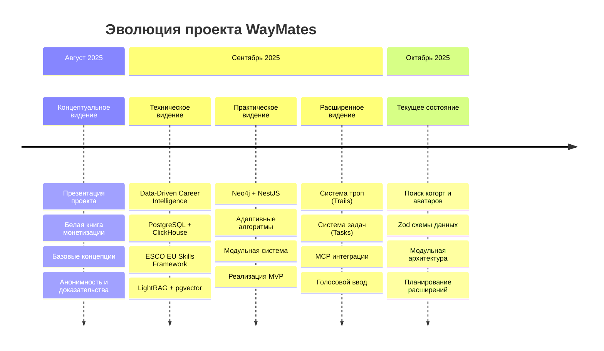

# 📈 Timeline развития проекта WayMates

## Mermaid диаграмма эволюции проекта



## 🎯 **Этапы видения проекта**

### **Этап 1: Концептуальное видение (август 2025)**
```
Проблема → Решение → Монетизация
    ↓         ↓         ↓
IT-специалисты → Платформа → Ценностная цепочка
не знают как    поиска      (рассказчики →
развиваться     похожих     слушатели →
дальше          людей       платформа)
```

### **Этап 2: Техническое видение (сентябрь 2025)**
```
Data-Driven Career Intelligence
    ↓
PostgreSQL + ClickHouse + ESCO EU Skills
    ↓
LightRAG + pgvector + Natural Language Queries
    ↓
Career Intelligence Engine
```

### **Этап 3: Практическое видение (сентябрь 2025)**
```
Простая архитектура (Neo4j + NestJS)
    ↓
Адаптивные алгоритмы поиска
    ↓
Модульная система (когорты → аватары → тропы)
    ↓
Реализация MVP
```

### **Этап 4: Расширенное видение (сентябрь 2025)**
```
Система троп (Trails) + Система задач (Tasks)
    ↓
MCP интеграции + Голосовой ввод
    ↓
Автоматизация сбора данных
    ↓
Полнофункциональная платформа
```

## 🚀 **Варианты реализации**

### **Вариант 1: Минимальный MVP (текущий)**
- ✅ Поиск когорт и аватаров
- ✅ Базовые схемы данных (Zod)
- ✅ Neo4j интеграция
- ✅ Простые алгоритмы матчинга

### **Вариант 2: Расширенный MVP**
- 🔄 Система троп (Trails)
- 🔄 Система задач (Tasks)
- 🔄 ESCO EU Skills интеграция
- 🔄 Голосовой ввод

### **Вариант 3: Полнофункциональная платформа**
- ⏸️ MCP интеграции (n8n + Telegram)
- ⏸️ LightRAG + PostgreSQL
- ⏸️ Mathematical Time Predictions
- ⏸️ ClickHouse analytics

## 📊 **Матрица приоритетов**

| Фича | Ценность | Сложность | Время | Приоритет |
|------|----------|-----------|-------|-----------|
| ESCO EU Skills | ⭐⭐⭐⭐⭐ | ⭐⭐⭐ | 3 недели | 🔥 Высокий |
| Голосовой ввод | ⭐⭐⭐⭐ | ⭐⭐⭐ | 6 недель | 🔥 Высокий |
| Система троп | ⭐⭐⭐⭐⭐ | ⭐⭐⭐ | 8 недель | 🔥 Высокий |
| MCP Server | ⭐⭐⭐ | ⭐⭐ | 3 недели | ⚡ Средний |
| Система задач | ⭐⭐⭐⭐ | ⭐⭐⭐ | 8 недель | ⚡ Средний |
| LightRAG | ⭐⭐⭐⭐ | ⭐⭐⭐⭐⭐ | 12 недель | ❄️ Низкий |
| Time Predictions | ⭐⭐⭐ | ⭐⭐⭐⭐⭐ | 16 недель | ❄️ Низкий |

## 🎯 **Ключевые выводы**

1. **Проект эволюционировал** от сложных концепций к практичным решениям
2. **Много ценных идей** остались нереализованными
3. **Фокус на быстрых победах** - ESCO Skills и голосовой ввод
4. **Постепенное усложнение** - от MVP к полной платформе
5. **Избежание overengineering** - практичный подход к развитию

