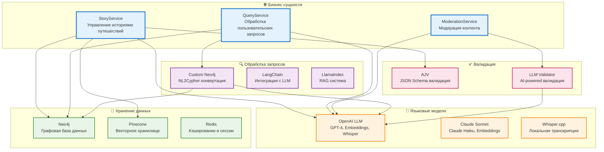
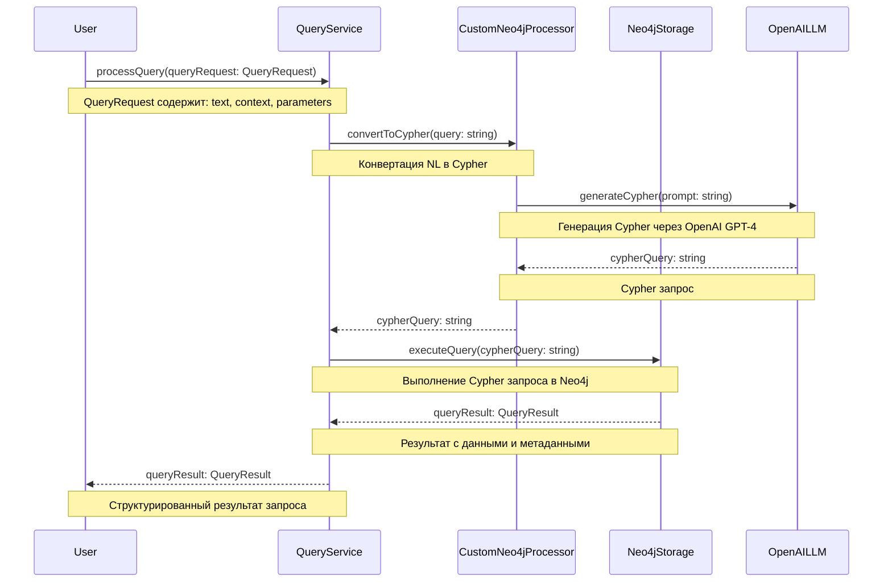

# 🏗️ WayMates Architecture Overview

## ✅ FINALIZED MVP ARCHITECTURE

### **🔧 Service-based Terminology (зафиксировано)**
```typescript
Interactive Casting Service ↔ Automated Casting Service    (Workflow Services)
Expand Search Service ↔ Narrow Search Service              (Search Services)
```

### **📊 MVP Technology Stack**
```typescript
const MVP_STACK = {
  backend: 'NestJS + TypeScript',
  database: 'Neo4j (graph + vectors)', 
  ranking: 'mcdm-js library',
  ai: 'LangGraph workflows',
  interface: 'Telegram Bot API',
  
  // Архитектурные возможности
  ranking_methods: ['TOPSIS', 'VIKOR', 'PROMETHEE', 'SimpleWeighted'],
  search_strategies: ['ExpandSearch', 'NarrowSearch'], 
  casting_approaches: ['Interactive', 'Automated'],
};
```

## 📚 Terminology & Data Types

### **Core Business Services**
- **AuthorRankingService** - сервис ранжирования авторов с MCDM поддержкой
- **InteractiveCastingService** - сервис интерактивного "кастинга" авторов
- **AutomatedCastingService** - сервис автоматического подбора авторов  
- **ExpandSearchService** - сервис расширяющего поиска (узко → широко)
- **NarrowSearchService** - сервис сужающего поиска (широко → узко)

### **Interface Nodes (Полиморфные компоненты)**
- **ILLMNode** - интерфейс обработки языковых моделей
- **IStorageNode** - интерфейс хранения данных
- **IValidatorNode** - интерфейс валидации
- **IRetrievalNode** - интерфейс поиска и извлечения
- **IQueryProcessorNode** - интерфейс обработки запросов

### **Data Types (Типы данных)**
- **StoryInput** - входные данные для создания истории (текст, метаданные, контекст)
- **Story** - полная история путешествия с информацией
- **QueryRequest** - запрос пользователя (текст, контекст, параметры)
- **QueryResult** - результат обработки запроса
- **ValidationResult** - результат валидации

## 🎯 Architecture Principles

### Dependency Inversion Principle
```
Business Services → Interface Nodes ← Implementation Providers
```

**Бизнес-сервисы зависят только от интерфейсов, реализации инжектятся через DI контейнер**

## 📊 High-Level Architecture

### **Бизнес-сущности и их технические имплементации**



### **Что скрывается под каждым бизнес-процессом:**

#### **📖 StoryService - Управление историями**
- **Технические процессы**: 
  - LLM обработка текста (OpenAI GPT-4)
  - Создание эмбеддингов (OpenAI text-embedding-ada-002)
  - Сохранение в граф (Neo4j)
  - Векторная индексация (Pinecone)
  - Валидация через JSON Schema (AJV)

#### **🔍 QueryService - Обработка запросов**
- **Технические процессы**:
  - NL2Cypher конвертация (Custom Neo4j + LLM)
  - Выполнение Cypher запросов (Neo4j)
  - Семантический поиск (Pinecone + эмбеддинги)
  - RAG (Retrieval Augmented Generation)

#### **🛡️ ModerationService - Модерация контента**
- **Технические процессы**:
  - AI-powered валидация (OpenAI GPT-4)
  - Проверка безопасности контента
  - Автоматическая модерация
  - Логирование нарушений


## 🏗️ Architecture Layers

### 1. **Business Services Layer (Слой бизнес-сервисов)**
- `StoryService` - управление историями путешествий
- `QueryService` - обработка пользовательских запросов
- `ModerationService` - модерация контента

### 2. **Technical Implementation Layer (Слой технических имплементаций)**
- **LLM**: OpenAI GPT-4, Claude Sonnet, Whisper.cpp
- **Storage**: Neo4j, Pinecone, Redis
- **Validation**: AJV, LLM-powered
- **Processing**: Custom Neo4j, LangChain, LlamaIndex

### 3. **Integration Layer (Слой интеграции)**

#### **Как компоненты взаимодействуют**
- **StoryService** использует **OpenAI** для обработки текста, **Neo4j** для хранения, **Pinecone** для поиска
- **QueryService** использует **Custom Neo4j** для NL2Cypher, **OpenAI** для генерации запросов
- **ModerationService** использует **LLM Validator** с **OpenAI** для AI-powered валидации

#### **Технические связи**
- **OpenAI** → **Neo4j** (сохранение обработанных данных)
- **Custom Neo4j** → **OpenAI** (генерация Cypher запросов)
- **LLM Validator** → **OpenAI** (валидация контента)

### 4. **Infrastructure Layer (Слой инфраструктуры)**
- **NestJS DI Container** - автоматическое управление зависимостями
- **Модульная архитектура** - разделение на Core, Business, API слои

## 🔌 Technical Implementation Details

### Как работают технические компоненты

```mermaid
graph TB
    subgraph "🌐 Бизнес-сущности"
        StoryService[StoryService<br/>Управление историями]
        QueryService[QueryService<br/>Обработка запросов]
        ModerationService[ModerationService<br/>Модерация]
    end
    
    subgraph "🧠 LLM компоненты"
        OpenAILLM[OpenAI<br/>GPT-4, Embeddings]
        SonnetLLM[Claude<br/>Sonnet, Haiku]
        WhisperLLM[Whisper.cpp<br/>Локальная транскрипция]
    end
    
    subgraph "💾 Хранение"
        Neo4jStorage[Neo4j<br/>Графовая БД]
        VectorStorage[Pinecone<br/>Векторы]
        RedisStorage[Redis<br/>Кэш]
    end
    
    subgraph "✅ Валидация"
        AJVValidator[AJV<br/>JSON Schema]
        LLMValidator[LLM<br/>AI валидация]
    end
    
    subgraph "🔍 Обработка"
        CustomNeo4jProcessor[Custom Neo4j<br/>NL2Cypher]
        LangChainProcessor[LangChain<br/>LLM интеграция]
        LlamaIndexProcessor[LlamaIndex<br/>RAG]
    end
    
    %% Прямые связи бизнес-сущностей с техническими компонентами
    StoryService --> OpenAILLM
    StoryService --> Neo4jStorage
    StoryService --> VectorStorage
    StoryService --> AJVValidator
    
    QueryService --> CustomNeo4jProcessor
    QueryService --> OpenAILLM
    QueryService --> Neo4jStorage
    
    ModerationService --> LLMValidator
    ModerationService --> OpenAILLM

    


    
    %% Service Interfaces to Concrete Implementations
    ILLMService -.-> OpenAILLM
    ILLMService -.-> SonnetLLM
    
    IStorageService -.-> Neo4jStorage
    IStorageService -.-> VectorStorage
    
    IValidatorService -.-> AJVValidator
    IValidatorService -.-> LLMValidator
    

    
    IQueryProcessorService -.-> CustomNeo4jProcessor
    IQueryProcessorService -.-> LangChainProcessor
    IQueryProcessorService -.-> LlamaIndexProcessor
    
    %% Styling
    classDef businessService fill:#e3f2fd,stroke:#1976d2,stroke-width:2px
    classDef serviceInterface fill:#f3e5f5,stroke:#7b1fa2,stroke-width:2px


## 🔄 Data Flow Example

### Story Creation Flow

```mermaid
sequenceDiagram
    participant User
    participant StoryService
    participant OpenAILLM
    participant Neo4jStorage
    participant AJVValidator
    
    User->>StoryService: createStory(storyInput: StoryInput)
    Note over User,StoryService: StoryInput содержит: text, metadata, context
    
    StoryService->>OpenAILLM: processText(text: string)
    Note over StoryService,OpenAILLM: Обработка текста через OpenAI GPT-4
    
    OpenAILLM-->>StoryService: processedText: string
    Note over OpenAILLM,StoryService: Обработанный и структурированный текст
    
    StoryService->>AJVValidator: validateStory(story: Story)
    Note over StoryService,AJVValidator: Валидация через JSON Schema
    
    AJVValidator-->>StoryService: validationResult: ValidationResult
    Note over AJVValidator,StoryService: Результат валидации с ошибками/предупреждениями
    
    StoryService->>Neo4jStorage: storeStory(story: Story)
    Note over StoryService,Neo4jStorage: Сохранение в Neo4j
    
    Neo4jStorage-->>StoryService: storyId: string
    Note over Neo4jStorage,StoryService: Уникальный идентификатор истории
    
    StoryService-->>User: story: Story
    Note over StoryService,User: Полная история с ID и метаданными
```

### Query Processing Flow



## 🎯 MCDM Ranking Architecture (финализировано)

### **DI-based MCDM Services**

```typescript
// Интерфейс для всех MCDM методов
interface MCDMService {
  rank(authors: Author[], criteria: Criteria[]): RankedAuthor[];
}

// Реализации разных методов (все одинаково просто с mcdm-js!)
@Injectable()
export class TopsisService implements MCDMService {
  rank(authors: Author[], criteria: Criteria[]): RankedAuthor[] {
    const topsis = new TOPSIS();
    return topsis.rank(this.authorsToMatrix(authors), criteria);
  }
}

@Injectable()
export class VikorService implements MCDMService {
  rank(authors: Author[], criteria: Criteria[]): RankedAuthor[] {
    const vikor = new VIKOR();
    return vikor.rank(this.authorsToMatrix(authors), criteria);
  }
}

// Переключение методов = 1 строчка в конфиге!
@Module({
  providers: [
    {
      provide: 'MCDMService',
      useClass: TopsisService,        // ← Меняем здесь
    },
  ],
})
```

### **Search Services Architecture**

```typescript
@Injectable()
export class ExpandSearchService implements SearchService {
  async search(context: UserContext): Promise<Author[]> {
    // Начинаем узко → расширяем если мало результатов
    let results = await this.neo4j.strictSearch(context);
    if (results.length < 5) {
      results = await this.neo4j.skillsOnlySearch(context);
    }
    if (results.length < 5) {
      results = await this.neo4j.broadSearch(context);
    }
    return results;
  }
}

@Injectable()
export class NarrowSearchService implements SearchService {
  async search(context: UserContext): Promise<Author[]> {
    // Начинаем широко → сужаем до оптимального количества
    let results = await this.neo4j.broadSearch(context);
    while (results.length > 20) {
      results = await this.applyAdditionalFilters(results);
    }
    return results.slice(0, 15);
  }
}
```

### **Casting Services Architecture**

```typescript
@Injectable()
export class InteractiveCastingService implements CastingService {
  async cast(authors: Author[], context: UserContext): Promise<CastingResult> {
    const selectedAuthors = [];
    
    for (const author of authors) {
      // Пользователь "примеряет" контекст автора
      const contextFeedback = await this.bot.askUser(
        `Подходят ли вам обстоятельства автора ${author.name}?`
      );
      
      if (contextFeedback.relevant) {
        const storyFeedback = await this.bot.askUser(
          `Что из истории ${author.name} готовы перенять?`
        );
        selectedAuthors.push({ ...author, userInsights: storyFeedback });
      }
    }
    
    return { selectedAuthors };
  }
}

@Injectable()
export class AutomatedCastingService implements CastingService {
  async cast(authors: Author[], context: UserContext): Promise<CastingResult> {
    const contextMatches = await this.ai.matchContexts(authors, context);
    const storyAnalysis = await this.ai.analyzeStories(contextMatches);
    const hybridPlan = await this.ai.synthesizePlan(storyAnalysis, context);
    
    return {
      selectedAuthors: contextMatches,
      hybridPlan,
      explanation: "AI проанализировал контексты и истории"
    };
  }
}
```

## ⚡ Архитектурные преимущества

### **1. Быстрое переключение MCDM методов:**
```typescript
// Смена метода = 1 строчка
export const RANKING_CONFIG = {
  method: 'TOPSIS',  // было: 'SIMPLE_WEIGHTED'
};
```

### **2. A/B тестирование методов:**
```typescript
@Injectable()
export class RankingExperimentService {
  async compareAllMethods(authors: Author[]): Promise<ComparisonResult> {
    const results = await Promise.all([
      this.topsis.rank(authors, criteria),
      this.vikor.rank(authors, criteria), 
      this.simple.rank(authors, criteria),
    ]);
    return this.analyzeResults(results);
  }
}
```

### **3. Все методы реализуются за 5-10 минут:**
```typescript
// Добавление нового метода = 5 минут
@Injectable()
export class PrometheeService implements MCDMService {
  rank(authors: Author[], criteria: Criteria[]): RankedAuthor[] {
    const promethee = new PROMETHEE_II();
    return promethee.rank(this.authorsToMatrix(authors), criteria);
  }
}
```

## 🚀 MVP Implementation Plan

### **Phase 1: Core Architecture (1 день)**
- Setup NestJS DI containers
- Implement MCDMService interface  
- Implement SearchService interface
- Implement CastingService interface
- Basic Telegram bot setup

### **Phase 2: MVP Services (1-2 дня)**
- TopsisService (5 минут с mcdm-js)
- ExpandSearchService 
- InteractiveCastingService
- Basic Neo4j integration

### **Phase 3: Testing & A/B (1 день)**
- Add VikorService (5 минут)
- Add SimpleWeightedService (5 минут)  
- A/B test ranking methods
- Choose best performing method

## ⏭️ Ready for Creative Mode

**Единственный компонент требующий творческой проработки:**

**Telegram Bot Interactive Casting Service Flow** - как спроектировать интуитивные диалоги для "примерки контекстов" авторов с поддержкой Expand/Narrow Search Service стратегий.
