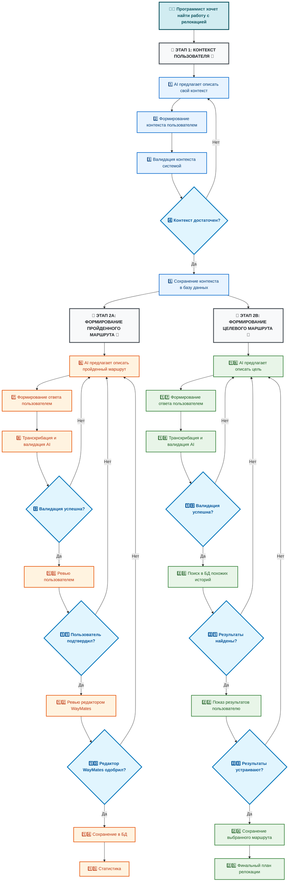

# 🌍 Level 1: System Context & Business Workflow

## 📊 WayMates Business Process Flow

### 📋 Справочник номеров шагов:

**Этап 1A: Сбор данных пользователя**
- [1] AI предлагает описать свой контекст
- [2] Формирование контекста пользователем
- [3] Валидация контекста системой
- [4] Контекст достаточен?
- [5] Сохранение контекста в базу данных
- [6] AI предлагает описать свой пройденный маршрут
- [7] Рассказ о пройденном опыте
- [8] OpenAI GPT-4 транскрибация и анализ
- [9] Валидация успешна?
- [10] Редакторы WayMates экспертная проверка
- [11] Редакторы одобряют?
- [12] Финальное подтверждение пользователем
- [13] Пользователь подтверждает?
- [14] Сохранение пройденного пути в базу данных
- [15] Статистика топ пользователей

**Этап 2: Формирование цели с помощью AI поиском по БД**
- [16] AI предлагает описать/изменить цель
- [17] Формирование цели пользователем
- [18] OpenAI GPT-4 валидация цели
- [19] Валидация прошла?
- [20] Поиск в БД похожих историй
- [21] Результаты найдены?
- [22] Показ результатов пользователю
- [23] Результаты устраивают?
- [24] Сохранение выбранного маршрута как план-цель
- [25] Финальный план релокации

**Этап доуточнения (универсальный)**
- [26] Анализ пробелов в информации
- [27] OpenAI GPT-4 генерация умных вопросов
- [28] Ответы пользователя



## 🎯 Описание бизнес-процессов

### **📖 Этап 1A: Сбор данных пользователя**

#### **Входные данные:**
- Пользователь с желанием релоцироваться

#### **Процессы:**

**Сбор контекста (шаги 1-5):**
1. **AI предлагает описать контекст** → запрос информации о навыках, опыте, ограничениях
2. **Формирование контекста** → пользователь описывает свой текущий контекст
3. **Валидация контекста** → система проверяет достаточность для поиска цели
4. **Проверка полноты** → контекст достаточен для дальнейшей работы?
5. **Сохранение контекста** → сохранение в базу данных для поиска маршрутов

**Сбор пройденного пути - опционально (шаги 6-15):**
6. **AI предлагает описать пройденный маршрут** → для помощи другим пользователям
7. **Рассказ о пройденном опыте** → детальная история карьеры
8. **Транскрибация и анализ** → обработка аудио/текста
9. **Валидация** → проверка цельности истории
10. **Экспертная проверка** → редакторы WayMates проверяют качество
11. **Одобрение редакторов** → экспертная оценка
12. **Подтверждение пользователем** → финальное согласие
13. **Подтверждение пользователя** → окончательное одобрение
14. **Сохранение пройденного пути** → запись истории в базу
15. **Статистика** → сравнение с топ пользователями

#### **Выходные данные:**
- **Обязательно**: Контекст пользователя для поиска целей
- **Опционально**: Структурированная история пройденного пути для других пользователей

### **🎯 Этап 2: Формирование цели с помощью AI поиском по БД**

#### **Входные данные:**
- Контекст пользователя из этапа 1A (шаг 5)
- Описание цели релокации (текст/аудио)

#### **Процессы (циклические):**
16. **AI предлагает описать/изменить цель** → Универсальный запрос (первый раз или корректировка)
17. **Формирование цели** → Пользователь описывает цель релокации
18. **Валидация цели** → OpenAI GPT-4 проверяет корректность цели
19. **Валидация прошла?** → Если НЕТ → возврат к шагу 16

20. **Поиск в БД** → Система ищет похожие истории в базе данных
21. **Результаты найдены?** → Проверка наличия совпадений
22. **Показ результатов** → Демонстрация найденных маршрутов пользователю
23. **Результаты устраивают?** → Пользователь оценивает подходящие маршруты

**Циклические возвраты к шагу 16:**
- **Если результатов НЕТ (шаг 21)** → AI находит совпадения с более широким запросом
- **Если результаты НЕ устраивают (шаг 23)** → пользователь обдумывает что изменить в запросе

**Если результаты устраивают:**
24. **Сохранение выбранного маршрута как план-цель** → Запись в БД связи пользователя с выбранным маршрутом
25. **Финальный план** → Готовый план релокации с выбранным маршрутом

#### **Выходные данные:**
- Финальный план релокации с выбранным маршрутом
- Список пруфов для изучения (story_id) из выбранного маршрута
- Временные рамки и затраты с обоснованием
- Конкретные шаги для реализации плана

### **🔄 Этап доуточнения (универсальный)**

#### **Функции:**
1. **Анализ пробелов** → Определение недостающей информации
2. **Приоритизация** → Выявление критически важных данных
3. **Персонализация** → Формирование вопросов под контекст пользователя
4. **Генерация** → Создание умных, наводящих вопросов

#### **Применение:**
- На этапе 1A (шаги 26-28): Доуточнение контекста и пройденного опыта  
- На этапе 2 (возвраты к шагу 16): Корректировка целей на основе результатов поиска

## 🔄 Ключевые особенности workflow

### **1. Итеративность с обратной связью**
Система анализирует результаты поиска и предлагает разные стратегии:
- При отсутствии совпадений → автоматическое расширение окна поиска, затем предложение кардинально изменить цель
- При неподходящих совпадениях → анализ причин неудовлетворенности и корректировка условий

### **2. AI-инициированное планирование**
AI начинает процесс с вопроса о цели, затем интерактивно помогает пользователю корректировать запрос для получения лучших результатов

### **3. Контекстность**
Система учитывает реальный опыт других пользователей через поиск похожих историй

### **4. Персонализация**
План адаптируется под конкретные ограничения пользователя на основе его профиля

### **5. Адаптивный поиск**
При отсутствии точных совпадений система автоматически расширяет критерии поиска перед предложением изменить цель

### **6. Адаптивный анализ отказов**
AI анализирует причины неудовлетворенности результатами и предлагает разные стратегии коррекции

### **7. Обоснованность**
Каждая рекомендация подкреплена данными из базы историй (story_id)

## 💡 Технические решения

### **AI/ML компоненты:**
- **OpenAI GPT-4** → анализ, генерация, валидация
- **OpenAI Whisper** → транскрибация аудио  
- **OpenAI Embeddings** → векторизация для поиска похожих историй

### **Хранение данных:**
- **Neo4j** → единая БД для графов и векторных индексов
- **Граф связей** → пользователи, навыки, страны, компании, временные рамки
- **Векторные индексы** → семантический поиск по историям

### **Уникальность подхода:**
- **NL2Cypher** → естественные вопросы превращаются в точные запросы к графу
- **Контекстный анализ** → сравнение пользователя с базой успешных релокаций
- **Риск-анализ** → предупреждение о потенциальных проблемах на основе данных
- **MCP Integration** → LLM напрямую обращается к базе через Context7 для поиска пруфов

## 📊 MVP Аналитика по пройденному пути

### **Статистика, которую можем выдать пользователю:**

#### **🎯 Карьерная траектория**
- Сравнение темпов роста с другими программистами
- Средние сроки достижения текущего уровня в индустрии
- Топ-3 самых ценных навыка в вашем профиле

#### **🌍 Релокационный потенциал**
- Процент успешных релокаций с похожим бэкграундом
- Топ-5 стран, куда чаще всего едут с вашими навыками
- Средние зарплатные ожидания для вашего профиля

#### **⚠️ Зоны риска**
- Навыки, которых не хватает для целевых позиций
- Типичные препятствия для программистов с похожим опытом
- Рекомендации по усилению профиля

### **Запросы, на которые сможем отвечать через MCP:**

#### **Поисковые запросы:**
```
"Найди программистов с опытом React, которые релоцировались в Германию"
"Покажи сроки получения Blue Card для JavaScript разработчиков"
"Какие компании чаще спонсируют визы для Python программистов?"
```

#### **Аналитические запросы:**
```
"Сравни мой опыт с успешными кейсами релокации в Канаду"
"Покажи риски для программистов без высшего образования в IT"
"Какие языки программирования дают больше шансов на релокацию?"
```

#### **Процесс работы MCP:**
1. **LLM получает вопрос** от пользователя
2. **Обращается к Neo4j** через Context7 MCP
3. **Находит релевантные story_id** с похожими контекстами
4. **Добавляет данные в контекст** LLM
5. **Формирует ответ с пруфами**: "По данным 15 историй (story_id: 23, 45, 67...), программисты с опытом React..."
6. **Предлагает изучить пруфы**: "Хотите ознакомиться с историями John (story_id: 23) и Maria (story_id: 45)?"

### **Ценность уже на MVP:**
- **Бенчмаркинг** → понимание своего места в индустрии
- **Реалистичные ожидания** → корректировка планов на основе данных
- **Персонализированные советы** → рекомендации на основе похожих кейсов
- **Proof of concept** → демонстрация уникальности подхода WayMates
