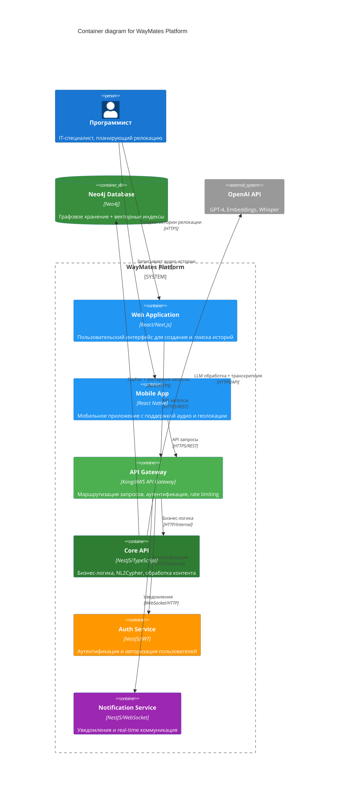

# 🏗️ Level 2: Container Diagram

## 📊 WayMates Container Architecture



## 🏗️ Контейнеры системы

### **Frontend Containers**

#### **Web Application (React/Next.js)**
- **Технологии**: React 18, Next.js 14, TypeScript, Tailwind CSS
- **Функции**:
  - Создание и редактирование историй
  - Интерактивный поиск с NL2Cypher
  - Визуализация маршрутов на картах
  - Управление профилем пользователя
- **Особенности**:
  - Server-side rendering для SEO
  - Progressive Web App возможности
  - Responsive design для всех устройств

#### **Mobile App (React Native)**
- **Технологии**: React Native, Expo, TypeScript
- **Функции**:
  - Запись аудио историй
  - GPS трекинг маршрутов
  - Offline режим для чтения историй
  - Push уведомления
- **Особенности**:
  - Нативная интеграция с камерой и микрофоном
  - Геолокация в реальном времени
  - Синхронизация с веб-версией

### **API Layer Containers**

#### **API Gateway (Kong/AWS API Gateway)**
- **Функции**:
  - Маршрутизация запросов между сервисами
  - Rate limiting и throttling
  - API ключи и аутентификация
  - Логирование и мониторинг
  - CORS и security headers
- **Паттерны**: Gateway Aggregation, Gateway Routing

#### **Core API (NestJS)**
- **Архитектура**: Модульная архитектура NestJS
- **Ключевые модули**:
  - **Stories Module**: управление историями
  - **Query Module**: NL2Cypher обработка
  - **Moderation Module**: валидация контента
  - **Integration Module**: работа с внешними API
- **Паттерны**: DI Container, Repository, Strategy

#### **Auth Service (NestJS/JWT)**
- **Функции**:
  - JWT токены и refresh tokens
  - OAuth2 интеграция (Google, Facebook)
  - Role-based access control (RBAC)
  - Password reset и email verification
- **Security**: bcrypt, helmet, rate limiting

#### **Notification Service (NestJS/WebSocket)**
- **Функции**:
  - Real-time уведомления
  - Email уведомления
  - Push notifications для мобильных
  - Event-driven архитектура
- **Технологии**: WebSocket, Redis Pub/Sub, SendGrid

### **Data Layer Containers**

#### **Neo4j Database (AuraDB)**
- **Схема данных**:
  ```cypher
  // Основные узлы
  (:Story {title, content, created_at, author_id})
  (:Place {name, coordinates, country, city})
  (:Person {name, email, profile})
  (:Event {name, date, description})
  
  // Связи
  (:Story)-[:HAPPENED_AT]->(:Place)
  (:Story)-[:MENTIONS]->(:Person)
  (:Story)-[:DESCRIBES]->(:Event)
  (:Place)-[:LOCATED_IN]->(:Place)
  ```

#### **Vector Database (Pinecone)**
- **Индексы**:
  - story_embeddings: эмбеддинги историй (1536 dim)
  - place_embeddings: эмбеддинги мест (1536 dim)
  - user_preferences: векторы предпочтений пользователей
- **Namespace strategy**: по языкам и категориям

#### **Cache (Redis)**
- **Структуры данных**:
  - Hash: пользовательские сессии
  - List: recent searches, популярные истории
  - Set: user preferences, blocked content
  - Pub/Sub: real-time уведомления
- **TTL**: 1 час для API responses, 24 часа для user sessions

#### **File Storage (AWS S3)**
- **Buckets**:
  - `waymates-images`: фотографии историй
  - `waymates-audio`: аудио записи
  - `waymates-assets`: статические файлы
- **CDN**: CloudFront для быстрой доставки контента

## 🔄 Основные потоки данных

### **1. Story Creation Flow**
```
Mobile App → API Gateway → Core API → OpenAI (processing) → Neo4j + Vector DB + S3
```

### **2. Search Query Flow**
```
Web App → API Gateway → Core API → NL2Cypher → Neo4j + Vector DB → Results
```

### **3. Real-time Notifications**
```
Core API → Notification Service → Redis Pub/Sub → WebSocket → Frontend
```

### **4. Authentication Flow**
```
Frontend → API Gateway → Auth Service → JWT Token → Redis (session) → Response
```

## 🚀 Deployment Architecture

### **Container Orchestration**
- **Platform**: Kubernetes (EKS/AKS/GKE)
- **Service Mesh**: Istio для service-to-service communication
- **Config Management**: ConfigMaps и Secrets

### **Scaling Strategy**
- **Horizontal Pod Autoscaler** для Core API
- **Vertical scaling** для баз данных
- **CDN caching** для статического контента
- **Read replicas** для Neo4j при необходимости

### **Monitoring & Observability**
- **Metrics**: Prometheus + Grafana
- **Logging**: ELK Stack (Elasticsearch, Logstash, Kibana)
- **Tracing**: Jaeger для distributed tracing
- **Health checks**: Kubernetes liveness/readiness probes
