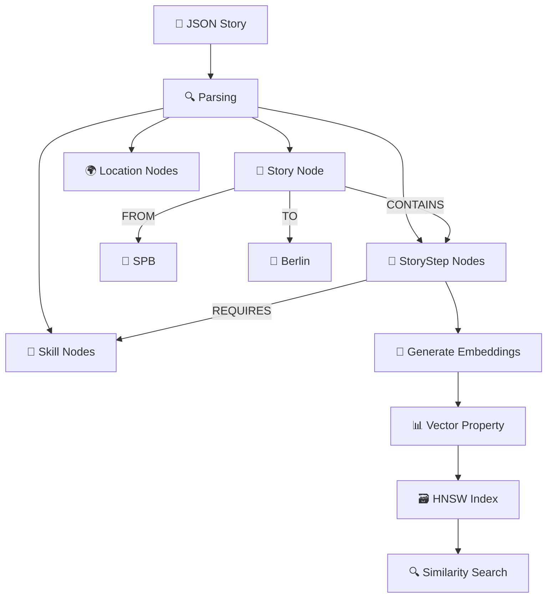
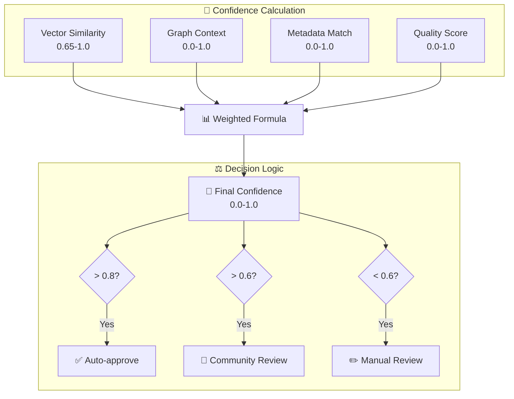
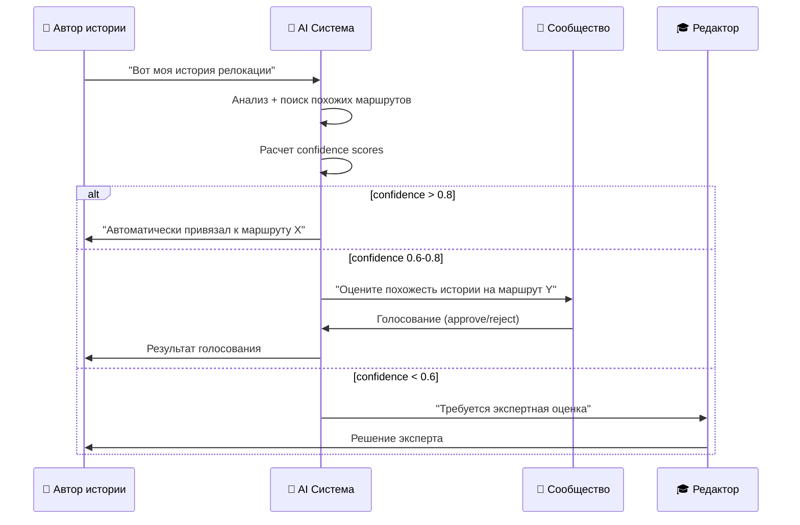

# 🔄 Трансформация данных: JSON → Neo4j → Поиск

## 📊 1. Хранение данных в Neo4j (простым языком)

### **От JSON к графу - пошаговая трансформация**

#### **Входной JSON (валидированный)**
```json
{
  "user_story": {
    "user_id": "user123",
    "title": "Python разработчик → Senior в Германии",
    "full_text": "Работал джуниором в Питере, изучал Django, получил оффер в Берлине...",
    "context": {
      "skills": ["Python", "Django", "PostgreSQL"],
      "experience_years": 3,
      "current_location": "SPB",
      "target_location": "Berlin"
    }
  }
}
```

#### **Трансформация в граф Neo4j**



#### **Результирующие узлы в Neo4j:**

```cypher
// 1. Главный узел истории
CREATE (s:Story {
  id: "story_123",
  user_id: "user123", 
  title: "Python разработчик → Senior в Германии",
  full_text: "Работал джуниором в Питере...",
  experience_years: 3,
  created_at: datetime()
})

// 2. Шаги истории (декомпозированные AI)
CREATE (step1:StoryStep {
  id: "step_123_1",
  step_number: 1,
  type: "skill_development",
  description: "Изучение Django и PostgreSQL",
  timeline: "6 месяцев", 
  outcome: "Получил middle уровень"
})
// embedding хранится как: step1.embedding = [0.123, -0.456, 0.789, ...]

CREATE (step2:StoryStep {
  id: "step_123_2", 
  step_number: 2,
  type: "job_search",
  description: "Поиск работы в Германии через LinkedIn",
  timeline: "3 месяца",
  outcome: "5 интервью, 1 оффер"
})

// 3. Связи между узлами
CREATE (s)-[:CONTAINS {order: 1}]->(step1)
CREATE (s)-[:CONTAINS {order: 2}]->(step2)
CREATE (step1)-[:REQUIRES]->(skill_django:Skill {name: "Django"})
CREATE (s)-[:FROM_LOCATION]->(spb:Location {city: "Saint Petersburg"})
CREATE (s)-[:TO_LOCATION]->(berlin:Location {city: "Berlin"})
```

### **Как работает поиск по такой БД**

```cypher
// Пример поиска: "Хочу стать Python разработчиком в Германии"

// 1. Генерируем embedding для запроса пользователя  
WITH genai.vector.encode("Python разработчик Германия", 'OpenAI', {token: $token}) AS queryVector

// 2. Векторный поиск похожих шагов
CALL db.index.vector.queryNodes('story_step_embeddings', queryVector, 10)
YIELD node as step, score
WHERE score > 0.7

// 3. Получаем полные истории через граф
MATCH (step)<-[:CONTAINS]-(story:Story)
MATCH (story)-[:FROM_LOCATION]->(from_loc)
MATCH (story)-[:TO_LOCATION]->(to_loc)

// 4. Возвращаем ранжированные результаты  
RETURN story, collect(step) as matched_steps, 
       from_loc.city, to_loc.city, 
       avg(score) as overall_score
ORDER BY overall_score DESC
```

## 🔍 2. Гибридный поиск и сопоставление

### **Исправление понимания эмбеддингов**

> ❌ **Неверно**: "эмбеддинги для оценки точности найденных совпадений"
> 
> ✅ **Верно**: "эмбеддинги ДЛЯ ПОИСКА семантически похожих историй"

#### **Как на самом деле работают эмбеддинги:**

```mermaid 
flowchart LR
    Query[🗣️ "Хочу в Канаду как DevOps"] --> Embed1[🧠 Embedding]
    
    Stories[📚 Все истории в БД] --> Embed2[🧠 Pre-computed Embeddings]
    
    Embed1 --> Compare[📊 Cosine Similarity]
    Embed2 --> Compare
    
    Compare --> Ranking[📈 Ранжирование по similarity]
    Ranking --> Top10[🎯 Топ-10 похожих историй]
    
    Top10 --> GraphExpand[🕸️ Graph Expansion]
    GraphExpand --> FinalResults[✨ Финальные результаты]
```

#### **Пример алгоритма:**

```python
class HybridStorySearch:
    async def search_similar_stories(self, user_query: str) -> List[StoryMatch]:
        # 1. ПОИСК через эмбеддинги (не оценка!)
        query_embedding = await self.embed_text(user_query)
        
        # 2. Векторный поиск в Neo4j
        vector_results = await self.neo4j.execute_query("""
            CALL db.index.vector.queryNodes('story_embeddings', $embedding, 20)
            YIELD node as story, score
            WHERE score > 0.65  // score = cosine similarity (мера похожести)
            RETURN story, score
            ORDER BY score DESC
        """, embedding=query_embedding)
        
        # 3. Graph expansion - расширяем через связи
        enriched_results = []
        for story, vector_score in vector_results:
            # Добавляем контекст из графа 
            graph_context = await self._get_graph_context(story.id)
            
            # ЗДЕСЬ confidence = комбинация факторов
            confidence = self._calculate_confidence(vector_score, graph_context)
            
            enriched_results.append(StoryMatch(
                story=story,
                vector_similarity=vector_score,     # 0.65-1.0 (от векторного поиска)
                confidence=confidence,              # 0.0-1.0 (итоговая уверенность)
                matched_steps=graph_context.steps
            ))
        
        return sorted(enriched_results, key=lambda x: x.confidence, reverse=True)
```

## 🎯 3. Что такое Confidence и кто определяет

### **Confidence Score - многофакторная метрика**



### **Формула расчета Confidence:**

```python
def calculate_confidence(
    vector_similarity: float,    # 0.65-1.0 от векторного поиска
    graph_context: GraphContext,
    metadata_match: MetadataMatch,
    quality_metrics: QualityMetrics
) -> float:
    """
    Confidence = взвешенная сумма факторов
    """
    
    # Веса компонентов (сумма = 1.0)
    WEIGHTS = {
        'vector': 0.4,      # Семантическое сходство текста
        'graph': 0.3,       # Совпадение связей в графе  
        'metadata': 0.2,    # Совпадение навыков, локаций, опыта
        'quality': 0.1      # Качество исходной истории
    }
    
    # Нормализация векторного сходства в 0-1
    vector_norm = (vector_similarity - 0.65) / 0.35
    
    # График сходства (количество общих узлов/связей)
    graph_score = len(graph_context.common_skills) / max(len(graph_context.all_skills), 1)
    
    # Метаданные (локация, опыт, роль)
    metadata_score = (
        metadata_match.location_match * 0.4 +
        metadata_match.experience_match * 0.3 + 
        metadata_match.role_match * 0.3
    )
    
    # Качество истории (рейтинг, количество подтверждений)
    quality_score = min(1.0, quality_metrics.rating / 5.0)
    
    confidence = (
        vector_norm * WEIGHTS['vector'] +
        graph_score * WEIGHTS['graph'] +
        metadata_score * WEIGHTS['metadata'] +
        quality_score * WEIGHTS['quality']
    )
    
    return min(1.0, max(0.0, confidence))
```

### **Кто определяет Confidence:**

#### **Шаг 1: AI Система (автоматически)**
```python
# Система рассчитывает confidence для каждого найденного совпадения
confidence = calculate_confidence(vector_sim, graph_ctx, metadata, quality)
```

#### **Шаг 2: Логика принятия решений**
```python
if confidence >= 0.8:
    decision = "AUTO_APPROVE"     # AI уверен - автоматически принимаем
elif confidence >= 0.6:  
    decision = "COMMUNITY_REVIEW" # Средняя уверенность - на голосование сообщества
else:
    decision = "MANUAL_REVIEW"    # Низкая уверенность - редактор решает
```

#### **Шаг 3: Валидация людьми (если нужно)**
```python
class CommunityValidation:
    def validate_story_match(self, story_match: StoryMatch) -> ValidationResult:
        if story_match.confidence >= 0.8:
            return ValidationResult.AUTO_APPROVED
            
        # Отправляем на голосование
        community_vote = self.send_to_community_vote(story_match)
        
        if community_vote.approval_rate >= 0.7:
            return ValidationResult.COMMUNITY_APPROVED
        else:
            return ValidationResult.REQUIRES_EXPERT_REVIEW
```

## 🤖 4. Кто определяет близость маршрутов

### **Краткий ответ: AI определяет, человек подтверждает**

#### **Роли в процессе:**



**Автор истории НЕ выбирает маршрут сам**, потому что:
- ❌ Он может быть субъективен
- ❌ Не видит всю базу маршрутов  
- ❌ Может некорректно оценить сходство
- ✅ AI видит всю картину и объективно сравнивает

## 📊 5. Критерии различия маршрутов

### **Когда маршруты НЕ объединяются (остаются отдельными):**

#### **А. Разные цели (даже если путь похож)**
```
Маршрут 1: "Python Junior → Senior в Германии"  
Маршрут 2: "Python Senior → Tech Lead в Германии"
```
**Различие**: разные карьерные уровни = разные маршруты

#### **Б. Разные контексты (даже если цель одна)**
```
Маршрут 1: "Python → Германия (с высшим образованием)"
Маршрут 2: "Python → Германия (без высшего образования)"  
```
**Различие**: разные юридические процессы = разные маршруты

#### **В. Разные временные рамки**
```
Маршрут 1: "Python → Германия (за 6 месяцев)" 
Маршрут 2: "Python → Германия (за 2 года)"
```
**Различие**: разная интенсивность подготовки = разные маршруты

### **Формула различия маршрутов:**

```python
def should_create_separate_route(existing_route: Route, new_story: Story) -> bool:
    """
    Определяет, нужно ли создавать отдельный маршрут или дополнить существующий
    """
    
    # Критические различия (всегда = отдельный маршрут)
    if (existing_route.target_role != new_story.target_role or
        existing_route.target_country != new_story.target_country or  
        existing_route.experience_level != new_story.experience_level):
        return True
        
    # Контекстуальные различия (веса)
    differences = {
        'education': abs(existing_route.has_degree - new_story.has_degree),      # 0.3
        'timeline': abs(existing_route.timeline_months - new_story.timeline_months) / 24,  # 0.25  
        'budget': abs(existing_route.budget_usd - new_story.budget_usd) / 50000,  # 0.2
        'visa_type': existing_route.visa_type != new_story.visa_type,            # 0.15
        'family': existing_route.has_family != new_story.has_family              # 0.1
    }
    
    # Взвешенная сумма различий
    difference_score = sum(diff * weight for diff, weight in zip(
        differences.values(), 
        [0.3, 0.25, 0.2, 0.15, 0.1]
    ))
    
    # Если различий > 40%, создаем отдельный маршрут
    return difference_score > 0.4
```

### **Может ли одна история обновить несколько маршрутов? ДА!**

```mermaid
flowchart TD
    Story[📖 "Python Junior → Senior в Берлине<br/>за 8 месяцев через курсы"]
    
    Route1[🛤️ Маршрут 1<br/>"Python Junior → Senior"]
    Route2[🛤️ Маршрут 2<br/>"Релокация в Германию"] 
    Route3[🛤️ Маршрут 3<br/>"Быстрая прокачка навыков"]
    
    Story -->|"Добавляет новый шаг"| Route1
    Story -->|"Уточняет сроки визы"| Route2
    Story -->|"Новый способ обучения"| Route3
    
    style Story fill:#e3f2fd
    style Route1 fill:#f3e5f5
    style Route2 fill:#e8f5e8  
    style Route3 fill:#fff3e0
```

**Пример обновления нескольких маршрутов:**
```python
# История может дополнить разные аспекты разных маршрутов
story_impact = {
    "python_junior_to_senior": {
        "new_step": "Участие в open-source проектах для портфолио",
        "confidence": 0.85
    },
    "relocation_to_germany": {
        "update_step": "Процесс получения Blue Card занял 3 недели (не 2 месяца)",  
        "confidence": 0.92
    },
    "skill_development_fast": {
        "new_method": "Coursera специализация + личные проекты = 4 месяца",
        "confidence": 0.78  
    }
}
```

Это рациональный подход - одна качественная история может обогатить сразу несколько маршрутов, если в ней есть уникальные инсайты для разных аспектов релокации.

Какой из аспектов требует дополнительной детализации?
