# 🧩 Level 3: Component Diagram

## 📊 WayMates Core API Components

```mermaid
C4Component
    title Component diagram for WayMates Core API

    Container(api_gateway, "API Gateway", "Kong", "Маршрутизация и аутентификация")
    Container(web_app, "Web Application", "React/Next.js", "Пользовательский интерфейс")

    Container_Boundary(api, "Core API - NestJS") {
        Component(story_controller, "Story Controller", "NestJS Controller", "REST API для управления историями")
        Component(query_controller, "Query Controller", "NestJS Controller", "REST API для обработки запросов")
        Component(moderation_controller, "Moderation Controller", "NestJS Controller", "API для модерации контента")
        
        Component(story_service, "Story Service", "NestJS Service", "Бизнес-логика управления историями")
        Component(query_service, "Query Service", "NestJS Service", "Обработка пользовательских запросов")
        Component(moderation_service, "Moderation Service", "NestJS Service", "Модерация и валидация контента")
        
        Component(openai_service, "OpenAI Service", "HTTP Client", "Интеграция с OpenAI GPT-4, Embeddings")
        Component(neo4j_service, "Neo4j Service", "Neo4j Driver", "Работа с графовой базой данных")
        Component(vector_service, "Vector Service", "Pinecone Client", "Векторный поиск и эмбеддинги")
        Component(cache_service, "Cache Service", "Redis Client", "Кэширование данных")
        Component(file_service, "File Service", "AWS S3 SDK", "Управление файлами")
        
        Component(nl2cypher_processor, "NL2Cypher Processor", "Custom Logic", "Конвертация естественного языка в Cypher")
        Component(validator_service, "Validator Service", "AJV + Custom", "Валидация данных и схем")
        Component(audio_processor, "Audio Processor", "Whisper.cpp Client", "Обработка аудио контента")
        
        Component(event_emitter, "Event Emitter", "NestJS Events", "Внутренние события системы")
        Component(config_service, "Config Service", "NestJS Config", "Управление конфигурацией")
        Component(logger_service, "Logger Service", "Winston/Pino", "Логирование системы")
    }

    ContainerDb(neo4j, "Neo4j Database", "AuraDB", "Графовые данные")
    ContainerDb(vector_db, "Vector Database", "Pinecone", "Векторные эмбеддинги")
    ContainerDb(cache, "Cache", "Redis", "Кэш и сессии")
    ContainerDb(file_storage, "File Storage", "AWS S3", "Файлы")

    System_Ext(openai, "OpenAI API", "GPT-4, Embeddings")
    System_Ext(whisper, "Whisper.cpp", "Локальная транскрипция")

    %% API Gateway connections
    Rel(api_gateway, story_controller, "Story API", "HTTP/REST")
    Rel(api_gateway, query_controller, "Query API", "HTTP/REST")
    Rel(api_gateway, moderation_controller, "Moderation API", "HTTP/REST")

    %% Web App connections
    Rel(web_app, story_controller, "Create/Edit Stories", "HTTPS/REST")
    Rel(web_app, query_controller, "Search Queries", "HTTPS/REST")

    %% Controller to Service connections
    Rel(story_controller, story_service, "Business Logic", "Method Call")
    Rel(query_controller, query_service, "Query Processing", "Method Call")
    Rel(moderation_controller, moderation_service, "Content Validation", "Method Call")

    %% Service dependencies
    Rel(story_service, openai_service, "Text Processing", "HTTP/API")
    Rel(story_service, neo4j_service, "Store Story", "Bolt/Cypher")
    Rel(story_service, vector_service, "Create Embeddings", "HTTPS/API")
    Rel(story_service, validator_service, "Validate Data", "Method Call")
    Rel(story_service, file_service, "Upload Files", "S3 API")
    Rel(story_service, event_emitter, "Story Events", "Event Bus")

    Rel(query_service, nl2cypher_processor, "Convert Query", "Method Call")
    Rel(query_service, neo4j_service, "Execute Cypher", "Bolt/Cypher")
    Rel(query_service, vector_service, "Semantic Search", "HTTPS/API")
    Rel(query_service, cache_service, "Cache Results", "Redis Protocol")

    Rel(moderation_service, validator_service, "Schema Validation", "Method Call")
    Rel(moderation_service, openai_service, "AI Moderation", "HTTP/API")

    %% Technical service connections
    Rel(openai_service, openai, "LLM Requests", "HTTPS/API")
    Rel(neo4j_service, neo4j, "Database Operations", "Bolt/HTTPS")
    Rel(vector_service, vector_db, "Vector Operations", "HTTPS/API")
    Rel(cache_service, cache, "Cache Operations", "Redis Protocol")
    Rel(file_service, file_storage, "File Operations", "S3 API")
    Rel(audio_processor, whisper, "Audio Transcription", "gRPC/HTTP")

    %% Cross-cutting concerns
    Rel(nl2cypher_processor, openai_service, "Generate Cypher", "HTTP/API")
    Rel(story_service, audio_processor, "Process Audio", "Method Call")

    %% Logging and config
    Rel_Back(story_service, logger_service, "Logs", "Method Call")
    Rel_Back(query_service, logger_service, "Logs", "Method Call")
    Rel_Back(openai_service, config_service, "API Keys", "Method Call")

    UpdateElementStyle(story_controller, $fontColor="white", $bgColor="#2196f3")
    UpdateElementStyle(query_controller, $fontColor="white", $bgColor="#2196f3")
    UpdateElementStyle(moderation_controller, $fontColor="white", $bgColor="#2196f3")
    UpdateElementStyle(story_service, $fontColor="white", $bgColor="#4caf50")
    UpdateElementStyle(query_service, $fontColor="white", $bgColor="#4caf50")
    UpdateElementStyle(moderation_service, $fontColor="white", $bgColor="#4caf50")
    UpdateElementStyle(openai_service, $fontColor="white", $bgColor="#ff9800")
    UpdateElementStyle(neo4j_service, $fontColor="white", $bgColor="#388e3c")
    UpdateElementStyle(vector_service, $fontColor="white", $bgColor="#f44336")
    UpdateElementStyle(nl2cypher_processor, $fontColor="white", $bgColor="#9c27b0")
```



## 🧩 Детали компонентов

### **🎮 Controllers Layer**

#### **Story Controller**
```typescript
@Controller('stories')
export class StoryController {
  constructor(private storyService: StoryService) {}

  @Post()
  async createStory(@Body() createStoryDto: CreateStoryDto) {
    return this.storyService.createStory(createStoryDto);
  }

  @Get(':id')
  async getStory(@Param('id') id: string) {
    return this.storyService.getStoryById(id);
  }

  @Put(':id')
  async updateStory(@Param('id') id: string, @Body() updateStoryDto: UpdateStoryDto) {
    return this.storyService.updateStory(id, updateStoryDto);
  }
}
```

#### **Query Controller**
```typescript
@Controller('queries')
export class QueryController {
  constructor(private queryService: QueryService) {}

  @Post('natural-language')
  async processNaturalQuery(@Body() queryDto: NaturalQueryDto) {
    return this.queryService.processNaturalLanguageQuery(queryDto.text);
  }

  @Post('cypher')
  async executeCypher(@Body() cypherDto: CypherQueryDto) {
    return this.queryService.executeCypherQuery(cypherDto.query);
  }
}
```

### **🏢 Business Services Layer**

#### **Story Service**
```typescript
@Injectable()
export class StoryService {
  constructor(
    private openaiService: OpenAIService,
    private neo4jService: Neo4jService,
    private vectorService: VectorService,
    private validatorService: ValidatorService,
    private fileService: FileService,
    private eventEmitter: EventEmitter2
  ) {}

  async createStory(createStoryDto: CreateStoryDto): Promise<Story> {
    // 1. Валидация входных данных
    await this.validatorService.validateStory(createStoryDto);
    
    // 2. Обработка текста через LLM
    const processedContent = await this.openaiService.processText(createStoryDto.content);
    
    // 3. Создание эмбеддингов
    const embeddings = await this.openaiService.createEmbeddings(processedContent);
    
    // 4. Сохранение в Neo4j
    const story = await this.neo4jService.createStory({
      ...createStoryDto,
      content: processedContent
    });
    
    // 5. Индексация в векторной БД
    await this.vectorService.indexStory(story.id, embeddings);
    
    // 6. Обработка файлов (если есть)
    if (createStoryDto.files) {
      await this.fileService.uploadStoryFiles(story.id, createStoryDto.files);
    }
    
    // 7. Событие о создании истории
    this.eventEmitter.emit('story.created', { storyId: story.id });
    
    return story;
  }
}
```

#### **Query Service**
```typescript
@Injectable()
export class QueryService {
  constructor(
    private nl2cypherProcessor: NL2CypherProcessor,
    private neo4jService: Neo4jService,
    private vectorService: VectorService,
    private cacheService: CacheService
  ) {}

  async processNaturalLanguageQuery(query: string): Promise<QueryResult> {
    // 1. Проверка кэша
    const cached = await this.cacheService.get(`query:${query}`);
    if (cached) return cached;
    
    // 2. Конвертация NL в Cypher
    const cypherQuery = await this.nl2cypherProcessor.convertToCypher(query);
    
    // 3. Выполнение запроса в Neo4j
    const graphResults = await this.neo4jService.executeQuery(cypherQuery);
    
    // 4. Дополнительный семантический поиск
    const vectorResults = await this.vectorService.semanticSearch(query);
    
    // 5. Объединение и ранжирование результатов
    const result = this.mergeAndRankResults(graphResults, vectorResults);
    
    // 6. Кэширование результата
    await this.cacheService.set(`query:${query}`, result, 3600);
    
    return result;
  }
}
```

### **🔧 Technical Services Layer**

#### **NL2Cypher Processor**
```typescript
@Injectable()
export class NL2CypherProcessor {
  constructor(private openaiService: OpenAIService) {}

  async convertToCypher(naturalLanguageQuery: string): Promise<string> {
    const prompt = this.buildCypherPrompt(naturalLanguageQuery);
    const cypherQuery = await this.openaiService.generateCypher(prompt);
    
    // Валидация и санитизация Cypher запроса
    return this.validateAndSanitizeCypher(cypherQuery);
  }

  private buildCypherPrompt(query: string): string {
    return `
      Convert this natural language query to Cypher for a travel stories graph database.
      
      Schema:
      - (:Story {title, content, created_at})
      - (:Place {name, coordinates, country})
      - (:Person {name, email})
      
      Relationships:
      - (:Story)-[:HAPPENED_AT]->(:Place)
      - (:Story)-[:MENTIONS]->(:Person)
      
      Query: "${query}"
      
      Return only valid Cypher syntax:
    `;
  }
}
```

#### **OpenAI Service**
```typescript
@Injectable()
export class OpenAIService {
  constructor(
    private configService: ConfigService,
    private httpService: HttpService
  ) {}

  async processText(text: string): Promise<string> {
    const response = await this.httpService.post('/chat/completions', {
      model: 'gpt-4',
      messages: [
        {
          role: 'system',
          content: 'Process and structure travel story content for database storage.'
        },
        {
          role: 'user',
          content: text
        }
      ]
    });
    
    return response.data.choices[0].message.content;
  }

  async createEmbeddings(text: string): Promise<number[]> {
    const response = await this.httpService.post('/embeddings', {
      model: 'text-embedding-ada-002',
      input: text
    });
    
    return response.data.data[0].embedding;
  }

  async generateCypher(prompt: string): Promise<string> {
    const response = await this.httpService.post('/chat/completions', {
      model: 'gpt-4',
      messages: [{ role: 'user', content: prompt }],
      temperature: 0.1
    });
    
    return response.data.choices[0].message.content;
  }
}
```

## 🔄 Component Interactions

### **Story Creation Flow**
```
1. StoryController.createStory()
2. StoryService.createStory()
   ├── ValidatorService.validateStory()
   ├── OpenAIService.processText()
   ├── OpenAIService.createEmbeddings()
   ├── Neo4jService.createStory()
   ├── VectorService.indexStory()
   ├── FileService.uploadStoryFiles()
   └── EventEmitter.emit('story.created')
```

### **Query Processing Flow**
```
1. QueryController.processNaturalQuery()
2. QueryService.processNaturalLanguageQuery()
   ├── CacheService.get()
   ├── NL2CypherProcessor.convertToCypher()
   │   └── OpenAIService.generateCypher()
   ├── Neo4jService.executeQuery()
   ├── VectorService.semanticSearch()
   └── CacheService.set()
```

### **Content Moderation Flow**
```
1. ModerationController.moderateContent()
2. ModerationService.moderateContent()
   ├── ValidatorService.validateSchema()
   └── OpenAIService.aiModeration()
```

## 🏗️ Architecture Patterns

### **Dependency Injection**
Все компоненты используют NestJS DI Container для автоматического разрешения зависимостей.

### **Repository Pattern**
Neo4jService и VectorService действуют как репозитории для соответствующих хранилищ данных.

### **Strategy Pattern**
Validator Service поддерживает разные стратегии валидации (AJV, LLM, Custom).

### **Event-Driven Architecture**
Event Emitter обеспечивает слабую связанность между компонентами через события.

### **Adapter Pattern**
OpenAI Service, Neo4j Service - адаптеры для внешних сервисов с единообразным интерфейсом.

