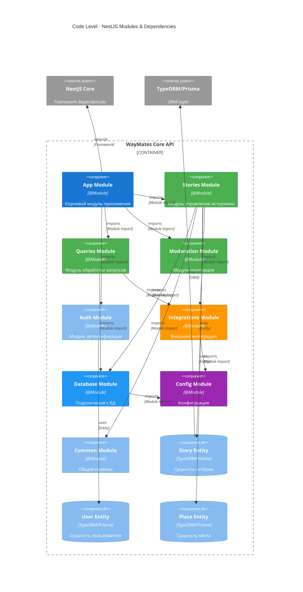
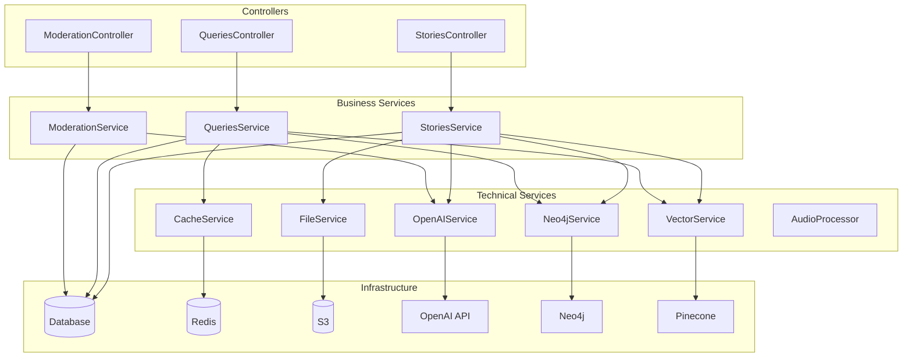

# 💻 Level 4: Code Level

## 📊 NestJS Module Architecture



## 🏗️ Module Structure

### **📁 Project Structure**
```
src/
├── app.module.ts                 # Корневой модуль
├── main.ts                      # Bootstrap файл
│
├── modules/
│   ├── stories/                 # Stories Module
│   │   ├── stories.module.ts
│   │   ├── stories.controller.ts
│   │   ├── stories.service.ts
│   │   ├── dto/
│   │   │   ├── create-story.dto.ts
│   │   │   └── update-story.dto.ts
│   │   └── entities/
│   │       └── story.entity.ts
│   │
│   ├── queries/                 # Queries Module
│   │   ├── queries.module.ts
│   │   ├── queries.controller.ts
│   │   ├── queries.service.ts
│   │   ├── processors/
│   │   │   └── nl2cypher.processor.ts
│   │   └── dto/
│   │       └── natural-query.dto.ts
│   │
│   ├── moderation/             # Moderation Module
│   │   ├── moderation.module.ts
│   │   ├── moderation.controller.ts
│   │   ├── moderation.service.ts
│   │   └── validators/
│   │       ├── ajv.validator.ts
│   │       └── llm.validator.ts
│   │
│   ├── auth/                   # Auth Module
│   │   ├── auth.module.ts
│   │   ├── auth.controller.ts
│   │   ├── auth.service.ts
│   │   ├── guards/
│   │   │   └── jwt.guard.ts
│   │   └── strategies/
│   │       └── jwt.strategy.ts
│   │
│   └── integrations/           # Integrations Module
│       ├── integrations.module.ts
│       ├── openai/
│       │   ├── openai.service.ts
│       │   └── openai.config.ts
│       ├── neo4j/
│       │   ├── neo4j.service.ts
│       │   └── neo4j.config.ts
│       ├── pinecone/
│       │   ├── vector.service.ts
│       │   └── pinecone.config.ts
│       └── whisper/
│           └── audio.processor.ts
│
├── database/                   # Database Module
│   ├── database.module.ts
│   ├── migrations/
│   └── seeds/
│
├── common/                     # Common Module
│   ├── common.module.ts
│   ├── services/
│   │   ├── logger.service.ts
│   │   ├── cache.service.ts
│   │   └── file.service.ts
│   ├── decorators/
│   ├── filters/
│   ├── guards/
│   ├── interceptors/
│   └── pipes/
│
└── config/                     # Config Module
    ├── config.module.ts
    ├── app.config.ts
    ├── database.config.ts
    └── integrations.config.ts
```

## 📋 Module Definitions

### **App Module**
```typescript
@Module({
  imports: [
    ConfigModule.forRoot({
      isGlobal: true,
      envFilePath: ['.env.local', '.env'],
    }),
    DatabaseModule,
    CommonModule,
    AuthModule,
    StoriesModule,
    QueriesModule,
    ModerationModule,
    IntegrationsModule,
  ],
  controllers: [],
  providers: [],
})
export class AppModule {}
```

### **Stories Module**
```typescript
@Module({
  imports: [
    IntegrationsModule,
    DatabaseModule,
    CommonModule,
  ],
  controllers: [StoriesController],
  providers: [
    StoriesService,
    {
      provide: 'STORY_REPOSITORY',
      useFactory: (dataSource: DataSource) => dataSource.getRepository(Story),
      inject: [DataSource],
    },
  ],
  exports: [StoriesService],
})
export class StoriesModule {}
```

### **Queries Module**
```typescript
@Module({
  imports: [
    IntegrationsModule,
    DatabaseModule,
    CommonModule,
  ],
  controllers: [QueriesController],
  providers: [
    QueriesService,
    NL2CypherProcessor,
    {
      provide: 'QUERY_CACHE',
      useFactory: (cacheService: CacheService) => cacheService.getClient(),
      inject: [CacheService],
    },
  ],
  exports: [QueriesService, NL2CypherProcessor],
})
export class QueriesModule {}
```

### **Integrations Module**
```typescript
@Module({
  imports: [ConfigModule],
  providers: [
    OpenAIService,
    Neo4jService,
    VectorService,
    AudioProcessor,
    {
      provide: 'OPENAI_CLIENT',
      useFactory: (configService: ConfigService) => {
        return new OpenAI({
          apiKey: configService.get('OPENAI_API_KEY'),
        });
      },
      inject: [ConfigService],
    },
    {
      provide: 'NEO4J_DRIVER',
      useFactory: (configService: ConfigService) => {
        return neo4j.driver(
          configService.get('NEO4J_URI'),
          neo4j.auth.basic(
            configService.get('NEO4J_USERNAME'),
            configService.get('NEO4J_PASSWORD')
          )
        );
      },
      inject: [ConfigService],
    },
    {
      provide: 'PINECONE_CLIENT',
      useFactory: (configService: ConfigService) => {
        return new PineconeClient({
          apiKey: configService.get('PINECONE_API_KEY'),
          environment: configService.get('PINECONE_ENVIRONMENT'),
        });
      },
      inject: [ConfigService],
    },
  ],
  exports: [
    OpenAIService,
    Neo4jService,
    VectorService,
    AudioProcessor,
  ],
})
export class IntegrationsModule {}
```

## 🎯 Entity Definitions

### **Story Entity**
```typescript
@Entity('stories')
export class Story {
  @PrimaryGeneratedColumn('uuid')
  id: string;

  @Column({ type: 'varchar', length: 255 })
  title: string;

  @Column({ type: 'text' })
  content: string;

  @Column({ type: 'text', nullable: true })
  processedContent?: string;

  @Column({ type: 'jsonb', nullable: true })
  metadata?: Record<string, any>;

  @Column({ type: 'varchar', array: true, default: [] })
  tags: string[];

  @ManyToOne(() => User, user => user.stories)
  @JoinColumn({ name: 'author_id' })
  author: User;

  @Column({ name: 'author_id' })
  authorId: string;

  @OneToMany(() => StoryPlace, storyPlace => storyPlace.story)
  places: StoryPlace[];

  @OneToMany(() => StoryFile, storyFile => storyFile.story)
  files: StoryFile[];

  @CreateDateColumn({ name: 'created_at' })
  createdAt: Date;

  @UpdateDateColumn({ name: 'updated_at' })
  updatedAt: Date;

  @Column({ type: 'boolean', default: false })
  isModerated: boolean;

  @Column({ type: 'enum', enum: ['draft', 'published', 'archived'], default: 'draft' })
  status: 'draft' | 'published' | 'archived';
}
```

### **User Entity**
```typescript
@Entity('users')
export class User {
  @PrimaryGeneratedColumn('uuid')
  id: string;

  @Column({ type: 'varchar', length: 100 })
  firstName: string;

  @Column({ type: 'varchar', length: 100 })
  lastName: string;

  @Column({ type: 'varchar', length: 255, unique: true })
  email: string;

  @Column({ type: 'varchar', length: 255, select: false })
  passwordHash: string;

  @Column({ type: 'jsonb', nullable: true })
  profile?: UserProfile;

  @OneToMany(() => Story, story => story.author)
  stories: Story[];

  @CreateDateColumn({ name: 'created_at' })
  createdAt: Date;

  @UpdateDateColumn({ name: 'updated_at' })
  updatedAt: Date;

  @Column({ type: 'boolean', default: true })
  isActive: boolean;

  @Column({ type: 'varchar', array: true, default: ['user'] })
  roles: string[];
}

interface UserProfile {
  avatar?: string;
  bio?: string;
  preferences?: {
    language: string;
    notifications: boolean;
    privacy: 'public' | 'private';
  };
  travelStats?: {
    countriesVisited: number;
    storiesCreated: number;
    totalDistance: number;
  };
}
```

### **Place Entity**
```typescript
@Entity('places')
export class Place {
  @PrimaryGeneratedColumn('uuid')
  id: string;

  @Column({ type: 'varchar', length: 255 })
  name: string;

  @Column({ type: 'varchar', length: 100, nullable: true })
  city?: string;

  @Column({ type: 'varchar', length: 100, nullable: true })
  country?: string;

  @Column({ type: 'varchar', length: 20, nullable: true })
  countryCode?: string;

  @Column({
    type: 'geography',
    spatialFeatureType: 'Point',
    srid: 4326,
    nullable: true,
  })
  coordinates?: Point;

  @Column({ type: 'jsonb', nullable: true })
  metadata?: {
    placeId?: string; // Google Places ID
    placeType?: string[];
    timezone?: string;
    elevation?: number;
  };

  @OneToMany(() => StoryPlace, storyPlace => storyPlace.place)
  stories: StoryPlace[];

  @CreateDateColumn({ name: 'created_at' })
  createdAt: Date;

  @UpdateDateColumn({ name: 'updated_at' })
  updatedAt: Date;
}
```

## 🔧 Service Dependencies

### **Dependency Injection Graph**


## 🎯 Key Interfaces

### **Service Interfaces**
```typescript
// LLM Service Interface
export interface ILLMService {
  processText(text: string): Promise<string>;
  createEmbeddings(text: string): Promise<number[]>;
  generateCypher(prompt: string): Promise<string>;
  moderateContent(content: string): Promise<ModerationResult>;
}

// Storage Service Interface
export interface IStorageService {
  createStory(story: CreateStoryDto): Promise<Story>;
  findStoryById(id: string): Promise<Story | null>;
  executeQuery(query: string): Promise<any[]>;
  searchByEmbedding(embedding: number[]): Promise<SearchResult[]>;
}

// Validator Service Interface
export interface IValidatorService {
  validateStory(story: CreateStoryDto): Promise<ValidationResult>;
  validateQuery(query: string): Promise<ValidationResult>;
  sanitizeContent(content: string): Promise<string>;
}
```

### **DTO Definitions**
```typescript
export class CreateStoryDto {
  @IsString()
  @MinLength(3)
  @MaxLength(255)
  title: string;

  @IsString()
  @MinLength(10)
  content: string;

  @IsOptional()
  @IsArray()
  @IsString({ each: true })
  tags?: string[];

  @IsOptional()
  @ValidateNested({ each: true })
  @Type(() => CreatePlaceDto)
  places?: CreatePlaceDto[];

  @IsOptional()
  @IsArray()
  files?: Express.Multer.File[];
}

export class NaturalQueryDto {
  @IsString()
  @MinLength(3)
  @MaxLength(500)
  text: string;

  @IsOptional()
  @IsObject()
  context?: {
    userId?: string;
    location?: {
      lat: number;
      lng: number;
    };
    language?: string;
  };
}
```

Эта C4 архитектура предоставляет полное понимание системы WayMates на всех уровнях - от высокоуровневого контекста до деталей кода. Каждый уровень дает необходимую детализацию для разных аудиторий: stakeholders, архитекторов, разработчиков.

