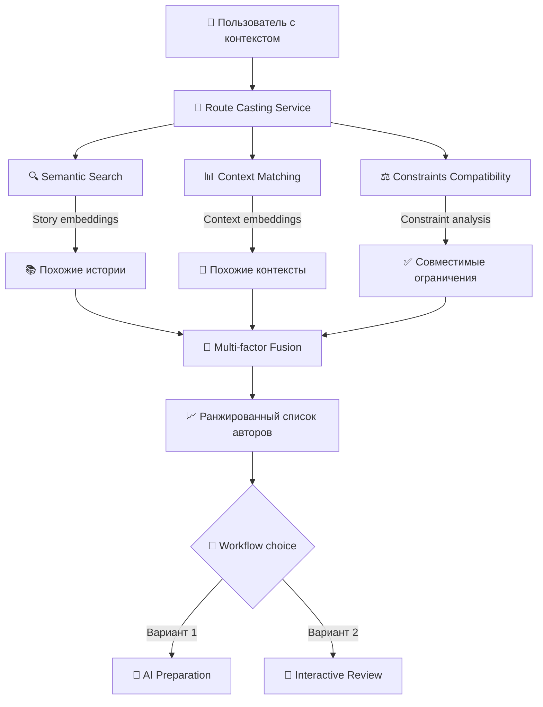
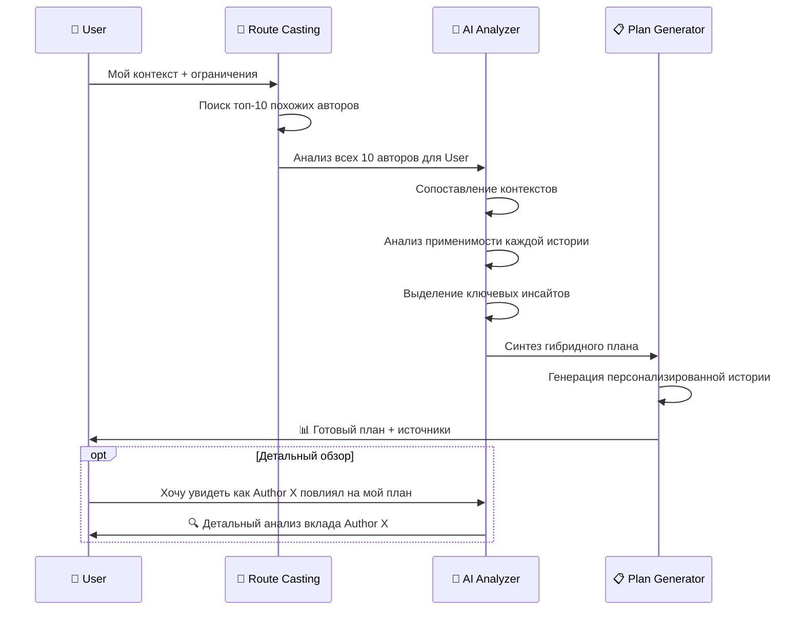
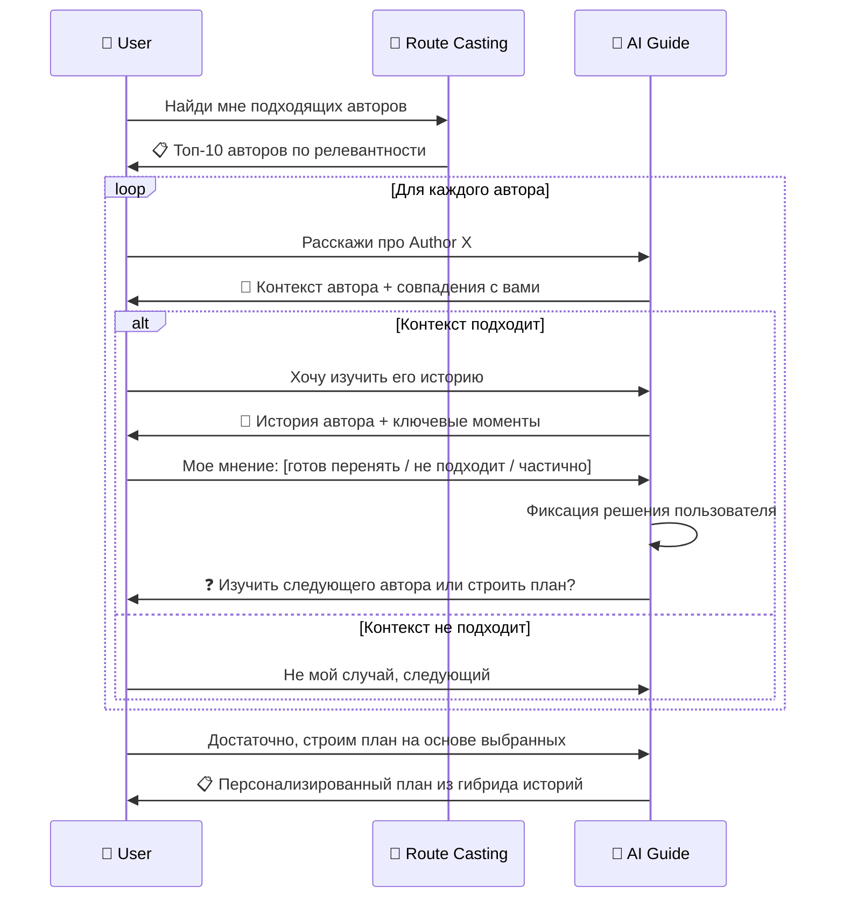
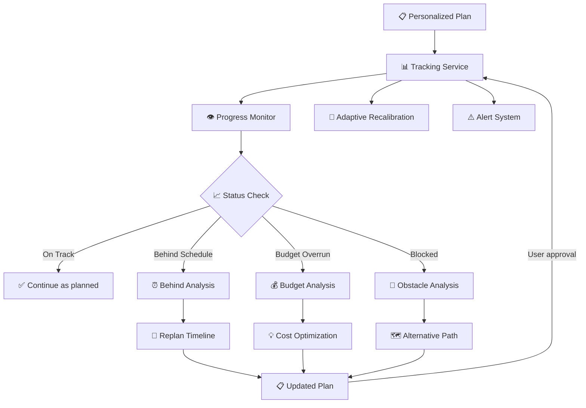

# 🎯 Персонализированная архитектура маршрутов

## 🔄 Кардинальная смена парадигмы

### **Было: Жесткие маршруты**
```
Пользователь → Поиск готового маршрута → Адаптация под себя
```

### **Стало: Персонализированное построение**
```
Пользователь → Поиск похожих историй → Интерактивное построение → Индивидуальный план
```

## 📊 Новая архитектура данных

### **1. Разделение контекста пользователя**

#### **UserContext (Обычный контекст)**
```typescript
interface UserContext {
  skills: string[];
  experience_years: number;
  current_location: string;
  target_location: string;
  education_level: string;
  industry: string;
  current_role: string;
  target_role: string;
}
```

#### **UserConstraints (Непоколебимые условия)** ⭐
```typescript
interface UserConstraints {
  // Временные границы
  max_hours_per_week: number;           // "Максимум 10 часов в неделю на изучение"
  max_timeline_months: number;          // "Хочу релоцироваться за 12 месяцев"
  
  // Финансовые границы  
  max_monthly_budget_usd: number;       // "Не больше $500 в месяц на курсы"
  max_total_budget_usd: number;         // "Общий бюджет релокации $10000"
  
  // Личные обстоятельства
  has_family: boolean;                  // "У меня семья с детьми"
  cannot_quit_current_job: boolean;     // "Не могу бросить текущую работу"
  language_barriers: string[];          // "Не знаю немецкий"
  
  // Магниты (что привлекает)
  magnets: string[];                    // ["хорошая зп", "стабильность", "образование детям"]
  
  // Антимагниты (что отталкивает)  
  anti_magnets: string[];               // ["долгие визовые процессы", "холодный климат"]
  
  // Жесткие требования
  hard_requirements: string[];          // ["только English-speaking страны", "виза для семьи"]
}
```

### **2. Структура хранения историй**

#### **AuthorStory (Полная история автора)**
```typescript
interface AuthorStory {
  id: string;
  author_id: string;
  
  // Контекст автора на момент начала
  author_context: UserContext;
  author_constraints: UserConstraints;
  
  // Полная история
  full_story: string;
  timeline_actual: number;             // Фактическое время выполнения
  budget_actual: number;               // Фактические затраты
  
  // Результаты
  success_level: 'partial' | 'full' | 'exceeded';
  lessons_learned: string[];
  would_do_differently: string[];
  
  // Метаданные для поиска
  story_embedding: number[];           // BGE-m3 для семантического поиска
  context_embedding: number[];         // Отдельный эмбеддинг для контекста
  outcome_tags: string[];              // ["получил_оффер", "blue_card", "переехал_с_семьей"]
}
```

## 🔍 Route Casting Service

### **Алгоритм поиска подходящих авторов**



### **Multi-factor Matching Algorithm**

```python
class RouteCastingService:
    async def find_matching_authors(
        self, 
        user_context: UserContext, 
        user_constraints: UserConstraints
    ) -> List[AuthorMatch]:
        
        # 1. Semantic similarity (история + цель)
        semantic_matches = await self._semantic_search(user_context)
        
        # 2. Context similarity (навыки, опыт, обстоятельства)  
        context_matches = await self._context_search(user_context)
        
        # 3. Constraints compatibility (возможность повторить путь)
        constraint_matches = await self._constraint_compatibility(user_constraints)
        
        # 4. Multi-factor fusion
        author_scores = {}
        for author in self._get_all_candidates():
            score = self._calculate_author_relevance(
                author, 
                semantic_matches, 
                context_matches, 
                constraint_matches
            )
            author_scores[author.id] = score
            
        # 5. Возврат топ-10 с детальным контекстом
        return self._prepare_author_matches(author_scores, top_k=10)
    
    def _calculate_author_relevance(self, author, sem, ctx, con) -> float:
        return (
            sem.get(author.id, 0) * 0.4 +      # Похожесть цели/истории
            ctx.get(author.id, 0) * 0.35 +     # Похожесть контекста  
            con.get(author.id, 0) * 0.25       # Совместимость ограничений
        )
```

## 🎭 Два варианта Workflow

### **Вариант 1: AI Preparation (Готовый отчет)**



#### **Структура готового отчета:**
```typescript
interface PreparedRouteReport {
  // Основной план
  personalized_story: string;           // "Ваша история релокации будет выглядеть так..."
  estimated_timeline: number;           // 14 месяцев с учетом ваших ограничений
  estimated_budget: number;             // $8,500 с разбивкой по категориям
  
  // Источники и обоснования
  contributing_authors: AuthorContribution[]; // Кто и чем повлиял
  key_insights: string[];               // Ключевые инсайты из всех историй
  risk_mitigation: string[];            // Потенциальные проблемы + решения
  
  // Персонализация
  constraint_accommodations: string[];  // Как учтены ваши ограничения
  alternative_paths: AlternativePath[]; // Если что-то пойдет не так
}

interface AuthorContribution {
  author_id: string;
  author_context: UserContext;
  contribution_type: 'timeline' | 'budget' | 'approach' | 'risk_mitigation';
  specific_insight: string;             // "Автор показал как получить Blue Card за 3 недели"
  applicability_score: number;         // Насколько применимо к пользователю
}
```

### **Вариант 2: Interactive Review (Пошаговое изучение)**



#### **Интерфейс Interactive Review:**
```typescript
interface AuthorReviewSession {
  author: AuthorStory;
  
  // Анализ контекста
  context_similarity: ContextComparison;
  constraint_compatibility: ConstraintAnalysis;
  
  // Пользовательская оценка
  user_interest_level: 'high' | 'medium' | 'low' | 'not_applicable';
  takeaways: string[];                  // Что пользователь готов перенять
  concerns: string[];                   // Что его беспокоит в этой истории
  
  // AI анализ  
  ai_recommendations: string[];         // Что AI рекомендует взять из этой истории
  applicability_factors: ApplicabilityFactor[];
}

interface ContextComparison {
  similarities: string[];              // "Оба Python разработчики с 3 годами опыта"
  differences: string[];               // "У автора нет семьи, у вас есть"  
  critical_matches: string[];          // "Одинаковая цель: Senior в Германии"
}
```

## 🏗️ Builder Plan Service

### **Персонализированное планирование с учетом ограничений**

```python
class BuilderPlanService:
    async def create_personalized_plan(
        self,
        selected_insights: List[AuthorInsight],
        user_context: UserContext,
        user_constraints: UserConstraints
    ) -> PersonalizedPlan:
        
        # 1. Синтез гибридной истории
        hybrid_story = await self._synthesize_story(selected_insights)
        
        # 2. Декомпозиция на шаги с учетом ограничений
        raw_steps = await self._decompose_story(hybrid_story)
        constrained_steps = await self._apply_constraints(raw_steps, user_constraints)
        
        # 3. Оптимизация под пользовательские границы
        optimized_plan = await self._optimize_timeline_budget(
            constrained_steps, 
            user_constraints
        )
        
        # 4. Валидация выполнимости
        validation = await self._validate_feasibility(optimized_plan, user_constraints)
        
        return PersonalizedPlan(
            steps=optimized_plan,
            timeline=validation.estimated_timeline,
            budget=validation.estimated_budget,
            feasibility_score=validation.score,
            constraint_violations=validation.violations
        )
```

#### **Структура персонализированного плана:**
```typescript
interface PersonalizedPlan {
  // Основная информация
  id: string;
  user_id: string;
  created_from_authors: string[];       // ID авторов, чьи истории использованы
  
  // План действий
  steps: PersonalizedStep[];
  total_timeline_months: number;
  total_budget_usd: number;
  
  // Проверка ограничений
  constraint_compliance: ConstraintCompliance;
  alternative_scenarios: AlternativeScenario[];  // Если ограничения нарушены
  
  // Адаптивность  
  flexibility_points: FlexibilityPoint[]; // Где можно корректировать план
  risk_mitigation: RiskMitigation[];      // Что делать если что-то идет не так
}

interface PersonalizedStep {
  id: string;
  order: number;
  
  // Содержание шага
  title: string;
  description: string;
  estimated_duration_weeks: number;
  estimated_cost_usd: number;
  
  // Источники (откуда взят шаг)
  derived_from_authors: AuthorInfluence[];
  
  // Персонализация
  constraint_accommodations: string[];   // "Разделен на части из-за лимита 10 часов в неделю"
  user_specific_notes: string[];        // "Учитывая ваше знание React..."
  
  // Адаптивность
  alternative_approaches: AlternativeApproach[];
  success_criteria: string[];
  failure_signals: string[];            // Признаки что что-то идет не так
}
```

## 📈 Tracking Plan Service  

### **Адаптивное отслеживание прогресса**



#### **Адаптивные возможности:**
```typescript
interface TrackingService {
  // Мониторинг
  trackStepCompletion(step_id: string, completion_data: CompletionData): void;
  detectDeviations(plan_id: string): Deviation[];
  
  // Адаптация
  suggestPlanAdjustments(plan_id: string, current_status: PlanStatus): Adjustment[];
  recalibrateTimeline(plan_id: string, new_constraints: UserConstraints): Promise<PersonalizedPlan>;
  
  // Повторное изучение авторов
  suggestAdditionalAuthors(plan_id: string, current_challenges: Challenge[]): AuthorMatch[];
  expandAuthorPool(user_id: string, new_focus_areas: string[]): Promise<AuthorStory[]>;
}

interface Deviation {
  type: 'timeline' | 'budget' | 'quality' | 'external_factor';
  severity: 'minor' | 'moderate' | 'critical';
  impact: string;                       // "Задержка на 2 месяца из-за изучения немецкого"
  suggested_actions: ActionOption[];
}

interface ActionOption {
  action_type: 'adjust_timeline' | 'find_alternative' | 'get_help' | 'study_more_authors';
  description: string;
  estimated_impact: string;
  requires_replan: boolean;
}
```

## 🎯 Преимущества новой архитектуры

### **Vs Жесткие маршруты:**

| Аспект | Жесткие маршруты | Персонализированные |
|--------|------------------|---------------------|
| **Гибкость** | ❌ Один размер для всех | ✅ Индивидуальная подгонка |
| **Реалистичность** | ⚠️ Может не учитывать ограничения | ✅ Строго учитывает границы |
| **Мотивация** | ❌ Абстрактные шаги | ✅ Реальные истории людей |
| **Адаптивность** | ❌ Сложно корректировать | ✅ Легко адаптируется |
| **Качество** | ✅ Проверенные маршруты | ⚠️ Зависит от качества историй |
| **Масштабируемость** | ✅ Легко масштабировать | ⚠️ Требует больше вычислений |

### **Ключевые инновации:**
1. **Разделение контекста и ограничений** - четкое понимание что можно менять, а что нет
2. **Многофакторный поиск** - семантика + контекст + ограничения  
3. **Два workflow** - для разных стилей принятия решений
4. **Адаптивное планирование** - план меняется вместе с обстоятельствами
5. **Трекинг с возможностью возврата** - можно изучить новых авторов если застрял

## 🚧 Вопросы для проработки

### **Архитектурные:**
1. **Как обеспечить качество** без валидированных маршрутов?
2. **Масштабируемость** - вычислительная сложность для каждого пользователя
3. **Кэширование** - как избежать пересчета для похожих пользователей?

### **UX/Продуктовые:**
1. **Cognitive load** - не перегрузим ли пользователя выбором?
2. **Time to value** - сколько времени до получения первого плана?
3. **Trust building** - как убедить что AI правильно синтезировал план?

### **Бизнес:**
1. **Монетизация** - как встроить в этот flow платные сервисы?
2. **Network effects** - как стимулировать авторов делиться историями?
3. **Quality control** - кто проверяет качество историй авторов?

---

**Вывод**: Архитектура очень перспективная, но требует creative phase для проработки UX flow и алгоритмов синтеза планов. 

Какой аспект хотите детализировать в первую очередь?
