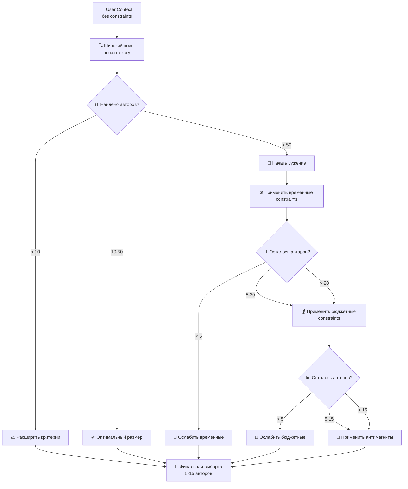

# 🔄 Переосмысление архитектурных решений

## 📊 1. Структура данных: Constraints как часть UserContext

### **Было:**
```typescript
interface UserContext { skills, experience, goals }
interface UserConstraints { max_hours_per_week, max_budget, ... }
```

### **Стало:**
```typescript
interface UserContext {
  // Базовая информация
  skills: string[];
  experience_years: number;
  current_location: string;
  target_location: string;
  education_level: string;
  industry: string;
  current_role: string;
  target_role: string;
  
  // Личные ограничения (подструктура)
  constraints: {
    // Временные границы
    max_hours_per_week: number;
    max_timeline_months: number;
    
    // Финансовые границы  
    max_monthly_budget_usd: number;
    max_total_budget_usd: number;
    
    // Личные обстоятельства
    has_family: boolean;
    cannot_quit_current_job: boolean;
    language_barriers: string[];
    
    // Магниты и антимагниты
    magnets: string[];
    anti_magnets: string[];
    hard_requirements: string[];
  }
}
```

**Преимущества:**
- ✅ Логичнее: constraints - часть контекста пользователя
- ✅ Проще API: один объект вместо двух
- ✅ Естественнее для пользователя: "расскажи о себе и своих ограничениях"

## 🏗️ 2. Названия сервисов - варианты тройками

### **Текущие названия:**
- Route Casting Service  
- Builder Plan Service
- Tracking Plan Service

### **Варианты A (действие-ориентированные):**
- **Story Matching Service** (поиск подходящих историй)
- **Plan Building Service** (построение персонального плана)  
- **Progress Tracking Service** (отслеживание выполнения)

### **Варианты B (результат-ориентированные):**
- **Author Discovery Service** (открытие подходящих авторов)
- **Personal Route Service** (создание персонального маршрута)
- **Journey Monitoring Service** (мониторинг путешествия)

### **Варианты C (пользователь-ориентированные):**
- **Match Finder Service** (находит совпадения)  
- **Plan Creator Service** (создает план)
- **Goal Tracker Service** (отслеживает цели)

**Рекомендация:** Варианты A - наиболее понятные и описывают именно то что делают.

## 🎭 3. Сравнение двух workflow подходов

### **AI Preparation vs Interactive Review**

| Критерий | AI Preparation | Interactive Review |
|----------|---------------|-------------------|
| **👤 Со стороны пользователя** |
| Time to value | ✅ 2-3 минуты до готового плана | ❌ 15-30 минут на изучение |
| Контроль процесса | ❌ Мало контроля | ✅ Полный контроль выбора |
| Cognitive load | ✅ Минимальный | ❌ Требует принятия решений |
| Trust building | ❌ "Черный ящик" | ✅ Понимает каждый шаг |
| Подходит для | Занятые, доверяющие AI | Детальные, осторожные |

| **🏢 Со стороны платформы** |
| Вычислительная сложность | ❌ Высокая (анализ всех авторов) | ✅ Поэтапная нагрузка |
| Quality control | ❌ Сложно контролировать | ✅ Пользователь сам фильтрует |
| User engagement | ❌ Низкий engagement | ✅ Высокий engagement |
| Data collection | ❌ Мало feedback'а | ✅ Много data о предпочтениях |
| Risk of errors | ❌ Высокий (automated decisions) | ✅ Низкий (human in the loop) |

### **Вывод для MVP:**
**Interactive Review** лучше для MVP:
- ✅ Trust building критично для нового продукта
- ✅ Больше feedback от early adopters  
- ✅ Меньше риска плохих рекомендаций
- ✅ Можем итерировать на основе пользовательского поведения

**AI Preparation** - для версии 2.0 когда алгоритмы отточены.

### **Альтернативные названия workflow:**

#### **Текущие:**
- AI Preparation  
- Interactive Review

#### **Варианты A (скорость-ориентированные):**
- **Quick Start** (быстрый старт)
- **Deep Dive** (глубокое погружение)

#### **Варианты B (контроль-ориентированные):**
- **Auto Mode** (автоматический режим)
- **Manual Mode** (ручной режим)

#### **Варианты C (метафора-ориентированные):**
- **Express Lane** (экспресс-дорожка)
- **Guided Journey** (путешествие с гидом)

**Рекомендация:** Варианты C наиболее понятные и создают правильные ожидания.

## 🔍 4. Инвертированный подход к constraints

### **Текущий подход: Strict Filtering**
```
UserContext + Constraints → Строгий фильтр → Найденные авторы → План
```
**Проблема:** Можем получить 0 результатов если constraints слишком строгие

### **Предлагаемый: Progressive Narrowing**
```
UserContext (без constraints) → Широкая выборка → Постепенное применение constraints → Оптимальная выборка
```

#### **Алгоритм Progressive Narrowing:**



#### **Интерфейс Progressive Narrowing:**

```typescript
interface ProgressiveConstraintApplication {
  initial_pool: AuthorMatch[];          // Широкая выборка по контексту
  constraint_steps: ConstraintStep[];   // Пошаговое применение constraints
  user_choice_points: ChoicePoint[];    // Точки где пользователь решает
  final_selection: AuthorMatch[];       // Финальная выборка
}

interface ConstraintStep {
  constraint_type: 'timeline' | 'budget' | 'family' | 'anti_magnets';
  before_count: number;                 // Авторов до применения
  after_count: number;                  // Авторов после применения
  removed_authors: AuthorMatch[];       // Кого исключили и почему
  user_decision_required: boolean;      // Нужно ли решение пользователя
}

interface ChoicePoint {
  situation: string;                    // "Остается только 3 автора после применения budget constraint"
  options: ConstraintOption[];          // Варианты действий
  user_choice: string;                  // Что выбрал пользователь
}

interface ConstraintOption {
  action: 'keep_strict' | 'relax_constraint' | 'explore_removed';
  description: string;                  // "Ослабить бюджетные ограничения до $800/месяц"
  expected_result: string;              // "Добавится 7 авторов"
}
```

#### **Пример работы Progressive Narrowing:**

```
1. 👤 Пользователь: "Python разработчик → Германия, до $500/месяц, 10 часов/неделю"

2. 🔍 Широкий поиск: Найдено 127 авторов с опытом Python → Германия

3. ⏰ Временные constraints (10 часов/неделю): Остается 34 автора
   💭 "Показываем пользователю: исключили 93 автора которые тратили >10 часов/неделю"

4. 💰 Бюджетные constraints ($500/месяц): Остается 8 авторов  
   ⚠️ "Мало авторов! Предлагаем:"
   - Оставить строгий фильтр (8 авторов)
   - Увеличить до $700/месяц (+12 авторов = 20 всего)
   - Посмотреть кого исключили по бюджету

5. 👤 Пользователь выбирает: "Увеличить до $700"

6. 🎯 Финальная выборка: 20 авторов для детального изучения
```

### **Сравнение подходов:**

| Критерий | Strict Filtering | Progressive Narrowing |
|----------|-----------------|----------------------|
| **Risk of zero results** | ❌ Высокий | ✅ Низкий |
| **User understanding** | ❌ "Не нашлось" | ✅ "Вот что исключили и почему" |
| **Flexibility** | ❌ Все или ничего | ✅ Можно регулировать на лету |
| **User engagement** | ❌ Пассивный | ✅ Активный в принятии решений |
| **Discovery** | ❌ Можем пропустить хорошие варианты | ✅ Видим всех исключенных |
| **Complexity** | ✅ Простая реализация | ❌ Сложная логика |

## 🤔 Два подхода к constraints или один?

### **Вариант 1: Два подхода (как с workflow)**
- **Strict Mode**: Для пользователей с четкими ограничениями
- **Explore Mode**: Для пользователей открытых к вариантам

### **Вариант 2: Один Progressive подход**
- Всегда начинаем с широкого поиска
- Даем пользователю контроль над сужением
- Более universal и educational

**Рекомендация:** Вариант 2 - один Progressive подход, потому что:
- ✅ Образовательный эффект - пользователь видит рынок
- ✅ Меньше cognitive load - не нужно выбирать между подходами  
- ✅ Больше discoveries - находим неожиданные варианты
- ✅ Trust building - понятно почему исключили авторов

## 🎯 Финальные рекомендации

### **1. Структура данных:**
✅ Constraints как подструктура UserContext

### **2. Названия сервисов:**
✅ Story Matching Service, Plan Building Service, Progress Tracking Service  

### **3. Workflow для MVP:**  
✅ Guided Journey (Interactive Review) - лучше для trust building

### **4. Подход к constraints:**
✅ Progressive Narrowing - начинаем широко, сужаем постепенно с контролем пользователя

Эти решения делают систему более понятной, гибкой и user-friendly. Готов детализировать любой из аспектов!
