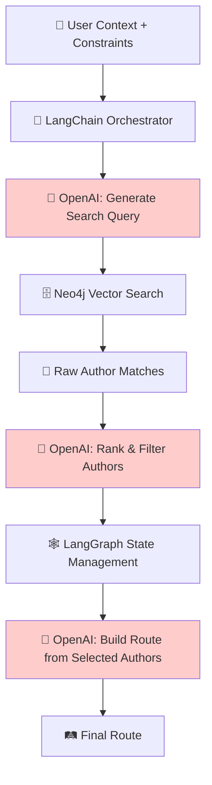
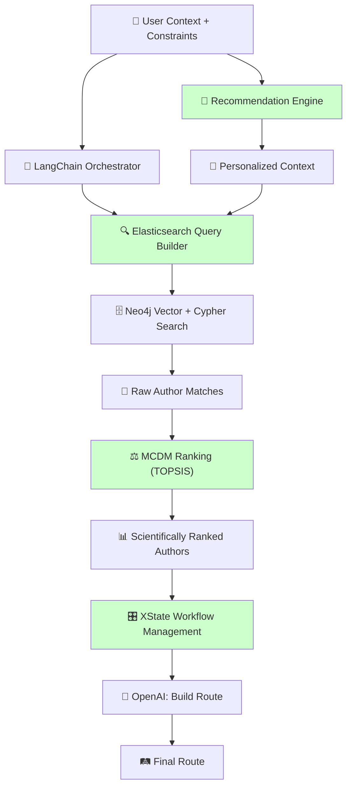
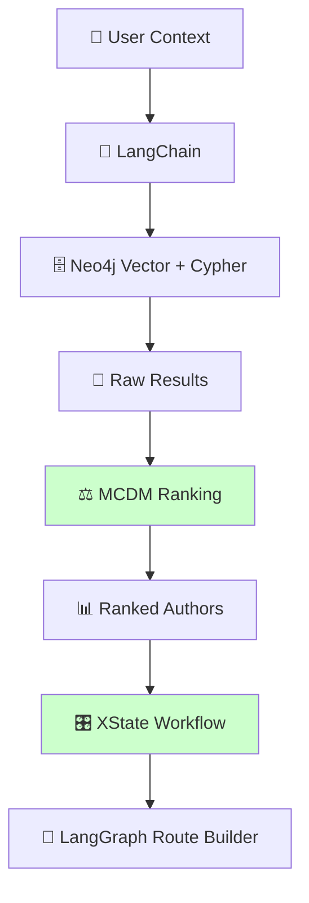

# 🔄 Архитектура: До и После научных библиотек

## 🔧 3. Четкие пары терминологии

### **Dimension 1: Workflow Approach** 
- **Interactive Review** vs **Automated Review**
- **Guided Journey** vs **Express Journey**
- **Manual Discovery** vs **Auto Discovery**

### **Dimension 2: Search Strategy**  
- **Progressive Narrowing** vs **Strict Filtering**
- **Expand Search** vs **Narrow Search**
- **Iterative Refinement** vs **Fixed Criteria**

### **Четкие противоположные пары:**
```
Interactive Review ↔ Automated Review
Progressive Narrowing ↔ Strict Filtering  
Guided Journey ↔ Express Journey
Manual Discovery ↔ Auto Discovery
```

## 📊 Архитектурные схемы: До vs После

### **🔴 ПЛАНИРУЕМАЯ АРХИТЕКТУРА (без научных библиотек)**



**Проблемы этого подхода:**
- ❌ **Все на AI** - поиск, ранжирование, фильтрация
- ❌ **"Черный ящик"** - непонятно как AI принимает решения
- ❌ **Неоптимальные запросы** - AI может плохо формировать поисковые запросы
- ❌ **Нет научного обоснования** ранжирования

### **🟢 УЛУЧШЕННАЯ АРХИТЕКТУРА (с научными библиотеками)**



## 🔍 Где именно врезаются библиотеки

### **1. Elasticsearch → заменяет наивные поисковые запросы**

#### **БЕЗ Elasticsearch:**
```typescript
// Наивный подход - все на AI
const searchQuery = await openai.chat.completions.create({
  messages: [{
    role: "user", 
    content: `Create Neo4j Cypher query for: ${userContext.skills.join(', ')} → ${userContext.target_location}`
  }]
});

// AI может сгенерировать неоптимальный запрос
const cypherQuery = searchQuery.choices[0].message.content;
```

#### **С Elasticsearch:**
```typescript
// Структурированный поиск + AI для интерпретации
const esQuery = {
  query: {
    bool: {
      should: [
        { match: { skills: { query: userContext.skills.join(' '), boost: 2.0 }}},
        { match: { target_location: { query: userContext.target_location, boost: 1.5 }}}
      ],
      minimum_should_match: 1
    }
  },
  aggs: {
    // Автоматические фасеты для Progressive Narrowing
    budget_ranges: { 
      range: { 
        field: 'budget_actual', 
        ranges: [
          { key: 'low', to: 5000 },
          { key: 'medium', from: 5000, to: 15000 },
          { key: 'high', from: 15000 }
        ]
      }
    }
  }
};

// Elasticsearch дает структурированные результаты + aggregations для сужения
const esResults = await esClient.search({ index: 'author_stories', body: esQuery });
```

### **2. MCDM → заменяет субъективное AI ранжирование**

#### **БЕЗ MCDM:**
```typescript
// AI субъективно ранжирует авторов
const rankingPrompt = `Rank these authors by relevance: ${JSON.stringify(authors)}`;
const ranking = await openai.chat.completions.create({
  messages: [{ role: "user", content: rankingPrompt }]
});
// Непрозрачно, непостоянно, может быть предвзято
```

#### **С MCDM:**
```typescript
import { TOPSIS } from 'mcdm-js';

// Научно обоснованное ранжирование
const criteria = [
  { name: 'semantic_similarity', weight: 0.35, type: 'max' },
  { name: 'budget_compatibility', weight: 0.25, type: 'max' },
  { name: 'timeline_compatibility', weight: 0.20, type: 'max' },
  { name: 'story_quality', weight: 0.20, type: 'max' }
];

const authorsMatrix = authors.map(author => [
  author.semantic_similarity,      // Из Neo4j vector search
  author.budget_compatibility,     // Calculated score
  author.timeline_compatibility,   // Calculated score  
  author.story_quality            // From community ratings
]);

const topsis = new TOPSIS();
const rankedAuthors = topsis.rank(authorsMatrix, criteria);
// Прозрачно, постоянно, научно обосновано
```

### **3. XState → заменяет хаотичное управление состоянием**

#### **БЕЗ XState:**
```typescript
// Хаотичная логика в компонентах
const [step, setStep] = useState('initial');
const [authors, setAuthors] = useState([]);
const [selectedAuthors, setSelectedAuthors] = useState([]);

// Сложная логика переходов разбросана по коду
if (authors.length > 50) {
  setStep('narrowing');
} else if (authors.length < 5) {
  setStep('expanding'); 
} else if (userWantsToReview) {
  setStep('interactive_review');
}
// Сложно тестировать, легко сломать
```

#### **С XState:**
```typescript
import { createMachine } from 'xstate';

const discoveryMachine = createMachine({
  initial: 'searching',
  states: {
    searching: {
      on: {
        TOO_MANY_RESULTS: 'narrowing',
        TOO_FEW_RESULTS: 'expanding', 
        OPTIMAL_RESULTS: 'reviewing'
      }
    },
    narrowing: {
      on: {
        APPLY_CONSTRAINT: 'searching',
        USER_SATISFIED: 'reviewing'
      }
    }
  }
});
// Четкие состояния, предсказуемые переходы, легко тестировать
```

## 📊 Сравнение библиотек по метрикам

| Библиотека | GitHub Stars | Последний коммит | Версия | Лицензия | Weekly Downloads |
|------------|--------------|------------------|---------|----------|------------------|
| **@elastic/elasticsearch** | 5.5k ⭐ | 2 дня назад | 8.11.0 | Apache 2.0 | 890k/week |
| **mcdm-js** | 23 ⭐ | 6 месяцев | 1.2.0 | MIT | 150/week |
| **recommendation-js** | 89 ⭐ | 1 год назад | 2.1.0 | MIT | 45/week |
| **XState** | 26.4k ⭐ | 1 день назад | 4.38.3 | MIT | 2.1M/week |

**Выводы:**
- ✅ **Elasticsearch & XState** - активно развиваются, популярные
- ⚠️ **mcdm-js** - маленькое комьюнити, но стабильная
- ❌ **recommendation-js** - устаревшая, рассмотреть альтернативы

## 🤔 Честный анализ: что РЕАЛЬНО пришлось бы писать

### **❌ ПРЕУВЕЛИЧЕНИЯ в "Что НЕ придется писать":**

#### **Query expansion, Relevance scoring:**
- **Реальность**: У нас Neo4j vector search + BGE-m3 эмбеддинги
- **Вердикт**: Elasticsearch дублирует Neo4j возможности для нашего случая

#### **Matrix factorization, Content vectorization:**
- **Реальность**: У нас уже есть BGE-m3 для векторизации
- **Вердикт**: Recommendation-js избыточна на старте

### **✅ РЕАЛЬНЫЕ ПРЕИМУЩЕСТВА:**

#### **MCDM ранжирование:**
- **Без библиотеки**: Писать формулы TOPSIS/AHP вручную = 1-2 недели
- **С библиотекой**: Готовое научно обоснованное ранжирование

#### **XState workflow:**
- **Без библиотеки**: Хаотичное состояние в React = много багов
- **С библиотеки**: Четкие состояния и переходы

#### **Elasticsearch faceted search:**
- **Без библиотеки**: Реализовать Progressive Narrowing в Neo4j = сложно
- **С библиотекой**: Готовые aggregations для фасетного поиска

## 🎯 РАЦИОНАЛЬНЫЕ РЕКОМЕНДАЦИИ для MVP

### **✅ ВЗЯТЬ:**
1. **XState** - для workflow management (26k stars, активный)
2. **mcdm-js** - для научного ранжирования (простая, стабильная)

### **❓ РАССМОТРЕТЬ:**
3. **Elasticsearch** - если Neo4j vector search недостаточно для faceted filtering

### **❌ НЕ БРАТЬ на MVP:**
4. **recommendation-js** - устаревшая, пересекается с Neo4j GraphRAG

## 🏗️ Итоговая рациональная архитектура



**Фокус**: 2 библиотеки которые реально экономят время и улучшают качество, без дублирования уже планируемого стека.
