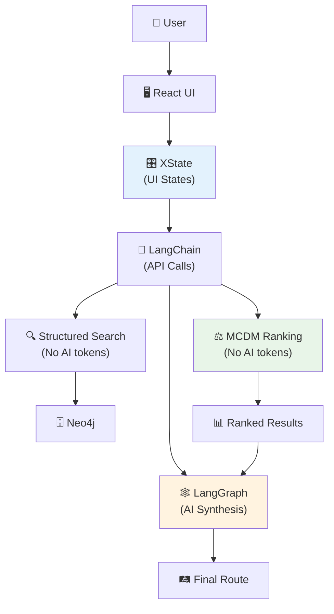

# 🎯 Анализ ключевых проблем и решений

## 🤖 Суть проблемы: Почему не полагаться только на AI?

### **Проблема 1: Неконсистентность AI решений**

#### **Пример проблемного AI поведения:**
```typescript
// Один и тот же запрос - разные результаты
const query1 = "Python разработчик → Германия, $500 бюджет";
const query2 = "Python разработчик → Германия, $500 бюджет"; 

// AI может сгенерировать разные Cypher запросы:
// Результат 1:
// MATCH (a:Author {skills: "Python"}) WHERE a.budget <= 500 RETURN a

// Результат 2: 
// MATCH (a:Author)-[:HAS_SKILL]->(s:Skill {name: "Python"}) 
// WHERE a.budget_actual < 500 AND a.target_country = "Germany" RETURN a

// Разная производительность, разные результаты!
```

**Последствия:**
- ❌ Пользователь получает разные результаты на один запрос
- ❌ Невозможно A/B тестировать алгоритмы
- ❌ Нет воспроизводимости результатов

### **Проблема 2: AI "Черный ящик" в ранжировании**

#### **Текущий подход (все на AI):**
```typescript
const prompt = `
Rank these 20 authors by relevance to user:
User: Python, 3 years, wants Germany, budget $500/month
Authors: ${JSON.stringify(authors)}
`;

const ranking = await openai.chat.completions.create({
  messages: [{ role: "user", content: prompt }]
});
```

**Проблемы:**
- ❌ **Необъяснимость**: Почему автор A ранжирован выше автора B?
- ❌ **Непредсказуемость**: Может поменять ранжирование без причины
- ❌ **Предвзятость**: AI может иметь скрытые bias
- ❌ **Нет контроля**: Нельзя настроить веса критериев

#### **Научный подход (MCDM):**
```typescript
const criteria = [
  { name: 'skills_match', weight: 0.4, type: 'max' },
  { name: 'budget_fit', weight: 0.3, type: 'max' },
  { name: 'location_match', weight: 0.2, type: 'max' },
  { name: 'success_rate', weight: 0.1, type: 'max' }
];

// Прозрачное, воспроизводимое ранжирование
const ranking = topsis.rank(authorsMatrix, criteria);
```

**Преимущества:**
- ✅ **Объяснимость**: Видно вклад каждого критерия
- ✅ **Настраиваемость**: Можно менять веса для разных сегментов
- ✅ **Воспроизводимость**: Одинаковый input = одинаковый output
- ✅ **A/B тестирование**: Легко тестировать разные формулы

### **Проблема 3: Неэффективное использование AI токенов**

#### **Расход токенов в наивном подходе:**
```typescript
// Поиск: 2000 токенов на формирование запроса
const searchQuery = await openai.chat.completions.create({...});

// Ранжирование: 5000 токенов на 20 авторов
const ranking = await openai.chat.completions.create({...});

// Фильтрация: 3000 токенов
const filtering = await openai.chat.completions.create({...});

// ИТОГО: 10,000 токенов на один пользовательский запрос
// При $0.01/1K токенов = $0.10 за запрос
```

#### **Оптимизированный подход:**
```typescript
// Поиск: структурированный запрос = 0 токенов
const esQuery = buildSearchQuery(userContext);

// Ранжирование: математическая формула = 0 токенов  
const ranking = topsis.rank(authorsMatrix, criteria);

// Только финальный синтез: 1000 токенов
const route = await openai.chat.completions.create({...});

// ИТОГО: 1,000 токенов = $0.01 за запрос (10x экономия!)
```

## 🔄 XState vs LangGraph/LangChain для состояний

### **Вопрос: Зачем XState если есть LangGraph?**

#### **LangGraph - для AI workflow orchestration:**
```python
# LangGraph хорош для AI пайплайнов
workflow = StateGraph(AgentState)
workflow.add_node("search", search_node)
workflow.add_node("rank", rank_node) 
workflow.add_node("build_route", build_route_node)

# Но плохо подходит для UI состояний
```

#### **XState - для детального UI state management:**
```typescript
// XState детально управляет UI состояниями
const discoveryMachine = createMachine({
  initial: 'loading_context',
  states: {
    loading_context: {
      on: {
        CONTEXT_LOADED: 'searching',
        CONTEXT_ERROR: 'error'
      }
    },
    searching: {
      on: {
        TOO_MANY_RESULTS: 'progressive_narrowing',
        TOO_FEW_RESULTS: 'expand_search',
        OPTIMAL_RESULTS: 'reviewing_authors'
      }
    },
    progressive_narrowing: {
      initial: 'selecting_constraint',
      states: {
        selecting_constraint: {
          on: {
            BUDGET_SELECTED: 'applying_budget_filter',
            TIMELINE_SELECTED: 'applying_timeline_filter'
          }
        },
        applying_budget_filter: {
          on: {
            FILTER_APPLIED: 'checking_results',
            FILTER_ERROR: 'constraint_error'
          }
        }
      }
    }
  }
});
```

### **Сравнение подходов:**

| Аспект | LangGraph | XState |
|--------|-----------|---------|
| **Область применения** | AI workflow orchestration | UI state management |
| **Гранулярность** | Высокоуровневые AI шаги | Детальные UI состояния |
| **Типы состояний** | "search" → "rank" → "build" | "idle" → "loading" → "success" → "error" |
| **Error handling** | AI-oriented errors | UI-oriented errors |
| **Debugging** | AI workflow debugging | UI behavior debugging |
| **Testability** | Integration tests | Unit tests для UI логики |

### **Почему XState, а не альтернативы?**

#### **Сравнение с альтернативами:**

| Библиотека | GitHub Stars | Особенности | Недостатки |
|------------|--------------|-------------|------------|
| **XState** | 26.4k ⭐ | Визуализация, DevTools, TypeScript | Steep learning curve |
| **Robot** | 1.2k ⭐ | Легковесная | Мало функций |
| **Machina.js** | 1.9k ⭐ | Простая | Устаревшая |
| **State Machine Cat** | 200 ⭐ | Визуализация | Только визуализация |

**Почему XState:**
- ✅ **Популярность**: 26k stars, активное комьюнити
- ✅ **DevTools**: Отличные инструменты отладки
- ✅ **TypeScript**: Полная типизация
- ✅ **Визуализация**: Можно видеть state machine графически
- ✅ **React integration**: `@xstate/react` из коробки

## 🏗️ Архитектурное разделение ответственности

### **LangGraph зона ответственности:**
```python
# Высокоуровневый AI workflow
def ai_workflow():
    context = gather_user_context()
    raw_matches = search_authors(context)
    ranked_authors = rank_authors(raw_matches)  # Тут используем MCDM!
    route = build_personalized_route(ranked_authors)
    return route
```

### **XState зона ответственности:**
```typescript
// Детальное управление UI
const uiMachine = createMachine({
  states: {
    gathering_context: {
      states: {
        skills_input: {},
        validating_skills: {},
        constraints_input: {},
        validating_constraints: {}
      }
    },
    discovering_authors: {
      states: {
        initial_search: {},
        too_many_results: {},
        progressive_narrowing: {
          states: {
            budget_constraint: {},
            timeline_constraint: {},
            location_constraint: {}
          }
        }
      }
    }
  }
});
```

## 🎯 Итоговая архитектура разделения



**Принцип**: Каждый инструмент для своей задачи, AI только там где действительно нужен интеллект, а не для рутинных операций.
