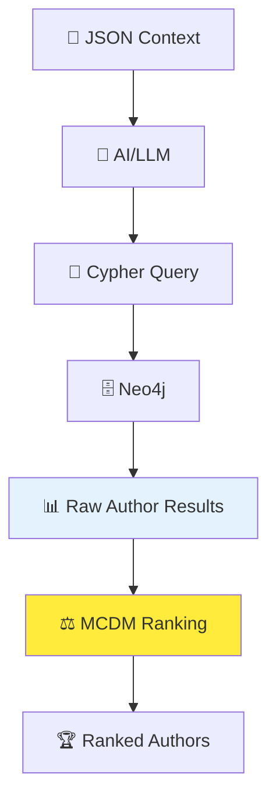

# 🔍 Уточненный архитектурный анализ

## 🔧 3. Улучшенные пары терминологии

### **Варианты с Review (противоположности):**
- **Interactive Review** ↔ **Automated Review**
- **Manual Review** ↔ **Instant Review** 
- **Guided Review** ↔ **Express Review**
- **Step-by-Step Review** ↔ **One-Click Review**

### **Варианты с Discovery (противоположности):**
- **Guided Discovery** ↔ **Instant Discovery**
- **Manual Discovery** ↔ **Auto Discovery**
- **Interactive Discovery** ↔ **Automated Discovery**
- **Exploratory Discovery** ↔ **Targeted Discovery**

### **Рекомендуемые пары для MVP:**
```
Interactive Review ↔ Automated Review
Guided Discovery ↔ Instant Discovery  
Progressive Narrowing ↔ Strict Filtering
```

## ❌ Исправление НЕПРАВИЛЬНОГО понимания MCDM

### **МОЯ ОШИБКА в объяснении:**
Я сказал что MCDM преобразует JSON в Cypher - **это неверно!**

### **ГДЕ РЕАЛЬНО используется MCDM:**

#### **Правильная схема:**


**MCDM НЕ генерирует запросы, а РАНЖИРУЕТ результаты!**

#### **Детальное объяснение:**

##### **Шаг 1: JSON → Cypher (как планировалось)**
```typescript
// Это остается как есть - через AI
const userContext = { skills: ["Python"], target: "Germany", budget: 500 };

const prompt = `Generate Cypher query for: ${JSON.stringify(userContext)}`;
const cypherQuery = await openai.chat.completions.create({...});
// Результат: "MATCH (a:Author {skills: 'Python'})..."
```

##### **Шаг 2: Cypher → Neo4j → Raw Results (как планировалось)**
```cypher
MATCH (a:Author)-[:HAS_SKILL]->(s:Skill {name: "Python"})
WHERE a.target_country = "Germany"
RETURN a.name, a.budget_actual, a.timeline_months, a.story_quality, a.semantic_similarity
```

##### **Шаг 3: MCDM ранжирование результатов (НОВОЕ)**
```typescript
// ВОТ ТУТ врезается MCDM!
const rawAuthors = neo4jResults; // Результаты из Neo4j

const criteria = [
  { name: 'semantic_similarity', weight: 0.35, type: 'max' },    // Из Neo4j vector search
  { name: 'budget_compatibility', weight: 0.25, type: 'max' },   // Calculated: budget_fit = 1 - |user_budget - author_budget| / max_budget
  { name: 'timeline_compatibility', weight: 0.20, type: 'max' }, // Calculated: timeline_fit  
  { name: 'story_quality', weight: 0.20, type: 'max' }          // Из Neo4j (community rating)
];

// Подготавливаем матрицу для MCDM
const authorsMatrix = rawAuthors.map(author => [
  author.semantic_similarity,                    // 0.87 (из Neo4j)
  calculateBudgetCompatibility(author, user),    // 0.92 (calculated)
  calculateTimelineCompatibility(author, user),  // 0.78 (calculated) 
  author.story_quality                           // 4.2 (из Neo4j)
]);

// MCDM ранжирование
import { TOPSIS } from 'mcdm-js';
const topsis = new TOPSIS();
const rankedAuthors = topsis.rank(authorsMatrix, criteria);
```

## 🤖 Альтернативы MCDM для ранжирования

### **Сравнение подходов к ранжированию:**

| Подход | Популярность | Сложность | Объяснимость | Настраиваемость |
|--------|--------------|-----------|---------------|-----------------|
| **AI Ranking** | ✅ Высокая | ✅ Низкая | ❌ Черный ящик | ❌ Нет контроля |
| **Simple Weighted Sum** | ✅ Высокая | ✅ Низкая | ✅ Прозрачно | ✅ Легко настроить |
| **MCDM (TOPSIS)** | ⚠️ Средняя | ⚠️ Средняя | ✅ Научно обосновано | ✅ Гибко настраивается |
| **ML Ranking Models** | ✅ Высокая | ❌ Высокая | ❌ Требует данных | ⚠️ Нужно обучение |

### **Простая альтернатива - Weighted Sum:**
```typescript
// Проще чем MCDM, но менее научно обосновано
function simpleRanking(authors: Author[], weights: Weights): RankedAuthor[] {
  return authors.map(author => ({
    ...author,
    score: 
      author.semantic_similarity * weights.semantic +
      author.budget_compatibility * weights.budget +
      author.timeline_compatibility * weights.timeline +
      author.story_quality * weights.quality
  })).sort((a, b) => b.score - a.score);
}
```

### **Рекомендация для MVP:**
**Простой Weighted Sum** вместо MCDM:
- ✅ Проще в реализации
- ✅ Легче объяснить команде  
- ✅ Быстрее запустить MVP
- ✅ Можно заменить на MCDM позже

## 📱 XState для MVP с Телеграм ботом - честная оценка

### **Контекст: Телеграм бот как основной интерфейс**

#### **Архитектура без XState:**
```typescript
// Простое управление состоянием в боте
const userSessions = new Map();

bot.on('text', async (ctx) => {
  const userId = ctx.from.id;
  const userSession = userSessions.get(userId) || { step: 'initial' };
  
  switch (userSession.step) {
    case 'initial':
      await ctx.reply('Расскажите о своих навыках');
      userSession.step = 'gathering_skills';
      break;
    case 'gathering_skills':
      userSession.skills = ctx.message.text;
      await ctx.reply('Какая ваша цель?');
      userSession.step = 'gathering_goal';
      break;
    // ... и так далее
  }
  
  userSessions.set(userId, userSession);
});
```

#### **Архитектура с XState:**
```typescript
import { createMachine, interpret } from 'xstate';

const chatMachine = createMachine({
  id: 'waymates-chat',
  initial: 'greeting',
  states: {
    greeting: {
      on: { START: 'gathering_context' }
    },
    gathering_context: {
      initial: 'skills',
      states: {
        skills: {
          on: {
            SKILLS_PROVIDED: 'goals',
            SKILLS_UNCLEAR: 'clarifying_skills'
          }
        },
        clarifying_skills: {
          on: { CLARIFICATION_PROVIDED: 'goals' }
        },
        goals: {
          on: { GOALS_PROVIDED: 'constraints' }
        },
        constraints: {
          on: { CONSTRAINTS_PROVIDED: '#discovering_authors' }
        }
      }
    },
    discovering_authors: {
      // ... сложная логика поиска
    }
  }
});

const userMachines = new Map(); // По машине на пользователя

bot.on('text', async (ctx) => {
  const userId = ctx.from.id;
  let machine = userMachines.get(userId);
  
  if (!machine) {
    machine = interpret(chatMachine).start();
    userMachines.set(userId, machine);
  }
  
  // Отправляем событие в машину состояний
  machine.send({ type: 'USER_INPUT', text: ctx.message.text });
});
```

### **Сравнение для MVP:**

| Аспект | Без XState | С XState |
|--------|------------|----------|
| **Время разработки** | ✅ 2-3 дня | ❌ 5-7 дней |
| **Сложность кода** | ✅ Простой switch | ❌ Изучение XState API |
| **Отладка** | ⚠️ console.log | ✅ XState DevTools |
| **Тестирование** | ❌ Сложно тестировать | ✅ Легко тестировать |
| **Масштабируемость** | ❌ Спагетти код при росте | ✅ Четкая структура |
| **Визуализация** | ❌ Нет | ✅ Диаграммы состояний |

### **Что мы ПОТЕРЯЕМ без XState на MVP:**
- ❌ Визуализация flow разговора
- ❌ Легкое тестирование сложных сценариев
- ❌ DevTools для отладки состояний
- ❌ Четкая документация логики бота

### **Что мы ВЫИГРАЕМ без XState на MVP:**
- ✅ Быстрее выйти на рынок (экономия 2-4 дня)
- ✅ Меньше сложности для команды
- ✅ Проще вносить изменения по feedback

### **ЧЕСТНАЯ РЕКОМЕНДАЦИЯ для MVP:**

#### **НЕ БРАТЬ XState на MVP**, потому что:
1. **Time to market критичнее** чем идеальная архитектура
2. **Телеграм бот = простые состояния** (не нужна вся мощь XState)
3. **Команде нужно изучать** еще один инструмент
4. **Можно добавить позже** без переписывания с нуля

#### **ВЗЯТЬ XState после MVP**, когда:
- Появятся сложные многошаговые сценарии
- Добавятся веб/мобильные клиенты
- Логика бота станет слишком сложной для простого switch

## 🔄 LangGraph vs XState - разделение ответственности

### **ПРАВИЛЬНОЕ понимание:**

#### **LangGraph (бэкенд AI workflow):**
```python
# Высокоуровневые AI операции
workflow = StateGraph(AgentState)

workflow.add_node("gather_context", gather_context_node)
workflow.add_node("search_authors", search_authors_node)  
workflow.add_node("rank_authors", rank_authors_node)
workflow.add_node("build_route", build_route_node)

# Переходы между AI операциями
workflow.add_edge("gather_context", "search_authors")
workflow.add_edge("search_authors", "rank_authors")
# ...
```

#### **XState (фронтенд UI states):**
```typescript
// Детальные пользовательские взаимодействия
const chatMachine = createMachine({
  states: {
    gathering_context: {
      // НЕ разбивает LangGraph шаг на подшаги
      // А управляет UI состояниями внутри этого шага
      initial: 'asking_skills',
      states: {
        asking_skills: {
          on: { 
            SKILLS_PROVIDED: 'validating_skills',
            UNCLEAR_INPUT: 'clarifying_skills'
          }
        },
        validating_skills: {
          on: {
            VALIDATION_SUCCESS: 'asking_goals',
            VALIDATION_FAILED: 'asking_skills'
          }
        }
      }
    }
  }
});
```

### **Они НЕ разбивают друг друга на подшаги:**
- **LangGraph**: "Собери контекст пользователя" (одна нода)
- **XState**: Как спросить навыки → как валидировать → как обработать ошибки → как спросить цели

**Разные уровни абстракции для разных задач.**

## 🎯 Финальные рекомендации для MVP

### **✅ ВЗЯТЬ на MVP:**
1. **Simple Weighted Ranking** вместо MCDM (проще, быстрее)
2. **Четкие пары терминов** для понятности команде

### **❌ НЕ БРАТЬ на MVP:**
1. **XState** - добавить после MVP при росте сложности
2. **MCDM библиотеки** - слишком сложно для старта

### **⏭️ Добавить после MVP:**
1. **XState** когда появятся сложные UI сценарии
2. **MCDM** когда нужна научная обоснованность ранжирования

**Принцип**: MVP = минимально работающий продукт, сложность добавляем по мере роста потребностей.
