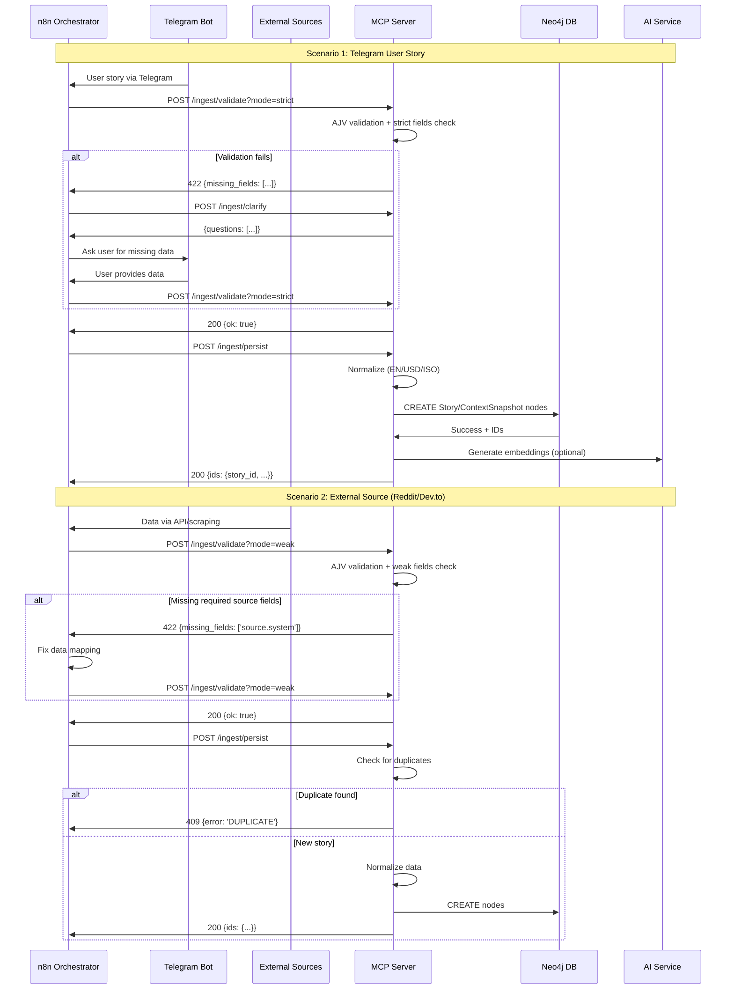
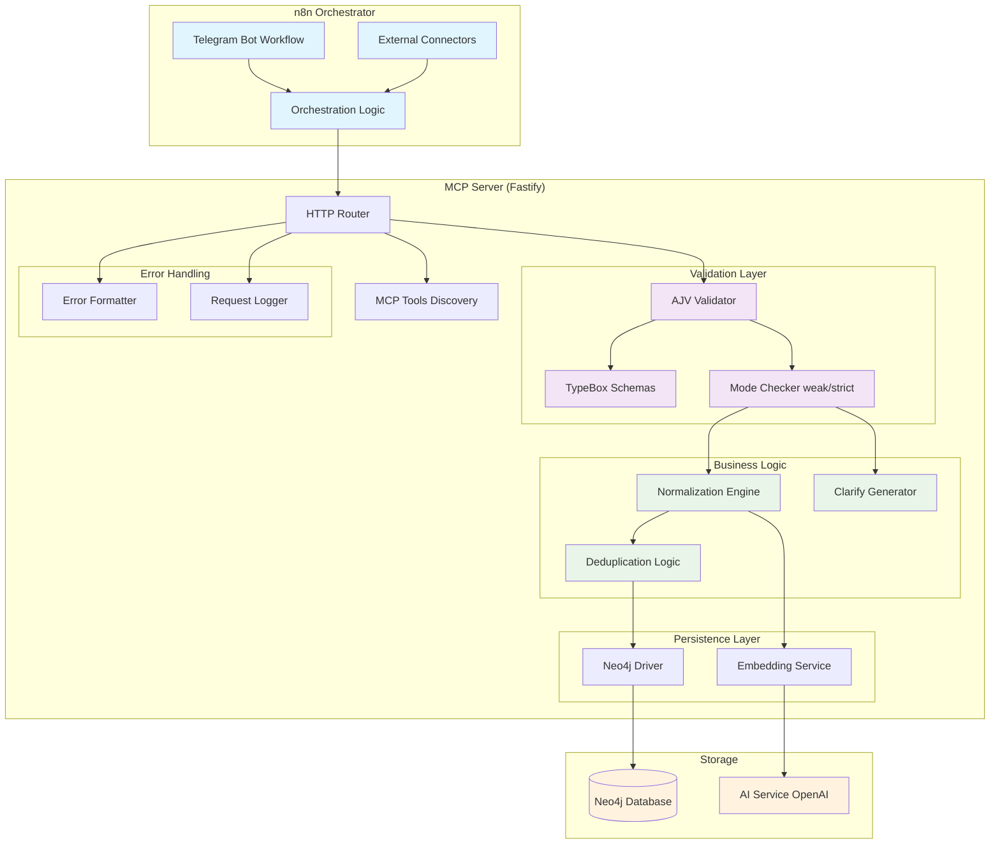
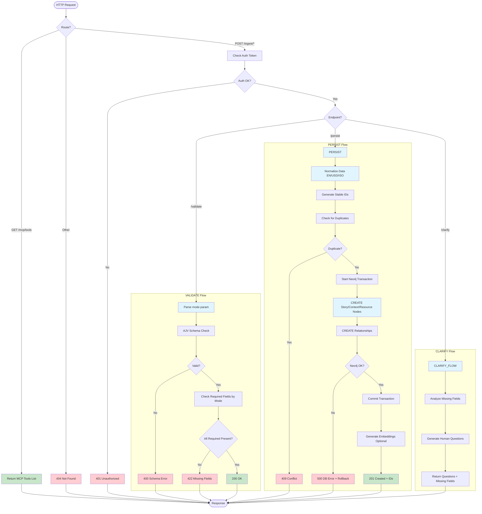
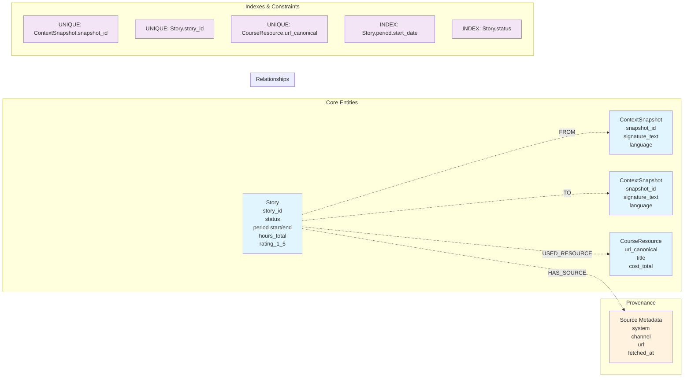

# Архитектурный план MCP Ingest Server

Дата: 2025-09-13

## Обзор системы

MCP Ingest Server - это HTTP-сервер, реализующий протокол Model Context Protocol для унифицированного инжеста карьерных историй из различных источников в Neo4j базу данных WayMates.

### Ключевые принципы:
- **Единый шлюз**: все данные проходят через один pipeline
- **Flexible validation**: weak/strict режимы для разных источников
- **Идемпотентность**: безопасные повторные вызовы
- **Machine-readable errors**: структурированные ошибки для n8n

## 1. Sequence диаграмма: End-to-end поток данных



## 2. Компонентная диаграмма: Архитектура и интерфейсы



## 3. Алгоритм обработки запроса: Блок-схема



## 4. Архитектура валидации: Детальная схема

```mermaid
flowchart LR
    subgraph "Input Payload"
        JSON[Raw JSON Payload]
    end
    
    subgraph "TypeBox Schema Layer"
        BASE_SCHEMA[Base Schema All Optional]
        TB_COMPILE[TypeBox → JSON Schema]
    end
    
    subgraph "AJV Validation"
        AJV_VALIDATE[AJV.validate]
        TYPE_CHECK[Type/Format Check]
    end
    
    subgraph "Mode-based Required Check"
        MODE_PARAM[mode=weak|strict]
        WEAK_RULES[Weak: source.* fields]
        STRICT_RULES[Strict: story.* fields]
        FIELD_CHECKER[Check Required Fields]
    end
    
    subgraph "Outputs"
        VALID[✓ Valid - Ready for Persist]
        MISSING[✗ Missing Fields List]
        INVALID[✗ Schema Violations]
    end
    
    JSON --> AJV_VALIDATE
    BASE_SCHEMA --> TB_COMPILE
    TB_COMPILE --> AJV_VALIDATE
    
    AJV_VALIDATE --> TYPE_CHECK
    TYPE_CHECK -->|Pass| FIELD_CHECKER
    TYPE_CHECK -->|Fail| INVALID
    
    MODE_PARAM --> WEAK_RULES
    MODE_PARAM --> STRICT_RULES
    WEAK_RULES --> FIELD_CHECKER
    STRICT_RULES --> FIELD_CHECKER
    
    FIELD_CHECKER -->|All Required Present| VALID
    FIELD_CHECKER -->|Missing Fields| MISSING
    
    classDef input fill:#e3f2fd
    classDef process fill:#f3e5f5  
    classDef success fill:#e8f5e8
    classDef error fill:#ffebee
    
    class JSON input
    class AJV_VALIDATE,FIELD_CHECKER process
    class VALID success
    class MISSING,INVALID error
```

## 5. Neo4j Data Model: Граф структуры



## Технические решения

### 1. Технологический стек
- **HTTP Server**: Fastify + встроенная AJV интеграция
- **Validation**: TypeBox + AJV v8
- **Database**: Neo4j официальный драйвер  
- **Embeddings**: OpenAI API (опционально)
- **Deployment**: Docker + GHCR + IaaS

### 2. Ключевые паттерны
- **Single Responsibility**: каждый endpoint выполняет одну задачу
- **Fail Fast**: валидация перед любой обработкой
- **Idempotency**: безопасные повторные вызовы persist
- **Machine Readable**: структурированные ошибки для автоматизации

### 3. Обработка ошибок
```typescript
interface MCPError {
  error: {
    code: 'VALIDATION_ERROR' | 'DUPLICATE' | 'DATABASE_ERROR';
    message: string;
    details?: any;
    missing_fields?: string[];
    request_id: string;
  }
}
```

### 4. Режимы валидации

| Mode | Use Case | Required Fields |
|------|----------|----------------|
| `weak` | External sources | `source.*`, `raw_text`, `lang` |
| `strict` | Telegram/Manual | `story.period.*`, `story.rating_1_5`, `story.*_snapshot_id` |

### 5. Нормализация

| Field | Transformation | Example |
|-------|---------------|---------|
| `signature_text` | → EN via AI | "Изучал React" → "Learned React" |
| `period` | → ISO dates + granularity | "2025-01" → `{start_date: "2025-01-01", granularity: "month"}` |
| `cost_total` | → USD conversion | "₽5000" → `{amount: 55.2, currency: "USD", original: "₽5000"}` |

## План разработки

### Phase 1: Core MCP Server (1-2 дня)
1. Fastify setup + TypeBox schemas
2. Basic endpoints `/mcp/tools`, `/ingest/validate`
3. AJV integration + mode checking
4. Unit tests

### Phase 2: Persistence Layer (1 день)  
1. Neo4j driver integration
2. `/ingest/persist` implementation
3. Normalization engine
4. Deduplication logic

### Phase 3: Error Handling & Polish (0.5 дня)
1. `/ingest/clarify` endpoint
2. Error formatting & logging
3. Integration tests
4. Docker deployment

### Phase 4: Production Ready (0.5 дня)
1. Security (auth, CORS, rate limiting)
2. Monitoring & health checks
3. Performance optimization
4. Documentation

**Total: ~4 дня разработки**
