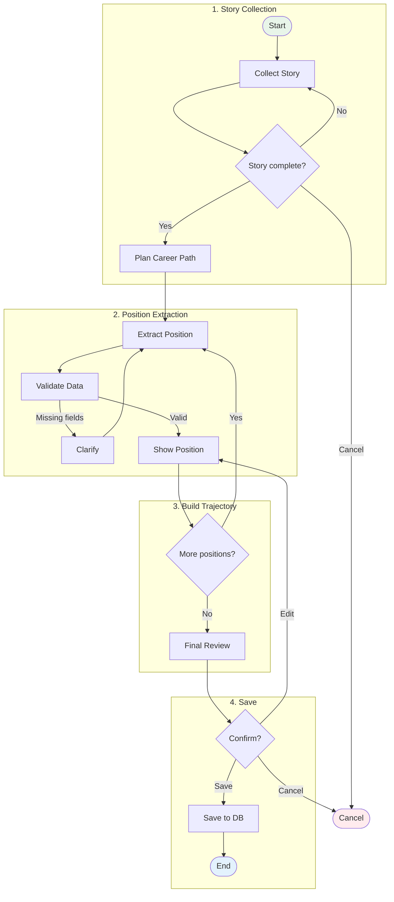

# Cold Start: Career Story Collection

> Multi-turn dialogue for collecting user's career history.

## Phases

| Phase | Description |
|-------|-------------|
| **Story Collection** | User tells their career story in free form |
| **Position Extraction** | AI extracts structured data (role, company, skills, dates) |
| **Build Trajectory** | Loop through all career positions |
| **Save** | Review and persist to database |

---
*Simplified view. Full graph: `npm run graph`*
