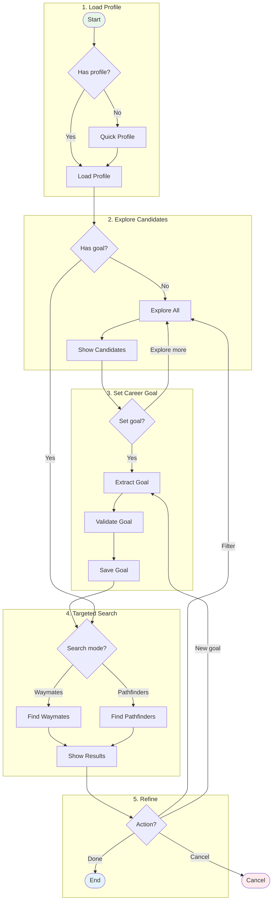

# Search: Career Path Discovery

> Find waymates (same goal) and pathfinders (achieved goal).

## Search Modes

| Mode | Description |
|------|-------------|
| **Explore** | All candidates without goal filter |
| **Waymates** | People with the SAME career goal (not achieved yet) |
| **Pathfinders** | People who ACHIEVED your goal (proof of path) |

## Key Concepts

- **Goal** = Target position (role + skills + industry)
- **DTW Matching** = Trajectory similarity scoring
- **Filters** = Refine by skills, location, experience

---
*Simplified view. Full graph: `npm run graph`*
