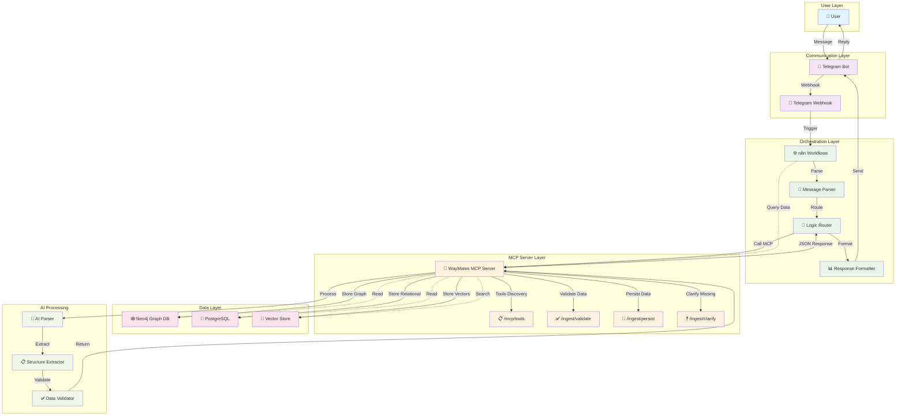
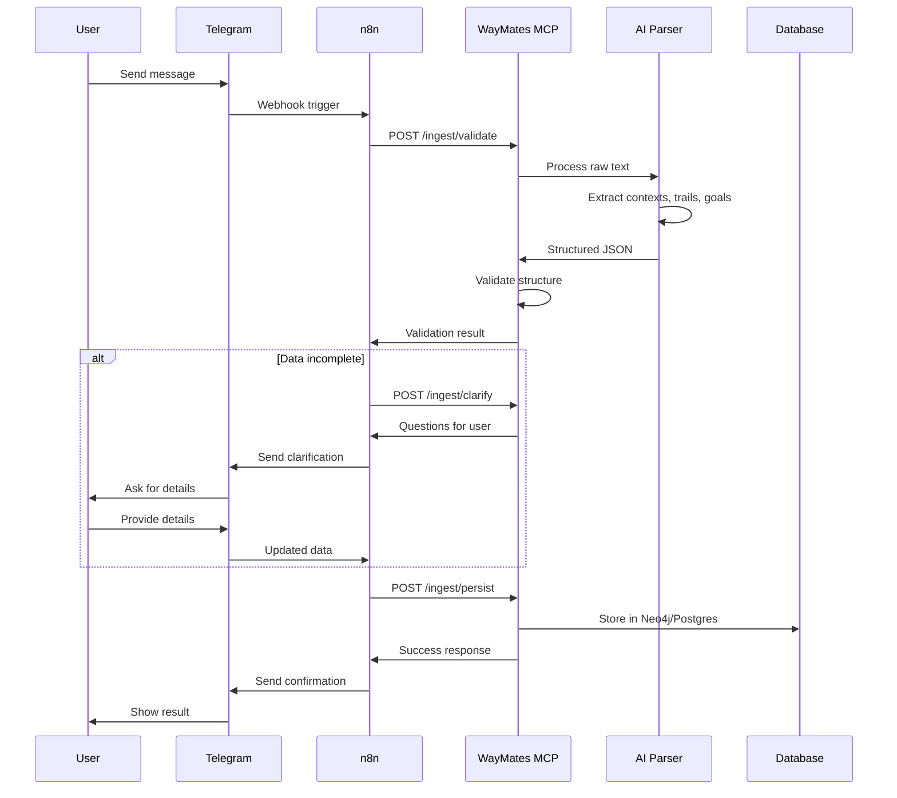
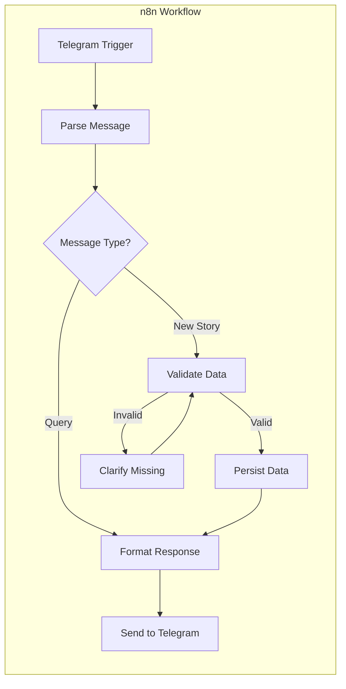

# WayMates MCP + n8n + Telegram Architecture

> **Статус:** Эта интеграция — после минимального плана.

## Mermaid Block Diagram

## Data Flow Sequence

## n8n Workflow Configuration

## Key Integration Points

1. **Telegram → n8n**: Webhook-based message processing
2. **n8n → MCP**: HTTP API calls to WayMates MCP server
3. **MCP → AI**: Text processing and structure extraction
4. **MCP → Database**: Data persistence in graph and relational stores
5. **n8n → Telegram**: Formatted responses back to user

## Benefits of This Architecture

- **Decoupled**: Each component has single responsibility
- **Scalable**: n8n handles orchestration, MCP handles data processing
- **Flexible**: Easy to add new integrations via n8n nodes
- **Maintainable**: Clear separation of concerns
- **Extensible**: Can add more data sources and AI providers

