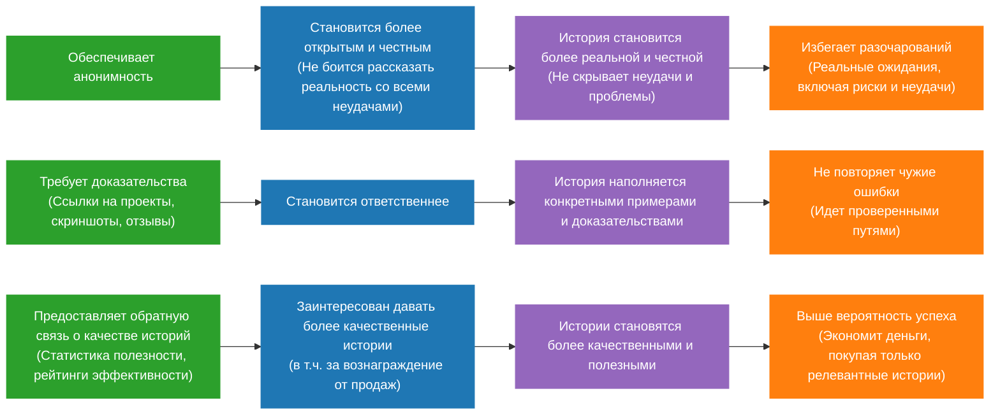

# Mind Map Ценностной Цепочки WayMates

### 1. Исключение компаний из экосистемы
**Принцип:** Компании НЕ являются участниками платформы WayMates.
**Обоснование:** Доступ компаний к платформе нарушает анонимность рассказчиков, что является ключевым принципом платформы.

### 2. Монетизация
**Подход:** Интегрирована в ценностную цепочку, а не выделена отдельно
- Рассказчики мотивированы вознаграждением от продаж
- Слушатели экономят деньги, покупая только релевантные истории

## Терминология проекта

### Участники
- **Рассказчики** - пользователи, кто создают контент (истории)
- **Слушатели** - пользователи, кто потребляют контент
- **Платформа** - обеспечивает инфраструктуру и правила

### Ключевые функции платформы
- **Анонимность** - защита личности рассказчиков
- **Доказательства** - требование подтверждения опыта (ссылки на проекты, скриншоты, отзывы)
- **Обратная связь** - статистика полезности контента (рейтинги эффективности)

### Ценностные потоки
1. **Анонимность → Честность → Реальность → Избежание разочарований**
2. **Доказательства → Ответственность → Конкретность → Избежание ошибок**  
3. **Обратная связь → Мотивация → Качество → Успех**