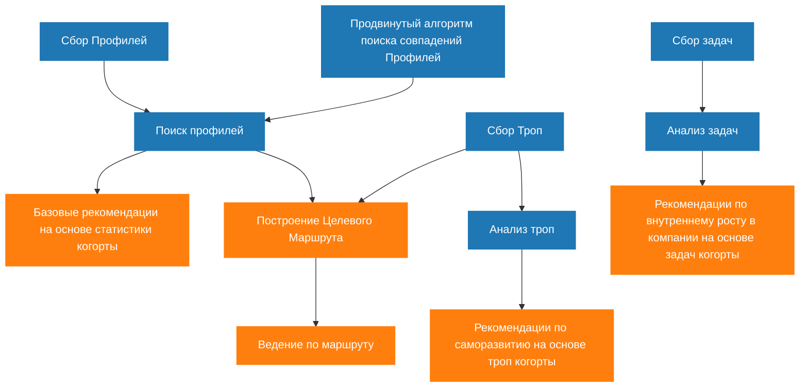

# Ценностная цепочка платформы WayMates: RAG vs KAG подходы

## Mermaid схема

**Версия 2.0** - Упрощенная схема без поиска когорты

## ОПИСАНИЕ СХЕМЫ

### **Блоки сбора данных (KAG)**
- **Сбор Профилей** - накопление контекстов пользователей
- **Поиск профилей** - поиск когорт и аватаров ([@2025_09_20_21_00_waymates-skill-assessment-evolution.md](memory-bank/2025_09_20_21_00_waymates-skill-assessment-evolution.md))
- **Сбор Троп** - накопление историй переходов между контекстами ([@2025_09_20_13_00_waymates-trails-architecture.md](memory-bank/2025_09_20_13_00_waymates-trails-architecture.md))
- **Сбор задач** - накопление задач, решаемых в компании ([@2025_09_20_14_00_waymates-tasks-architecture.md](memory-bank/2025_09_20_14_00_waymates-tasks-architecture.md))

### **Блоки анализа (KAG)**
- **Анализ троп** - анализ историй для рекомендаций по саморазвитию
- **Анализ задач** - анализ задач для рекомендаций по внутреннему росту
- **Продвинутый алгоритм поиска совпадений Профилей** - AI-оценка уровня владения технологиями и семантический поиск аватаров ([@2025_09_20_21_00_waymates-skill-assessment-evolution.md](memory-bank/2025_09_20_21_00_waymates-skill-assessment-evolution.md))

### **Пользовательские фичи**
- **Базовые рекомендации на основе статистики когорты** - простые советы на основе профилей
- **Построение Целевого Маршрута** - создание оптимального пути к цели
- **Ведение по маршруту** - сопровождение пользователя по маршруту
- **Рекомендации по внутреннему росту в компании** - советы на основе анализа задач
- **Рекомендации по саморазвитию** - советы на основе анализа троп

## ПРИНЦИП РАБОТЫ

**Общий подход**: Сбор данных → Анализ → Рекомендации

1. **Сбор данных**: Профили, тропы и задачи накапливаются в графовой БД
2. **Анализ**: Специализированный анализ троп и задач для разных типов рекомендаций
3. **Рекомендации**: Персонализированные советы на основе анализа данных

**Потоки данных**:
- **Продвинутый алгоритм поиска** → Поиск профилей (для точного семантического поиска аватаров)
- **Сбор профилей** → Поиск профилей (накопленные данные для поиска)
- **Поиск профилей** → Базовые рекомендации + Построение маршрута
- **Тропы** → Построение маршрута + Анализ троп → Рекомендации по саморазвитию
- **Задачи** → Анализ задач → Рекомендации по внутреннему росту

## ТЕХНОЛОГИИ

- **Графовая БД**: Neo4j для хранения профилей, троп
- **Векторная БД**: Для семантического поиска по задачам
- **LLM**: Для генерации рекомендаций на основе анализа данных
---

**KAG (Knowledge-Augmented Generation)** - использует структурированные знания (графы) для поиска связей:
- Поиск когорты и аватаров через графовые связи
- Построение маршрутов между контекстами
- Анализ структурированных данных

**RAG (Retrieval-Augmented Generation)** - извлекает релевантную информацию для генерации ответов:
- Задачи пользователей?

## 🔗 Связанные документы

- [Эволюция оценки навыков](../memory-bank/2025_09_20_21_00_waymates-skill-assessment-evolution.md) - детальная логика поиска и сопоставления профилей
- [Trails Architecture](../memory-bank/2025_09_20_13_00_waymates-trails-architecture.md) - архитектура троп
- [Tasks Architecture](../memory-bank/2025_09_20_14_00_waymates-tasks-architecture.md) - архитектура задач
