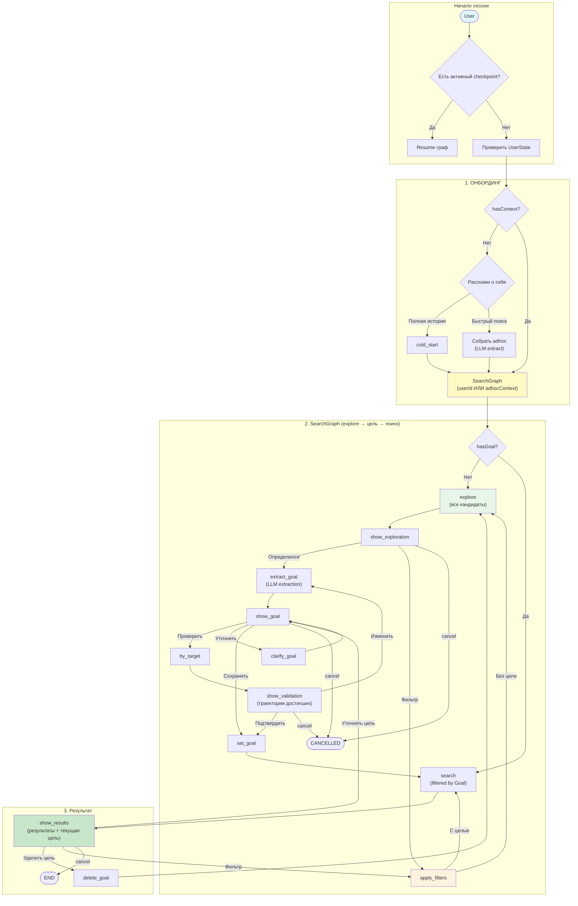

# WayMates MVP — Business Logic & User Journey

**Дата:** 2025-12-26
**Статус:** APPROVED
**Цель документа:** Зафиксировать бизнес-логику MVP
**ADR:** [ADR-030-conversation-orchestrator](../architecture/decisions/ADR-030-conversation-orchestrator.md)

---

## 1. Концепция продукта

WayMates помогает найти карьерный путь через анализ траекторий похожих профессионалов.

### Ключевые сущности:

| Сущность | Описание |
|----------|----------|
| **Context** | Карьерная позиция (должность, компания, навыки, локация) |
| **Trajectory** | Путь = последовательность контекстов + trails между ними |
| **Trail** | Обучение/сертификация между контекстами |
| **Goal** | Карьерная цель пользователя |
| **Pathfinder** | Кандидат, который БЫЛ как мы + ДОСТИГ нашей цели (proof of transition) |
| **Waymate** | Кандидат с ТОЙ ЖЕ целью (ещё не достиг, `isWaymate: true`) |
| **ReversePathfinder** | Кандидат, который ДОСТИГ цели (любой старт, для валидации) |

---

## 2. User Journey (упрощённый flow)

### Ключевые принципы:

1. **Explore-first** — начинаем с показа ВСЕХ кандидатов (без фильтрации по цели)
2. **Цель формируется после explore** — пользователь видит кандидатов, потом определяется с целью
3. **by_target для валидации** — перед сохранением цели можно проверить траектории достигших
4. **Цель фильтрует финальные результаты** — search с целью показывает только pathfinders/waymates + DTW
5. **Цикл уточнения** — после результатов можно удалить цель и вернуться к explore

### Mermaid диаграмма:



### Текстовое описание:

```
[Начало сессии]
    • Есть активный checkpoint? → Resume соответствующий граф
    • Нет checkpoint → Проверить UserState

[1] ОНБОРДИНГ (если нет контекста)
    • "Полная история" → cold_start → hasContext: true
    • "Быстрый поиск" → собрать adhoc → SearchGraph (без сохранения)

[2] SearchGraph (explore → цель → поиск)
    • Вход: userId (by_current) ИЛИ adhocContext (adhoc)

    [2.1] check_goal
        • hasGoal=false → explore (все кандидаты, без фильтрации)
        • hasGoal=true → search (filtered by Goal) → show_results

    [2.2] explore → show_exploration
        • "Определился" → extract_goal (LLM извлекает цель из описания)
        • "Фильтр" → apply_filters (уточнить результаты)
        • "cancel" → END

    [2.25] apply_filters (уточнение результатов)
        • LLM парсит CurrentSearchParams из текста пользователя:
          - excludedContextFields (исключить поля: industry, birthYear...)
          - excludedCreationReasons (исключить причины смены: company_changed...)
          - recencyThresholdMonths (только за последние N месяцев)
          - limit (макс. результатов: 1-100, default 20)
        • Нормализация через fuzzy matching (user input → canonical values)
        • Validation: clamping limit [1, 100], recencyThreshold >= 1
        • Возврат appliedFilters + rejectedFields (feedback что не нашлось)
        • Повтор explore (без цели) ИЛИ search (с целью)

    [2.3] extract_goal → show_goal
        • "Проверить" → by_target (показать траектории достигших)
        • "Уточнить" → clarify_goal → show_goal
        • "Сохранить" → set_goal → search
        • "cancel" → END

    [2.4] by_target → show_validation
        • "Подтвердить" → set_goal → search
        • "Изменить" → extract_goal
        • "cancel" → END

[3] РЕЗУЛЬТАТ
    show_results (показывает результаты + текущую цель):
        • Pathfinders (достигли цели)
        • Waymates (идут к цели)
        • DTW метрики (если траектория)

    Опции после результатов:
        • "Уточнить цель" → show_goal (можно изменить/проверить)
        • "Удалить цель" → explore (вернуться к всем кандидатам)
        • "Фильтр" → apply_filters (уточнить результаты без изменения цели)
        • "cancel" → END
```

---

## 3. User State (состояние пользователя)

### Структура:

```typescript
interface UserState {
  hasContext: boolean;        // есть ли сохранённый контекст в БД
  hasGoal: boolean;           // есть ли зафиксированная цель
}
```

**Почему нет флага `skippedOnboarding`:**
- Режим определяется по активному checkpoint графа
- "Быстрый поиск" — альтернативный путь, не пропуск
- adhoc контекст передаётся как параметр в SearchGraph

### Влияние на поиск:

| Флаг | Влияние |
|------|---------|
| `hasContext` | Можно делать by_current (иначе только adhoc) |
| `hasGoal` | by_current/adhoc фильтрует по pathfinders/waymates |

### Переходы:

```
anonymous → "Полная история" → cold_start → hasContext=true
          │
          └→ "Быстрый поиск" → adhoc context (не сохраняется)

hasContext=true → setGoal → hasGoal=true
```

---

## 4. MCP Tools (текущие)

| Tool | Роль | Статус |
|------|------|--------|
| `cold_start` | Сбор полной истории (контексты + trails) | ✅ OK |
| `upsert_context` | Добавить контекст в цепочку | ✅ OK |
| `upsert_trail` | Добавить trail (курс/серт) | ✅ OK |
| `converse` | Единая точка входа для диалога | ✅ OK |
| `set_goal` | Фиксация цели | ✅ OK |

**Примечание:** Поиск реализован через `converse` → SearchGraph → Core API (см. секцию 5).

---

## 5. Логика поиска

### Три режима поиска (Search Modes)

| Режим | Кого ищем | Ценность | Требует Goal |
|-------|-----------|----------|--------------|
| **searchWaymates** | Похожие люди с той же целью | Peers, networking | Желательно |
| **searchPathfinders** | Кто прошёл ОТ нас К цели | Proof of transition | ДА |
| **reverseSearchPathfinders** | Кто достиг target (любой старт) | Валидация цели | ДА |

---

### 5.1 searchWaymates (unified: adhoc + profile)

**Определение:** Waymate = человек который:
1. Похож на нас по контексту (match referenceContext)
2. Имеет ту же цель что и мы
3. Ещё не достиг этой цели

```typescript
// Вход
WaymatesSearchParams {
  referenceContext?: AdhocContext,  // optional: adhoc или из DB
  goalPositions?: string[],          // позиции цели для matching
  recencyMonths: number,             // фильтр по актуальности
  excludedContextFields: string[],   // поля для исключения из matching
  excludedCreationReasons: string[], // причины смены для исключения
  limit: number,
}

// Выход
ScoredMatchedCandidate {
  userId: string,
  matchedContext: UserContext,       // контекст который совпал
  score: number,                     // score совпадения
  isWaymate: boolean,                // true = та же цель
  trajectory: UserContext[],         // полная траектория
  dtwMetrics?: DTWMetrics,           // только для profile mode
}
```

**Логика:**
- `referenceContext` есть → adhoc mode (из сообщения)
- `referenceContext` нет → profile mode (из user.currentContextId + DTW)

---

### 5.2 searchPathfinders (dual matching)

**Определение:** Pathfinder = человек который:
1. БЫЛ в контексте похожем на наш (в истории, не сейчас)
2. ДОСТИГ нашей цели (имеет контекст matching target)
3. `refContext.createdAt < targetContext.createdAt` (proof of progression)

```typescript
// Вход
PathfinderSearchParams {
  referenceContext: AdhocContext,    // наш текущий контекст
  targetContext: TargetContext,      // наша цель
  referenceRecencyMonths: number,    // как давно был в нашем контексте (2-5 лет)
  targetRecencyMonths: number,       // как давно достиг цели (2-6 мес)
  excludedContextFields: string[],
  excludedCreationReasons: string[],
  limit: number,
}

// Выход
PathfinderCandidate {
  userId: string,
  referenceContext: UserContext,     // где был похож на нас
  matchedContext: UserContext,       // где достиг цели
  timeSinceReferenceMonths: number,  // длина пути
  timeSinceTargetMonths: number,     // как давно достиг
  trajectory: UserContext[],
}
```

**Ключевые параметры:**
- `targetRecencyMonths` (2-6 мес) — недавно достиг цели
- `referenceRecencyMonths` (2-5 лет) — был в нашем контексте давно (путь занимает годы)

---

### 5.3 reverseSearchPathfinders (валидация цели)

**Определение:** ReversePathfinder = человек который:
1. ДОСТИГ конкретной цели (match targetContext)
2. Любой старт (неважно откуда пришёл)

**Ценность:** ОТКУДА, КАК, ЗА СКОЛЬКО, КОГДА пришёл к цели.

```typescript
// Вход
ReversePathfinderSearchParams {
  targetContext: TargetContext,      // целевая позиция
  recencyMonths: number,             // как давно достиг
  excludedCreationReasons: string[],
  limit: number,
}

// Выход (как searchWaymates)
```

---

### 5.4 Adhoc vs Profile

Adhoc/Profile — это НЕ режим поиска, а **источник referenceContext**:

| Источник | referenceContext | DTW | Доступные режимы |
|----------|------------------|-----|------------------|
| **Adhoc** | Из сообщения | ❌ | Waymates, Pathfinders |
| **Profile** | Из DB (user.currentContextId) | ✅ | Все три |

---

### 5.5 isWaymate (classification)

```typescript
isWaymate: boolean
// true = кандидат имеет ту же цель что и мы
// false = нет goal ИЛИ другая цель
```

**Примечание:** `candidateType` enum удалён, заменён на `isWaymate: boolean`.

---

### 5.6 SearchParams Filtering

Применяется ко ВСЕМ типам поиска.

```typescript
// Общие фильтры
excludedContextFields: string[]      // поля для исключения (industry, birthYear...)
excludedCreationReasons: string[]    // причины смены (company_changed...)
recencyThresholdMonths: number       // только контексты не старше N мес
limit: number                        // макс. результатов (1-100, default 20)
```

**Нормализация:**
- LLM парсит user input
- Normalizer делает fuzzy matching к canonical values
- Clamping: `limit` ∈ [1, 100]

---

### 5.7 Ключевые файлы

| Компонент | Файл |
|-----------|------|
| Cypher queries | `src/cypher/queries/search.ts` |
| SearchManager | `src/core/search-manager.ts` |
| tRPC Router | `src/core/routers/search.router.ts` |
| Types | `src/shared/schemas.ts` |

---

## 6. Conversation Router

Техническая архитектура описана в [ADR-030-conversation-orchestrator](../architecture/decisions/ADR-030-conversation-orchestrator.md).

**Ключевая идея:** Единая точка входа `converse.tool` в Facade, Telegram Bot становится тонким клиентом.

---

## 7. Решённые вопросы

| # | Вопрос | Решение |
|---|--------|---------|
| Q1 | setGoal — как парсить цель из свободного текста? | ✅ SearchGraph в Facade (см. ADR-030) |
| Q2 | Лимит кандидатов в результатах? | ✅ SearchParams.limit (1-100, default 20) |

---

## 8. Kaggle Import (синтетические данные)

225 пользователей с 1319 контекстами из Kaggle resume dataset.

```bash
# 1. Поднять БД
npm run test:setup          # тестовая
# ИЛИ
npm run docker:prod:up      # prod

# 2. Импорт
npx tsx scripts/import-kaggle.ts

# 3. Проверка
# MATCH (u:User:Synthetic) RETURN count(u)
```

**Данные:** `data/kaggle-enriched.json`

---

## 9. Не MVP (Future)

- Ведение профиля (upsert_context, upsert_trail после MVP)
- Follow кандидатов
- Связь в Telegram
- Групповые waymates чаты

