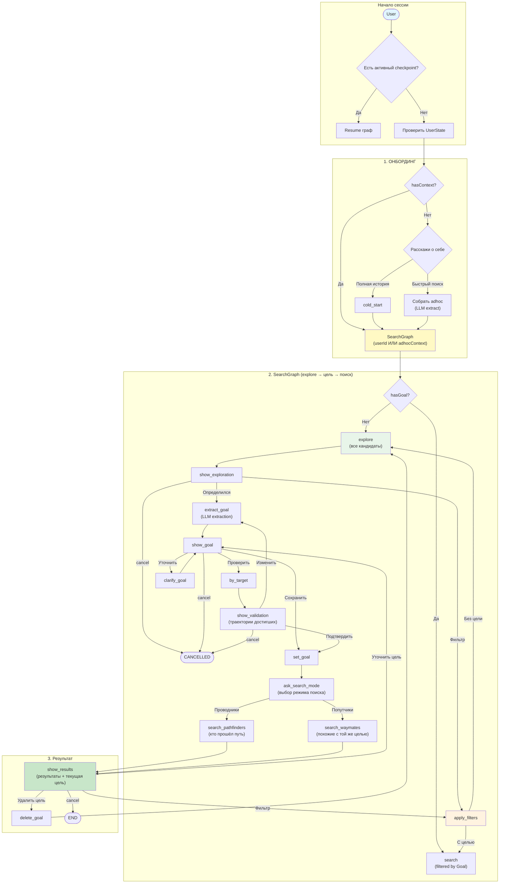

# WayMates MVP — Business Logic & User Journey

**Дата:** 2025-12-26
**Статус:** APPROVED
**Цель документа:** Зафиксировать бизнес-логику MVP
**ADR:** [ADR-030-conversation-orchestrator](../architecture/decisions/ADR-030-conversation-orchestrator.md)

---

## 1. Концепция продукта

WayMates помогает найти карьерный путь через анализ траекторий похожих профессионалов.

### Ключевые сущности:

| Сущность | Описание |
|----------|----------|
| **Context** | Карьерная позиция (должность, компания, навыки, локация) |
| **Trajectory** | Путь = последовательность контекстов + trails между ними |
| **Trail** | Обучение/сертификация между контекстами |
| **Goal** | Карьерная цель пользователя |
| **Pathfinder** | Кандидат, который БЫЛ как мы + ДОСТИГ нашей цели (proof of transition) |
| **Waymate** | Кандидат с ТОЙ ЖЕ целью (ещё не достиг, `isWaymate: true`) |
| **ReversePathfinder** | Кандидат, который ДОСТИГ цели (любой старт, для валидации) |

---

## 2. User Journey (упрощённый flow)

### Ключевые принципы:

1. **Explore-first** — начинаем с показа ВСЕХ кандидатов (без фильтрации по цели)
2. **Цель формируется после explore** — пользователь видит кандидатов, потом определяется с целью
3. **by_target для валидации** — перед сохранением цели можно проверить траектории достигших
4. **Цель фильтрует финальные результаты** — search с целью показывает только pathfinders/waymates + DTW
5. **Цикл уточнения** — после результатов можно удалить цель и вернуться к explore

### Mermaid диаграмма:



---

## 3. MCP Tools (текущие)

| Tool | Роль | Статус |
|------|------|--------|
| `cold_start` | Сбор полной истории (контексты + trails) | ✅ OK |
| `upsert_context` | Добавить контекст в цепочку | ✅ OK |
| `upsert_trail` | Добавить trail (курс/серт) | ✅ OK |
| `converse` | Единая точка входа для диалога | ✅ OK |
| `set_goal` | Фиксация цели | ✅ OK |

**Примечание:** Поиск реализован через `converse` → SearchGraph → Core API (см. секцию 4).

---

## 4. Логика поиска

### Три режима поиска (Search Modes)

| Режим | Кого ищем | Ценность | Требует Goal |
|-------|-----------|----------|--------------|
| **searchWaymates** | Похожие люди с той же целью | Peers, networking | Желательно |
| **searchPathfinders** | Кто прошёл ОТ нас К цели | Proof of transition | ДА |
| **reverseSearchPathfinders** | Кто достиг target (любой старт) | Валидация цели | ДА |

---

### 4.1 searchWaymates (unified: adhoc + profile)

**Определение:** Waymate = человек который:
1. Похож на нас по контексту (match referenceContext)
2. Имеет ту же цель что и мы
3. Ещё не достиг этой цели

**Ценность:** Peers для networking, люди в такой же ситуации.

**Режим определяется по referenceContext:**
- Передан → adhoc mode (контекст из сообщения)
- Не передан → profile mode (из user.currentContextId + DTW)

**Ключевые поля результата:**
- `matchedContext` — где кандидат похож на нас
- `isWaymate` — true если та же цель
- `path` + `trails` — полная траектория (всегда)

---

### 4.2 searchPathfinders (dual matching)

**Определение:** Pathfinder = человек который:
1. БЫЛ в контексте похожем на наш (в истории, не сейчас)
2. ДОСТИГ нашей цели (имеет контекст matching target)
3. `matchedContext.createdAt < targetContext.createdAt` (proof of progression)

**Ценность:** Доказательство что переход возможен, путь + сроки.

**Dual matching:**
- `matchedContext` — где кандидат БЫЛ как мы
- `targetContext` — где кандидат ДОСТИГ цели

**Dual recency (разные окна времени):**
- `targetRecencyMonths` (2-6 мес) — недавно достиг цели
- `referenceRecencyMonths` (2-5 лет) — был в нашем контексте давно (путь занимает годы)

---

### 4.3 reverseSearchPathfinders (валидация цели)

**Определение:** ReversePathfinder = человек который:
1. ДОСТИГ конкретной цели (match targetContext)
2. Любой старт (неважно откуда пришёл)

**Ценность:** ОТКУДА, КАК, ЗА СКОЛЬКО, КОГДА люди приходят к цели.

**Использование:** Валидация цели перед её сохранением — показать реальных людей на этой позиции.

---

### 4.4 Adhoc vs Profile

Adhoc/Profile — это НЕ режим поиска, а **источник referenceContext**:

| Источник | referenceContext | DTW | Доступные режимы |
|----------|------------------|-----|------------------|
| **Adhoc** | Из сообщения | ❌ | Waymates, Pathfinders |
| **Profile** | Из DB (user.currentContextId) | ✅ | Все три |

### 4.5 Adhoc Context Validation

**Required fields** (для осмысленного поиска):
- `position` — уровень (junior/middle/senior)
- `role` — специализация (backend/frontend/etc)
- `countryCode` — страна работы
- `domains` — область (минимум 1)

**Optional fields** (улучшают matching):
- skills, industry, companySize, cityName, citizenships, birthYear, educationLevel, languages

**UX паттерн:** Показывать пользователю статус полей:
- ✅ FILLED — заполненные поля с значениями
- ❌ MISSING — обязательные незаполненные
- ⚪ OPTIONAL — необязательные (можно добавить)

**Валидация:** Zod `safeParse` → список `missingFields` для NLP

---

### 4.6 isWaymate (classification)

| isWaymate | Значение |
|-----------|----------|
| `true` | Кандидат имеет ту же цель что и мы |
| `false` | Нет goal ИЛИ другая цель |

---

### 4.7 SearchParams Filtering

Применяется ко ВСЕМ типам поиска.

| Фильтр | Что делает |
|--------|------------|
| `excludedContextFields` | Поля для исключения (industry, birthYear...) |
| `excludedCreationReasons` | Причины смены для исключения (company_changed...) |
| `recencyThresholdMonths` | Только контексты не старше N мес |
| `limit` | Макс. результатов (1-100, default 20) |

**Нормализация:** LLM парсит → fuzzy matching к canonical values → clamping

---

### 4.8 DTW метрики (Trajectory Similarity)

DTW (Dynamic Time Warping) сравнивает траектории пользователя и кандидата.

**Условие:** userTrajectory >= 3 контекстов И candidate.path >= 3 контекстов.

**Три метрики:**

| Метрика | Что измеряет | Формула |
|---------|--------------|---------|
| **Shape** | Похожесть позиций/ролей/skills на каждом шаге | `1 / (1 + distance / pathLength)` |
| **Tempo** | Похожесть скорости карьерного роста (производные) | `1 / (1 + derivDistance / derivPathLength)` |
| **Alignment** | Насколько этапы накладываются 1:1 | `max(len1, len2) / pathLength` |

**Диапазон:** каждая метрика 0-1, Total = sum (0-3).

#### Градации для пользователя

**Shape — "Маршрут" (какие позиции проходил):**

| Значение | Градация | Ассоциация |
|----------|----------|------------|
| 0.8+ | 🟢 Те же ступеньки | Прошёл junior→middle→senior как вы |
| 0.6-0.8 | 🟡 Похожий маршрут | Те же позиции, но другой порядок |
| 0.4-0.6 | 🟠 Частично похожий | Есть общие этапы |
| <0.4 | 🔴 Обходной путь | Шёл через другие роли/домены |

**Tempo — "Ритм" (скорость карьерного роста):**

| Значение | Градация | Ассоциация |
|----------|----------|------------|
| 0.8+ | 🟢 В вашем ритме | Такая же скорость роста |
| 0.6-0.8 | 🟡 Близкий темп | Немного быстрее/медленнее |
| 0.4-0.6 | 🟠 Марафонец/Спринтер | Заметно другой темп |
| <0.4 | 🔴 Совсем другой темп | Сильно быстрее или медленнее вас |

**Alignment — "Синхронность" (совпадение этапов):**

| Значение | Градация | Ассоциация |
|----------|----------|------------|
| 0.9+ | 🟢 Параллельные карьеры | Этапы идеально накладываются |
| 0.7-0.9 | 🟡 Похожая структура | Хорошее совпадение |
| 0.5-0.7 | 🟠 Больше/меньше остановок | Разное количество этапов |
| <0.5 | 🔴 Разные истории | Сложно сравнивать напрямую |

**Пример отображения:**
```
🎯 Сходство с кандидатом:
  Маршрут: Похожий (0.67)     — проходил те же позиции developer
  Ритм: Марафонец (0.03)      — ему понадобилось 22 года vs ваши 3
  Синхронность: Идеально (1.00) — этапы хорошо накладываются
```

---

## 5. Conversation Router

Техническая архитектура описана в [ADR-030-conversation-orchestrator](../architecture/decisions/ADR-030-conversation-orchestrator.md).

**Ключевая идея:** Единая точка входа `converse.tool` в Facade, Telegram Bot становится тонким клиентом.

---

## 6. Решённые вопросы

| # | Вопрос | Решение |
|---|--------|---------|
| Q1 | setGoal — как парсить цель из свободного текста? | ✅ SearchGraph в Facade (см. ADR-030) |
| Q2 | Лимит кандидатов в результатах? | ✅ SearchParams.limit (1-100, default 20) |

---

## 7. UX-требования

### Роль токсичного пользователя

При тестировании думай как пользователь который:
- Не читает инструкции
- Пишет кратко и неформально
- Ожидает что бот поймёт контекст
- Раздражается когда бот отменяет действие
- Хочет простой и понятный flow

### Примеры плохого UX (что искать)

| Ситуация | Плохой UX | Хороший UX |
|----------|-----------|------------|
| Контекст не извлечён | Пустые результаты | Спросить явно |
| Unknown intent | Cancel | Уточнить что имел в виду |
| Много кандидатов (>10) | Token limit error | Progressive Disclosure |
| 0 результатов | "Ничего не найдено" | Показать фильтры + missing |

### Progressive Disclosure Pattern

Когда candidates > threshold (10):
1. Показать **facets** — распределение с counts (Countries, Positions, Roles, Industries)
2. Предложить выбрать фильтр: "Technology (31), Healthcare (8) — какая индустрия?"
3. После фильтра — полный анализ + Chart

Зачем: избежать token limit, помочь пользователю сузить выбор.

### Прозрачность = доверие

| Что показать | Зачем |
|--------------|-------|
| Missing fields | "we're missing position" → понятно почему такие результаты |
| Applied filters | "искали: senior, backend, Europe" → можно скорректировать |
| Counts | "найдено 20 pathfinders, 5 waymates" → масштаб понятен |

### Intent семантика

| Intent | Значение | Когда использовать |
|--------|----------|-------------------|
| `proceed` | Согласие БЕЗ новой информации | "да", "ок", "давай" |
| `explore` | Просмотр похожих | "глянь похожих", "покажи кандидатов" |
| `clarify` | Дополнить существующую цель | "ещё хочу в IT" |
| `change` | Полная замена цели | "нет, хочу другое" |
| `validate` | "покажи реальных людей" | перед сохранением цели |
| `save` | Явное сохранение цели | "сохрани" |
| `ask` | Мета-вопрос о боте | "что ты умеешь?" |

**Важно:** `ask` должен быть в КАЖДОЙ фазе — пользователь может спросить в любой момент.

---

## 8. Не MVP (Future)

- Ведение профиля (upsert_context, upsert_trail после MVP)
- Follow кандидатов
- Связь в Telegram
- Групповые waymates чаты

